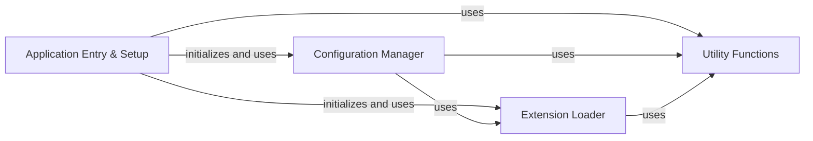

## Component Details

This graph illustrates the 'Application Entry & Setup' component of the Bandit application. This component is responsible for the initial bootstrapping process, including parsing command-line arguments, setting up logging, loading and validating configuration settings from various sources (like INI files and main configuration files), and dynamically loading necessary extensions such as security plugins, output formatters, and blacklists. It orchestrates the preparation of the environment before the security scanning process begins, ensuring all required configurations and extensions are in place and properly initialized.

### Application Entry & Setup
Manages the initial startup of the Bandit application, including command-line argument parsing, logging initialization, loading and validating configurations, and dynamically loading security plugins, output formatters, and blacklists. It prepares the environment for the security scan.

**Related Classes/Methods**:

- <a href="https://github.com/PyCQA/bandit/blob/master/bandit/cli/main.py#L134-L693" target="_blank" rel="noopener noreferrer">`bandit.bandit.cli.main:main` (134:693)</a>
- <a href="https://github.com/PyCQA/bandit/blob/master/bandit/cli/main.py#L23-L43" target="_blank" rel="noopener noreferrer">`bandit.bandit.cli.main:_init_logger` (23:43)</a>
- <a href="https://github.com/PyCQA/bandit/blob/master/bandit/cli/main.py#L46-L75" target="_blank" rel="noopener noreferrer">`bandit.bandit.cli.main:_get_options_from_ini` (46:75)</a>
- <a href="https://github.com/PyCQA/bandit/blob/master/bandit/cli/main.py#L111-L122" target="_blank" rel="noopener noreferrer">`bandit.bandit.cli.main:_get_profile` (111:122)</a>
- <a href="https://github.com/PyCQA/bandit/blob/master/bandit/core/config.py#L25-L271" target="_blank" rel="noopener noreferrer">`bandit.core.config.BanditConfig` (25:271)</a>
- <a href="https://github.com/PyCQA/bandit/blob/master/bandit/core/config.py#L26-L82" target="_blank" rel="noopener noreferrer">`bandit.core.config.BanditConfig.__init__` (26:82)</a>
- <a href="https://github.com/PyCQA/bandit/blob/master/bandit/core/config.py#L84-L101" target="_blank" rel="noopener noreferrer">`bandit.core.config.BanditConfig.get_option` (84:101)</a>
- <a href="https://github.com/PyCQA/bandit/blob/master/bandit/core/config.py#L235-L271" target="_blank" rel="noopener noreferrer">`bandit.core.config.BanditConfig.validate` (235:271)</a>
- <a href="https://github.com/PyCQA/bandit/blob/master/bandit/core/extension_loader.py#L13-L107" target="_blank" rel="noopener noreferrer">`bandit.core.extension_loader.Manager` (13:107)</a>
- <a href="https://github.com/PyCQA/bandit/blob/master/bandit/core/extension_loader.py#L28-L35" target="_blank" rel="noopener noreferrer">`bandit.core.extension_loader.Manager.load_formatters` (28:35)</a>
- <a href="https://github.com/PyCQA/bandit/blob/master/bandit/core/extension_loader.py#L37-L57" target="_blank" rel="noopener noreferrer">`bandit.core.extension_loader.Manager.load_plugins` (37:57)</a>
- <a href="https://github.com/PyCQA/bandit/blob/master/bandit/core/extension_loader.py#L66-L84" target="_blank" rel="noopener noreferrer">`bandit.core.extension_loader.Manager.load_blacklists` (66:84)</a>
- <a href="https://github.com/PyCQA/bandit/blob/master/bandit/core/utils.py#L346-L358" target="_blank" rel="noopener noreferrer">`bandit.core.utils.parse_ini_file` (346:358)</a>

### Configuration Manager
This component is responsible for loading, validating, and managing Bandit's configuration. It can read configuration from YAML or TOML files, handle legacy configuration formats, and provide options to other parts of the system.

**Related Classes/Methods**:

- <a href="https://github.com/PyCQA/bandit/blob/master/bandit/core/config.py#L25-L271" target="_blank" rel="noopener noreferrer">`bandit.core.config.BanditConfig` (25:271)</a>
- <a href="https://github.com/PyCQA/bandit/blob/master/bandit/core/config.py#L26-L82" target="_blank" rel="noopener noreferrer">`bandit.core.config.BanditConfig.__init__` (26:82)</a>
- <a href="https://github.com/PyCQA/bandit/blob/master/bandit/core/config.py#L235-L271" target="_blank" rel="noopener noreferrer">`bandit.core.config.BanditConfig.validate` (235:271)</a>
- <a href="https://github.com/PyCQA/bandit/blob/master/bandit/core/config.py#L136-L144" target="_blank" rel="noopener noreferrer">`bandit.core.config.BanditConfig.convert_legacy_config` (136:144)</a>
- <a href="https://github.com/PyCQA/bandit/blob/master/bandit/core/config.py#L117-L127" target="_blank" rel="noopener noreferrer">`bandit.core.config.BanditConfig._init_settings` (117:127)</a>
- <a href="https://github.com/PyCQA/bandit/blob/master/bandit/core/config.py#L84-L101" target="_blank" rel="noopener noreferrer">`bandit.core.config.BanditConfig.get_option` (84:101)</a>
- <a href="https://github.com/PyCQA/bandit/blob/master/bandit/core/config.py#L103-L107" target="_blank" rel="noopener noreferrer">`bandit.core.config.BanditConfig.get_setting` (103:107)</a>
- <a href="https://github.com/PyCQA/bandit/blob/master/bandit/core/config.py#L129-L134" target="_blank" rel="noopener noreferrer">`bandit.core.config.BanditConfig._init_plugin_name_pattern` (129:134)</a>
- <a href="https://github.com/PyCQA/bandit/blob/master/bandit/core/config.py#L146-L164" target="_blank" rel="noopener noreferrer">`bandit.core.config.BanditConfig.convert_names_to_ids` (146:164)</a>
- <a href="https://github.com/PyCQA/bandit/blob/master/bandit/core/config.py#L166-L194" target="_blank" rel="noopener noreferrer">`bandit.core.config.BanditConfig.convert_legacy_blacklist_data` (166:194)</a>
- <a href="https://github.com/PyCQA/bandit/blob/master/bandit/core/config.py#L197-L233" target="_blank" rel="noopener noreferrer">`bandit.core.config.BanditConfig.convert_legacy_blacklist_tests` (197:233)</a>

### Extension Loader
This component is responsible for loading and managing various extensions for Bandit, including formatters, plugins (tests), and blacklists. It ensures that extensions are properly loaded and validated, making them available for use during the scanning process.

**Related Classes/Methods**:

- <a href="https://github.com/PyCQA/bandit/blob/master/bandit/core/extension_loader.py#L13-L107" target="_blank" rel="noopener noreferrer">`bandit.core.extension_loader.Manager` (13:107)</a>
- <a href="https://github.com/PyCQA/bandit/blob/master/bandit/core/extension_loader.py#L17-L26" target="_blank" rel="noopener noreferrer">`bandit.core.extension_loader.Manager.__init__` (17:26)</a>
- <a href="https://github.com/PyCQA/bandit/blob/master/bandit/core/extension_loader.py#L28-L35" target="_blank" rel="noopener noreferrer">`bandit.core.extension_loader.Manager.load_formatters` (28:35)</a>
- <a href="https://github.com/PyCQA/bandit/blob/master/bandit/core/extension_loader.py#L37-L57" target="_blank" rel="noopener noreferrer">`bandit.core.extension_loader.Manager.load_plugins` (37:57)</a>
- <a href="https://github.com/PyCQA/bandit/blob/master/bandit/core/extension_loader.py#L66-L84" target="_blank" rel="noopener noreferrer">`bandit.core.extension_loader.Manager.load_blacklists` (66:84)</a>
- <a href="https://github.com/PyCQA/bandit/blob/master/bandit/core/extension_loader.py#L59-L64" target="_blank" rel="noopener noreferrer">`bandit.core.extension_loader.Manager.get_test_id` (59:64)</a>
- <a href="https://github.com/PyCQA/bandit/blob/master/bandit/core/extension_loader.py#L86-L100" target="_blank" rel="noopener noreferrer">`bandit.core.extension_loader.Manager.validate_profile` (86:100)</a>
- <a href="https://github.com/PyCQA/bandit/blob/master/bandit/core/extension_loader.py#L102-L107" target="_blank" rel="noopener noreferrer">`bandit.core.extension_loader.Manager.check_id` (102:107)</a>

### Utility Functions
This component provides a collection of utility functions used across different parts of the Bandit system. These functions handle tasks such as parsing INI files, managing exceptions, and performing AST node checks.

**Related Classes/Methods**:

- <a href="https://github.com/PyCQA/bandit/blob/master/bandit/core/utils.py#L346-L358" target="_blank" rel="noopener noreferrer">`bandit.core.utils.parse_ini_file` (346:358)</a>
- <a href="https://github.com/PyCQA/bandit/blob/master/bandit/core/utils.py#L102-L112" target="_blank" rel="noopener noreferrer">`bandit.core.utils.ProfileNotFound` (102:112)</a>
- <a href="https://github.com/PyCQA/bandit/blob/master/bandit/core/utils.py#L93-L99" target="_blank" rel="noopener noreferrer">`bandit.core.utils.ConfigError` (93:99)</a>
- <a href="https://github.com/PyCQA/bandit/blob/master/bandit/core/utils.py#L361-L370" target="_blank" rel="noopener noreferrer">`bandit.core.utils.check_ast_node` (361:370)</a>
- <a href="https://github.com/PyCQA/bandit/blob/master/bandit/core/utils.py#L21-L46" target="_blank" rel="noopener noreferrer">`bandit.core.utils._get_attr_qual_name` (21:46)</a>
- <a href="https://github.com/PyCQA/bandit/blob/master/bandit/core/utils.py#L49-L57" target="_blank" rel="noopener noreferrer">`bandit.core.utils.get_call_name` (49:57)</a>
- <a href="https://github.com/PyCQA/bandit/blob/master/bandit/core/utils.py#L60-L61" target="_blank" rel="noopener noreferrer">`bandit.core.utils.get_func_name` (60:61)</a>
- <a href="https://github.com/PyCQA/bandit/blob/master/bandit/core/utils.py#L64-L79" target="_blank" rel="noopener noreferrer">`bandit.core.utils.get_qual_attr` (64:79)</a>
- <a href="https://github.com/PyCQA/bandit/blob/master/bandit/core/utils.py#L82-L86" target="_blank" rel="noopener noreferrer">`bandit.core.utils.deepgetattr` (82:86)</a>
- <a href="https://github.com/PyCQA/bandit/blob/master/bandit/core/utils.py#L89-L90" target="_blank" rel="noopener noreferrer">`bandit.core.utils.InvalidModulePath` (89:90)</a>
- <a href="https://github.com/PyCQA/bandit/blob/master/bandit/core/utils.py#L115-L119" target="_blank" rel="noopener noreferrer">`bandit.core.utils.warnings_formatter` (115:119)</a>
- <a href="https://github.com/PyCQA/bandit/blob/master/bandit/core/utils.py#L122-L154" target="_blank" rel="noopener noreferrer">`bandit.core.utils.get_module_qualname_from_path` (122:154)</a>
- <a href="https://github.com/PyCQA/bandit/blob/master/bandit/core/utils.py#L157-L169" target="_blank" rel="noopener noreferrer">`bandit.core.utils.namespace_path_join` (157:169)</a>
- <a href="https://github.com/PyCQA/bandit/blob/master/bandit/core/utils.py#L172-L183" target="_blank" rel="noopener noreferrer">`bandit.core.utils.namespace_path_split` (172:183)</a>
- <a href="https://github.com/PyCQA/bandit/blob/master/bandit/core/utils.py#L186-L196" target="_blank" rel="noopener noreferrer">`bandit.core.utils.escaped_bytes_representation` (186:196)</a>
- <a href="https://github.com/PyCQA/bandit/blob/master/bandit/core/utils.py#L199-L216" target="_blank" rel="noopener noreferrer">`bandit.core.utils.calc_linerange` (199:216)</a>
- <a href="https://github.com/PyCQA/bandit/blob/master/bandit/core/utils.py#L219-L270" target="_blank" rel="noopener noreferrer">`bandit.core.utils.linerange` (219:270)</a>
- <a href="https://github.com/PyCQA/bandit/blob/master/bandit/core/utils.py#L273-L303" target="_blank" rel="noopener noreferrer">`bandit.core.utils.concat_string` (273:303)</a>
- <a href="https://github.com/PyCQA/bandit/blob/master/bandit/core/utils.py#L306-L320" target="_blank" rel="noopener noreferrer">`bandit.core.utils.get_called_name` (306:320)</a>
- <a href="https://github.com/PyCQA/bandit/blob/master/bandit/core/utils.py#L323-L343" target="_blank" rel="noopener noreferrer">`bandit.core.utils.get_path_for_function` (323:343)</a>
- <a href="https://github.com/PyCQA/bandit/blob/master/bandit/core/utils.py#L373-L378" target="_blank" rel="noopener noreferrer">`bandit.core.utils.get_nosec` (373:378)</a>

### [FAQ](https://github.com/CodeBoarding/GeneratedOnBoardings/tree/main?tab=readme-ov-file#faq)