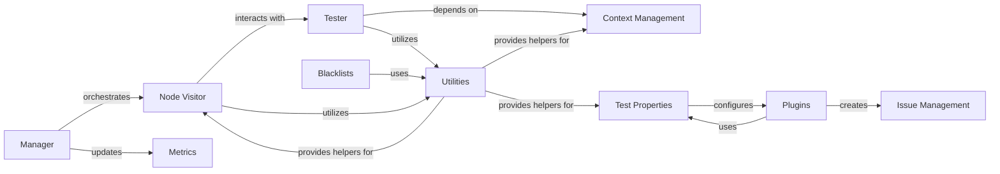

## Component Details

The Code Analysis Engine in Bandit is the core subsystem responsible for identifying security vulnerabilities in Python source code. It operates by traversing the Abstract Syntax Tree (AST) of the code, applying a suite of security plugins (tests), and leveraging predefined blacklists of insecure constructs. The main flow involves a Manager orchestrating the analysis, a Node Visitor traversing the AST and dispatching to a Tester, which executes security checks. Context Management provides necessary information to tests, while Issue Management handles the representation of identified vulnerabilities. Utilities provide common helper functions, Metrics track scan statistics, Blacklists define insecure patterns, and Test Properties configure the behavior of individual Plugins (security checks).

### Node Visitor
This component is responsible for traversing the Abstract Syntax Tree (AST) of the analyzed code. It dispatches to specific `visit_` methods based on the type of AST node encountered, collecting relevant information and running security tests on each node. It also manages the namespace and updates scores based on test results.

**Related Classes/Methods**:

- <a href="https://github.com/PyCQA/bandit/blob/master/bandit/core/node_visitor.py#L16-L297" target="_blank" rel="noopener noreferrer">`bandit.core.node_visitor.BanditNodeVisitor` (16:297)</a>
- <a href="https://github.com/PyCQA/bandit/blob/master/bandit/core/node_visitor.py#L80-L96" target="_blank" rel="noopener noreferrer">`bandit.core.node_visitor.BanditNodeVisitor.visit_Call` (80:96)</a>
- <a href="https://github.com/PyCQA/bandit/blob/master/bandit/core/node_visitor.py#L17-L46" target="_blank" rel="noopener noreferrer">`bandit.core.node_visitor.BanditNodeVisitor:__init__` (17:46)</a>
- <a href="https://github.com/PyCQA/bandit/blob/master/bandit/core/node_visitor.py#L48-L56" target="_blank" rel="noopener noreferrer">`bandit.core.node_visitor.BanditNodeVisitor:visit_ClassDef` (48:56)</a>
- <a href="https://github.com/PyCQA/bandit/blob/master/bandit/core/node_visitor.py#L58-L78" target="_blank" rel="noopener noreferrer">`bandit.core.node_visitor.BanditNodeVisitor:visit_FunctionDef` (58:78)</a>
- <a href="https://github.com/PyCQA/bandit/blob/master/bandit/core/node_visitor.py#L98-L111" target="_blank" rel="noopener noreferrer">`bandit.core.node_visitor.BanditNodeVisitor:visit_Import` (98:111)</a>
- <a href="https://github.com/PyCQA/bandit/blob/master/bandit/core/node_visitor.py#L113-L144" target="_blank" rel="noopener noreferrer">`bandit.core.node_visitor.BanditNodeVisitor:visit_ImportFrom` (113:144)</a>
- <a href="https://github.com/PyCQA/bandit/blob/master/bandit/core/node_visitor.py#L146-L161" target="_blank" rel="noopener noreferrer">`bandit.core.node_visitor.BanditNodeVisitor:visit_Constant` (146:161)</a>
- <a href="https://github.com/PyCQA/bandit/blob/master/bandit/core/node_visitor.py#L163-L174" target="_blank" rel="noopener noreferrer">`bandit.core.node_visitor.BanditNodeVisitor:visit_Str` (163:174)</a>
- <a href="https://github.com/PyCQA/bandit/blob/master/bandit/core/node_visitor.py#L176-L187" target="_blank" rel="noopener noreferrer">`bandit.core.node_visitor.BanditNodeVisitor:visit_Bytes` (176:187)</a>
- <a href="https://github.com/PyCQA/bandit/blob/master/bandit/core/node_visitor.py#L189-L216" target="_blank" rel="noopener noreferrer">`bandit.core.node_visitor.BanditNodeVisitor:pre_visit` (189:216)</a>
- <a href="https://github.com/PyCQA/bandit/blob/master/bandit/core/node_visitor.py#L218-L227" target="_blank" rel="noopener noreferrer">`bandit.core.node_visitor.BanditNodeVisitor:visit` (218:227)</a>
- <a href="https://github.com/PyCQA/bandit/blob/master/bandit/core/node_visitor.py#L229-L236" target="_blank" rel="noopener noreferrer">`bandit.core.node_visitor.BanditNodeVisitor:post_visit` (229:236)</a>
- <a href="https://github.com/PyCQA/bandit/blob/master/bandit/core/node_visitor.py#L238-L262" target="_blank" rel="noopener noreferrer">`bandit.core.node_visitor.BanditNodeVisitor:generic_visit` (238:262)</a>
- <a href="https://github.com/PyCQA/bandit/blob/master/bandit/core/node_visitor.py#L278-L297" target="_blank" rel="noopener noreferrer">`bandit.core.node_visitor.BanditNodeVisitor:process` (278:297)</a>
- <a href="https://github.com/PyCQA/bandit/blob/master/bandit/core/node_visitor.py#L264-L276" target="_blank" rel="noopener noreferrer">`bandit.core.node_visitor.BanditNodeVisitor.update_scores` (264:276)</a>

### Tester
The Tester component is central to executing the security checks. It receives context information about AST nodes from the Node Visitor and runs the appropriate tests defined in the test set. It also handles the reporting of errors and manages `nosec` comments.

**Related Classes/Methods**:

- <a href="https://github.com/PyCQA/bandit/blob/master/bandit/core/tester.py#L17-L166" target="_blank" rel="noopener noreferrer">`bandit.core.tester.BanditTester` (17:166)</a>
- <a href="https://github.com/PyCQA/bandit/blob/master/bandit/core/tester.py#L26-L123" target="_blank" rel="noopener noreferrer">`bandit.core.tester.BanditTester.run_tests` (26:123)</a>
- <a href="https://github.com/PyCQA/bandit/blob/master/bandit/core/tester.py#L125-L152" target="_blank" rel="noopener noreferrer">`bandit.core.tester.BanditTester._get_nosecs_from_contexts` (125:152)</a>
- <a href="https://github.com/PyCQA/bandit/blob/master/bandit/core/tester.py#L155-L166" target="_blank" rel="noopener noreferrer">`bandit.core.tester.BanditTester.report_error` (155:166)</a>

### Manager
This component orchestrates the entire scanning process. It is responsible for parsing input files, managing the AST visitor, and aggregating metrics. It acts as the high-level controller for the Bandit analysis.

**Related Classes/Methods**:

- <a href="https://github.com/PyCQA/bandit/blob/master/bandit/core/manager.py#L261-L299" target="_blank" rel="noopener noreferrer">`bandit.core.manager.BanditManager:run_tests` (261:299)</a>
- <a href="https://github.com/PyCQA/bandit/blob/master/bandit/core/manager.py#L301-L344" target="_blank" rel="noopener noreferrer">`bandit.core.manager.BanditManager._parse_file` (301:344)</a>
- <a href="https://github.com/PyCQA/bandit/blob/master/bandit/core/manager.py#L478-L499" target="_blank" rel="noopener noreferrer">`bandit.core.manager._parse_nosec_comment` (478:499)</a>
- <a href="https://github.com/PyCQA/bandit/blob/master/bandit/core/manager.py#L346-L367" target="_blank" rel="noopener noreferrer">`bandit.core.manager.BanditManager._execute_ast_visitor` (346:367)</a>

### Utilities
This component provides a collection of general-purpose helper functions used across various parts of the Bandit system. These utilities include functions for resolving qualified names, calculating line ranges, handling `nosec` comments, and other common operations.

**Related Classes/Methods**:

- <a href="https://github.com/PyCQA/bandit/blob/master/bandit/core/utils.py#L122-L154" target="_blank" rel="noopener noreferrer">`bandit.core.utils.get_module_qualname_from_path` (122:154)</a>
- <a href="https://github.com/PyCQA/bandit/blob/master/bandit/core/utils.py#L157-L169" target="_blank" rel="noopener noreferrer">`bandit.core.utils.namespace_path_join` (157:169)</a>
- <a href="https://github.com/PyCQA/bandit/blob/master/bandit/core/utils.py#L60-L61" target="_blank" rel="noopener noreferrer">`bandit.core.utils.get_func_name` (60:61)</a>
- <a href="https://github.com/PyCQA/bandit/blob/master/bandit/core/utils.py#L49-L57" target="_blank" rel="noopener noreferrer">`bandit.core.utils.get_call_name` (49:57)</a>
- <a href="https://github.com/PyCQA/bandit/blob/master/bandit/core/utils.py#L219-L270" target="_blank" rel="noopener noreferrer">`bandit.core.utils.linerange` (219:270)</a>
- <a href="https://github.com/PyCQA/bandit/blob/master/bandit/core/utils.py#L172-L183" target="_blank" rel="noopener noreferrer">`bandit.core.utils.namespace_path_split` (172:183)</a>
- <a href="https://github.com/PyCQA/bandit/blob/master/bandit/core/utils.py#L373-L378" target="_blank" rel="noopener noreferrer">`bandit.core.utils.get_nosec` (373:378)</a>
- <a href="https://github.com/PyCQA/bandit/blob/master/bandit/core/utils.py#L82-L86" target="_blank" rel="noopener noreferrer">`bandit.core.utils.deepgetattr` (82:86)</a>
- <a href="https://github.com/PyCQA/bandit/blob/master/bandit/core/utils.py#L21-L46" target="_blank" rel="noopener noreferrer">`bandit.core.utils._get_attr_qual_name` (21:46)</a>
- <a href="https://github.com/PyCQA/bandit/blob/master/bandit/core/utils.py#L199-L216" target="_blank" rel="noopener noreferrer">`bandit.core.utils.calc_linerange` (199:216)</a>
- <a href="https://github.com/PyCQA/bandit/blob/master/bandit/core/utils.py#L89-L90" target="_blank" rel="noopener noreferrer">`bandit.core.utils.InvalidModulePath` (89:90)</a>
- <a href="https://github.com/PyCQA/bandit/blob/master/bandit/core/utils.py#L64-L79" target="_blank" rel="noopener noreferrer">`bandit.core.utils.get_qual_attr` (64:79)</a>
- <a href="https://github.com/PyCQA/bandit/blob/master/bandit/core/utils.py#L273-L303" target="_blank" rel="noopener noreferrer">`bandit.core.utils.concat_string` (273:303)</a>
- <a href="https://github.com/PyCQA/bandit/blob/master/bandit/core/utils.py#L285-L296" target="_blank" rel="noopener noreferrer">`bandit.core.utils.concat_string._get` (285:296)</a>
- <a href="https://github.com/PyCQA/bandit/blob/master/bandit/core/utils.py#L361-L370" target="_blank" rel="noopener noreferrer">`bandit.core.utils.check_ast_node` (361:370)</a>

### Issue Management
This component defines the data structures and methods for representing and managing security issues identified during the scan. It includes classes for issues themselves and for Common Weakness Enumeration (CWE) references.

**Related Classes/Methods**:

- <a href="https://github.com/PyCQA/bandit/blob/master/bandit/core/issue.py#L78-L232" target="_blank" rel="noopener noreferrer">`bandit.core.issue.Issue` (78:232)</a>
- <a href="https://github.com/PyCQA/bandit/blob/master/bandit/core/issue.py#L79-L105" target="_blank" rel="noopener noreferrer">`bandit.core.issue.Issue:__init__` (79:105)</a>
- <a href="https://github.com/PyCQA/bandit/blob/master/bandit/core/issue.py#L10-L75" target="_blank" rel="noopener noreferrer">`bandit.core.issue.Cwe` (10:75)</a>
- <a href="https://github.com/PyCQA/bandit/blob/master/bandit/core/issue.py#L46-L50" target="_blank" rel="noopener noreferrer">`bandit.core.issue.Cwe:__str__` (46:50)</a>
- <a href="https://github.com/PyCQA/bandit/blob/master/bandit/core/issue.py#L52-L57" target="_blank" rel="noopener noreferrer">`bandit.core.issue.Cwe:as_dict` (52:57)</a>
- <a href="https://github.com/PyCQA/bandit/blob/master/bandit/core/issue.py#L40-L44" target="_blank" rel="noopener noreferrer">`bandit.core.issue.Cwe.link` (40:44)</a>

### Context Management
This component is responsible for maintaining and providing contextual information about the currently visited AST node to the security tests. It allows tests to access details like function arguments, keywords, and literal values.

**Related Classes/Methods**:

- <a href="https://github.com/PyCQA/bandit/blob/master/bandit/core/context.py#L10-L324" target="_blank" rel="noopener noreferrer">`bandit.core.context.Context` (10:324)</a>
- <a href="https://github.com/PyCQA/bandit/blob/master/bandit/core/context.py#L40-L52" target="_blank" rel="noopener noreferrer">`bandit.core.context.Context:call_args` (40:52)</a>
- <a href="https://github.com/PyCQA/bandit/blob/master/bandit/core/context.py#L82-L98" target="_blank" rel="noopener noreferrer">`bandit.core.context.Context:call_keywords` (82:98)</a>
- <a href="https://github.com/PyCQA/bandit/blob/master/bandit/core/context.py#L175-L224" target="_blank" rel="noopener noreferrer">`bandit.core.context.Context:_get_literal_value` (175:224)</a>

### Metrics
The Metrics component is dedicated to collecting and aggregating statistical data about the code analysis. This includes counting lines of code, tracking the number of issues found, and providing overall scan statistics.

**Related Classes/Methods**:

- <a href="https://github.com/PyCQA/bandit/blob/master/bandit/core/metrics.py#L80-L85" target="_blank" rel="noopener noreferrer">`bandit.core.metrics.Metrics.aggregate` (80:85)</a>
- <a href="https://github.com/PyCQA/bandit/blob/master/bandit/core/metrics.py#L33-L44" target="_blank" rel="noopener noreferrer">`bandit.core.metrics.Metrics.begin` (33:44)</a>
- <a href="https://github.com/PyCQA/bandit/blob/master/bandit/core/metrics.py#L62-L75" target="_blank" rel="noopener noreferrer">`bandit.core.metrics.Metrics.count_locs` (62:75)</a>
- <a href="https://github.com/PyCQA/bandit/blob/master/bandit/core/metrics.py#L77-L78" target="_blank" rel="noopener noreferrer">`bandit.core.metrics.Metrics.count_issues` (77:78)</a>

### Blacklists
This component manages predefined lists of insecure imports and function calls. It provides functionality to generate and utilize these blacklists to identify common security vulnerabilities.

**Related Classes/Methods**:

- <a href="https://github.com/PyCQA/bandit/blob/master/bandit/blacklists/imports.py#L234-L425" target="_blank" rel="noopener noreferrer">`bandit.blacklists.imports:gen_blacklist` (234:425)</a>
- <a href="https://github.com/PyCQA/bandit/blob/master/bandit/blacklists/utils.py#L8-L17" target="_blank" rel="noopener noreferrer">`bandit.blacklists.utils.build_conf_dict` (8:17)</a>
- <a href="https://github.com/PyCQA/bandit/blob/master/bandit/blacklists/calls.py#L346-L670" target="_blank" rel="noopener noreferrer">`bandit.blacklists.calls:gen_blacklist` (346:670)</a>

### Test Properties
This component defines decorators and functions used to associate properties and metadata with security tests. It helps in defining what kind of AST nodes a test applies to and other test-specific attributes.

**Related Classes/Methods**:

- <a href="https://github.com/PyCQA/bandit/blob/master/bandit/core/test_properties.py#L12-L28" target="_blank" rel="noopener noreferrer">`bandit.core.test_properties.checks` (12:28)</a>
- <a href="https://github.com/PyCQA/bandit/blob/master/bandit/core/test_properties.py#L53-L64" target="_blank" rel="noopener noreferrer">`bandit.core.test_properties.test_id` (53:64)</a>

### Plugins
This component represents the extensible part of Bandit, containing specific security checks implemented as individual plugins. These plugins are designed to detect particular types of vulnerabilities, such as injection flaws.

**Related Classes/Methods**:

- <a href="https://github.com/PyCQA/bandit/blob/master/bandit/plugins/injection_paramiko.py#L50-L63" target="_blank" rel="noopener noreferrer">`bandit.plugins.injection_paramiko:paramiko_calls` (50:63)</a>

### [FAQ](https://github.com/CodeBoarding/GeneratedOnBoardings/tree/main?tab=readme-ov-file#faq)