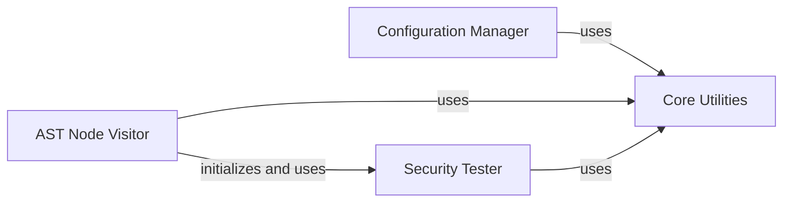

## Component Details

This architecture overview describes the core components of Bandit, a security linter for Python. The main flow involves a Configuration Manager setting up the scan, an AST Node Visitor traversing the code's Abstract Syntax Tree, and a Security Tester executing checks against the AST nodes. Various Core Utilities provide foundational helper functions for tasks like configuration parsing, path resolution, and AST node analysis, supporting all other components.

### Configuration Manager
This component is responsible for parsing and managing configuration options for Bandit, including reading from INI files and handling command-line arguments. It ensures that the correct settings are applied for the scan.

**Related Classes/Methods**:

- <a href="https://github.com/PyCQA/bandit/blob/master/bandit/cli/main.py#L46-L75" target="_blank" rel="noopener noreferrer">`bandit.cli.main:_get_options_from_ini` (46:75)</a>
- <a href="https://github.com/PyCQA/bandit/blob/master/bandit/core/utils.py#L346-L358" target="_blank" rel="noopener noreferrer">`bandit.core.utils.parse_ini_file` (346:358)</a>

### AST Node Visitor
This component traverses the Abstract Syntax Tree (AST) of the Python code. It identifies different types of nodes (e.g., strings, bytes, function calls) and prepares the context for security tests. It also manages the namespace and import aliases during the traversal.

**Related Classes/Methods**:

- <a href="https://github.com/PyCQA/bandit/blob/master/bandit/core/node_visitor.py#L17-L46" target="_blank" rel="noopener noreferrer">`bandit.core.node_visitor.BanditNodeVisitor:__init__` (17:46)</a>
- <a href="https://github.com/PyCQA/bandit/blob/master/bandit/core/node_visitor.py#L163-L174" target="_blank" rel="noopener noreferrer">`bandit.core.node_visitor.BanditNodeVisitor:visit_Str` (163:174)</a>
- <a href="https://github.com/PyCQA/bandit/blob/master/bandit/core/node_visitor.py#L176-L187" target="_blank" rel="noopener noreferrer">`bandit.core.node_visitor.BanditNodeVisitor:visit_Bytes` (176:187)</a>
- <a href="https://github.com/PyCQA/bandit/blob/master/bandit/core/node_visitor.py#L189-L216" target="_blank" rel="noopener noreferrer">`bandit.core.node_visitor.BanditNodeVisitor:pre_visit` (189:216)</a>
- <a href="https://github.com/PyCQA/bandit/blob/master/bandit/core/node_visitor.py#L264-L276" target="_blank" rel="noopener noreferrer">`bandit.core.node_visitor.BanditNodeVisitor.update_scores` (264:276)</a>

### Security Tester
This component executes the security tests against the provided code context. It receives the context from the AST Node Visitor and runs relevant tests, accumulating scores based on the identified vulnerabilities. It also handles the skipping of tests based on 'nosec' comments.

**Related Classes/Methods**:

- <a href="https://github.com/PyCQA/bandit/blob/master/bandit/core/tester.py#L17-L166" target="_blank" rel="noopener noreferrer">`bandit.core.tester.BanditTester` (17:166)</a>
- <a href="https://github.com/PyCQA/bandit/blob/master/bandit/core/tester.py#L26-L123" target="_blank" rel="noopener noreferrer">`bandit.core.tester.BanditTester.run_tests` (26:123)</a>

### Core Utilities
Provides a foundational set of general-purpose helper functions and classes used across various components of Bandit. These utilities support tasks such as file parsing, string manipulation, and path resolution.

**Related Classes/Methods**:

- <a href="https://github.com/PyCQA/bandit/blob/master/bandit/core/utils.py#L346-L358" target="_blank" rel="noopener noreferrer">`bandit.core.utils.parse_ini_file` (346:358)</a>
- <a href="https://github.com/PyCQA/bandit/blob/master/bandit/core/utils.py#L122-L154" target="_blank" rel="noopener noreferrer">`bandit.core.utils.get_module_qualname_from_path` (122:154)</a>
- <a href="https://github.com/PyCQA/bandit/blob/master/bandit/core/utils.py#L219-L270" target="_blank" rel="noopener noreferrer">`bandit.core.utils.linerange` (219:270)</a>
- <a href="https://github.com/PyCQA/bandit/blob/master/bandit/core/utils.py#L89-L90" target="_blank" rel="noopener noreferrer">`bandit.core.utils.InvalidModulePath` (89:90)</a>
- <a href="https://github.com/PyCQA/bandit/blob/master/bandit/core/utils.py#L199-L216" target="_blank" rel="noopener noreferrer">`bandit.core.utils.calc_linerange` (199:216)</a>

### [FAQ](https://github.com/CodeBoarding/GeneratedOnBoardings/tree/main?tab=readme-ov-file#faq)