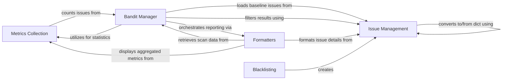

## Component Details

This graph illustrates the key components involved in the `Results Management & Reporting` subsystem of the Bandit security scanner. It details how security issues are defined and managed, how scan metrics are collected and aggregated, how the core scanning process is orchestrated, how blacklisting is applied to identify issues, and how the final scan results are formatted and presented to the user. The interactions highlight the flow of data from issue identification and metric collection through to the final reporting.

### Issue Management
This component defines and manages security issues identified during the scan. It includes the `Issue` class, which encapsulates details about a security vulnerability, and the `Cwe` class, which provides information about Common Weakness Enumeration (CWE) IDs associated with the issues. It also handles the conversion of issue data to and from dictionary formats.

**Related Classes/Methods**:

- <a href="https://github.com/PyCQA/bandit/blob/master/bandit/core/issue.py#L78-L232" target="_blank" rel="noopener noreferrer">`bandit.core.issue.Issue` (78:232)</a>
- <a href="https://github.com/PyCQA/bandit/blob/master/bandit/core/issue.py#L10-L75" target="_blank" rel="noopener noreferrer">`bandit.core.issue.Cwe` (10:75)</a>
- <a href="https://github.com/PyCQA/bandit/blob/master/bandit/core/issue.py#L235-L238" target="_blank" rel="noopener noreferrer">`bandit.core.issue.cwe_from_dict` (235:238)</a>
- <a href="https://github.com/PyCQA/bandit/blob/master/bandit/core/issue.py#L241-L244" target="_blank" rel="noopener noreferrer">`bandit.core.issue.issue_from_dict` (241:244)</a>

### Metrics Collection
This component is responsible for gathering and aggregating various statistics and metrics related to the code analysis, such as lines of code, number of issues, and skipped tests. It provides methods to begin a new metric block, count lines of code, and count issues, and performs final aggregation of metrics.

**Related Classes/Methods**:

- <a href="https://github.com/PyCQA/bandit/blob/master/bandit/core/metrics.py#L10-L106" target="_blank" rel="noopener noreferrer">`bandit.core.metrics.Metrics` (10:106)</a>
- <a href="https://github.com/PyCQA/bandit/blob/master/bandit/core/metrics.py#L62-L75" target="_blank" rel="noopener noreferrer">`bandit.core.metrics.Metrics.count_locs` (62:75)</a>
- <a href="https://github.com/PyCQA/bandit/blob/master/bandit/core/metrics.py#L77-L78" target="_blank" rel="noopener noreferrer">`bandit.core.metrics.Metrics.count_issues` (77:78)</a>
- <a href="https://github.com/PyCQA/bandit/blob/master/bandit/core/metrics.py#L80-L85" target="_blank" rel="noopener noreferrer">`bandit.core.metrics.Metrics.aggregate` (80:85)</a>

### Bandit Manager
This is the core orchestration component of the Bandit security scanner. It manages the entire scanning process, including discovering files, parsing code, executing security tests, populating baselines, filtering results, and coordinating with other components like metrics collection and formatters.

**Related Classes/Methods**:

- <a href="https://github.com/PyCQA/bandit/blob/master/bandit/core/manager.py#L32-L367" target="_blank" rel="noopener noreferrer">`bandit.core.manager.BanditManager` (32:367)</a>
- <a href="https://github.com/PyCQA/bandit/blob/master/bandit/core/manager.py#L90-L103" target="_blank" rel="noopener noreferrer">`bandit.core.manager.BanditManager.populate_baseline` (90:103)</a>
- <a href="https://github.com/PyCQA/bandit/blob/master/bandit/core/manager.py#L105-L128" target="_blank" rel="noopener noreferrer">`bandit.core.manager.BanditManager.filter_results` (105:128)</a>
- <a href="https://github.com/PyCQA/bandit/blob/master/bandit/core/manager.py#L141-L198" target="_blank" rel="noopener noreferrer">`bandit.core.manager.BanditManager.output_results` (141:198)</a>
- <a href="https://github.com/PyCQA/bandit/blob/master/bandit/core/manager.py#L200-L259" target="_blank" rel="noopener noreferrer">`bandit.core.manager.BanditManager.discover_files` (200:259)</a>
- <a href="https://github.com/PyCQA/bandit/blob/master/bandit/core/manager.py#L261-L299" target="_blank" rel="noopener noreferrer">`bandit.core.manager.BanditManager.run_tests` (261:299)</a>
- <a href="https://github.com/PyCQA/bandit/blob/master/bandit/core/manager.py#L301-L344" target="_blank" rel="noopener noreferrer">`bandit.core.manager.BanditManager._parse_file` (301:344)</a>
- <a href="https://github.com/PyCQA/bandit/blob/master/bandit/core/manager.py#L346-L367" target="_blank" rel="noopener noreferrer">`bandit.core.manager.BanditManager._execute_ast_visitor` (346:367)</a>

### Blacklisting
This component provides a generic blacklisting mechanism to identify and report security issues based on predefined lists of insecure functions, modules, or patterns. It's used by various plugins to detect common insecure coding practices and generates issues based on these blacklists.

**Related Classes/Methods**:

- <a href="https://github.com/PyCQA/bandit/blob/master/bandit/core/blacklisting.py#L10-L18" target="_blank" rel="noopener noreferrer">`bandit.core.blacklisting.report_issue` (10:18)</a>
- <a href="https://github.com/PyCQA/bandit/blob/master/bandit/core/blacklisting.py#L21-L70" target="_blank" rel="noopener noreferrer">`bandit.core.blacklisting.blacklist` (21:70)</a>

### Formatters
This component is responsible for taking the processed scan results, including identified security issues and collected metrics, and presenting them in various output formats (e.g., text, JSON, XML, HTML, SARIF, CSV, YAML). It retrieves the necessary data from the Bandit Manager and the Issue Management and Metrics Collection components to generate comprehensive reports.

**Related Classes/Methods**:

- <a href="https://github.com/PyCQA/bandit/blob/master/bandit/formatters/text.py#L151-L198" target="_blank" rel="noopener noreferrer">`bandit.formatters.text:report` (151:198)</a>
- <a href="https://github.com/PyCQA/bandit/blob/master/bandit/formatters/text.py#L118-L147" target="_blank" rel="noopener noreferrer">`bandit.formatters.text:get_results` (118:147)</a>
- <a href="https://github.com/PyCQA/bandit/blob/master/bandit/formatters/text.py#L78-L115" target="_blank" rel="noopener noreferrer">`bandit.formatters.text._output_issue_str` (78:115)</a>
- <a href="https://github.com/PyCQA/bandit/blob/master/bandit/formatters/text.py#L47-L59" target="_blank" rel="noopener noreferrer">`bandit.formatters.text.get_verbose_details` (47:59)</a>
- <a href="https://github.com/PyCQA/bandit/blob/master/bandit/formatters/text.py#L62-L75" target="_blank" rel="noopener noreferrer">`bandit.formatters.text.get_metrics` (62:75)</a>
- `bandit.formatters.csv` (full file reference)
- `bandit.formatters.custom` (full file reference)
- `bandit.formatters.html` (full file reference)
- `bandit.formatters.json` (full file reference)
- `bandit.formatters.sarif` (full file reference)
- `bandit.formatters.screen` (full file reference)
- `bandit.formatters.xml` (full file reference)
- `bandit.formatters.yaml` (full file reference)

### [FAQ](https://github.com/CodeBoarding/GeneratedOnBoardings/tree/main?tab=readme-ov-file#faq)