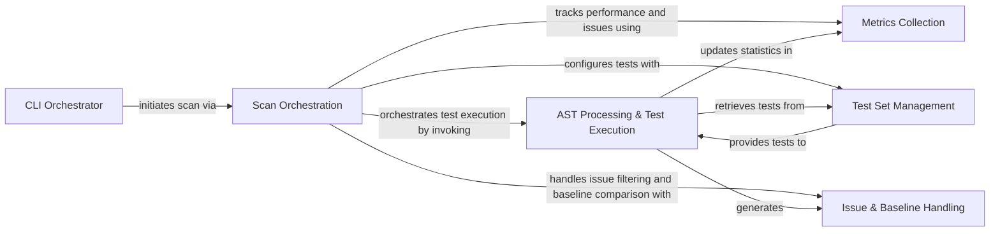

## Component Details

The Scan Orchestration component is central to Bandit's security scanning process. It manages the discovery of files, the execution of security tests, and the final reporting of results. It interacts with other components to handle AST processing, collect metrics, manage test sets, and process issues and baselines.

### Scan Orchestration
Oversees the entire security scanning workflow. It discovers files to be analyzed, manages baseline issues, initiates the AST traversal and test execution, and coordinates the final output of the scan results. This core component manages the list of files to be scanned, handles baseline comparisons, runs tests on each file, and interacts with AST processing, metrics collection, and test set management.

**Related Classes/Methods**:

- <a href="https://github.com/PyCQA/bandit/blob/master/bandit/core/manager.py#L32-L367" target="_blank" rel="noopener noreferrer">`bandit.core.manager.BanditManager` (32:367)</a>
- <a href="https://github.com/PyCQA/bandit/blob/master/bandit/core/manager.py#L200-L259" target="_blank" rel="noopener noreferrer">`bandit.core.manager.BanditManager.discover_files` (200:259)</a>
- <a href="https://github.com/PyCQA/bandit/blob/master/bandit/core/manager.py#L261-L299" target="_blank" rel="noopener noreferrer">`bandit.core.manager.BanditManager.run_tests` (261:299)</a>
- <a href="https://github.com/PyCQA/bandit/blob/master/bandit/core/manager.py#L141-L198" target="_blank" rel="noopener noreferrer">`bandit.core.manager.BanditManager.output_results` (141:198)</a>
- <a href="https://github.com/PyCQA/bandit/blob/master/bandit/core/manager.py#L370-L389" target="_blank" rel="noopener noreferrer">`bandit.core.manager._get_files_from_dir` (370:389)</a>
- <a href="https://github.com/PyCQA/bandit/blob/master/bandit/core/manager.py#L392-L418" target="_blank" rel="noopener noreferrer">`bandit.core.manager._is_file_included` (392:418)</a>
- <a href="https://github.com/PyCQA/bandit/blob/master/bandit/core/manager.py#L478-L499" target="_blank" rel="noopener noreferrer">`bandit.core.manager._parse_nosec_comment` (478:499)</a>
- <a href="https://github.com/PyCQA/bandit/blob/master/bandit/core/manager.py#L428-L438" target="_blank" rel="noopener noreferrer">`bandit.core.manager._compare_baseline_results` (428:438)</a>
- <a href="https://github.com/PyCQA/bandit/blob/master/bandit/core/manager.py#L441-L461" target="_blank" rel="noopener noreferrer">`bandit.core.manager._find_candidate_matches` (441:461)</a>
- <a href="https://github.com/PyCQA/bandit/blob/master/bandit/core/manager.py#L464-L475" target="_blank" rel="noopener noreferrer">`bandit.core.manager._find_test_id_from_nosec_string` (464:475)</a>

### CLI Orchestrator
This component is the entry point of the Bandit tool. It handles command-line argument parsing, initializes the logging system, loads extensions, configures the Scan Orchestration component, initiates the file discovery and test execution, and finally outputs the results.

**Related Classes/Methods**:

- <a href="https://github.com/PyCQA/bandit/blob/master/bandit/cli/main.py#L134-L693" target="_blank" rel="noopener noreferrer">`bandit.cli.main` (134:693)</a>

### AST Processing & Test Execution
This component is responsible for parsing Python source code into an Abstract Syntax Tree (AST) and traversing it. During traversal, it applies various security tests defined in the test set, collects issues, and updates metrics. It also manages the AST node collection.

**Related Classes/Methods**:

- <a href="https://github.com/PyCQA/bandit/blob/master/bandit/core/node_visitor.py#L16-L297" target="_blank" rel="noopener noreferrer">`bandit.core.node_visitor.BanditNodeVisitor` (16:297)</a>
- <a href="https://github.com/PyCQA/bandit/blob/master/bandit/core/meta_ast.py#L11-L44" target="_blank" rel="noopener noreferrer">`bandit.core.meta_ast.BanditMetaAst` (11:44)</a>
- <a href="https://github.com/PyCQA/bandit/blob/master/bandit/core/tester.py#L17-L166" target="_blank" rel="noopener noreferrer">`bandit.core.tester.BanditTester` (17:166)</a>

### Metrics Collection
This component is dedicated to gathering and aggregating various statistics and metrics throughout the scanning process. This includes lines of code, 'nosec' comments, and counts of identified security issues based on severity and confidence.

**Related Classes/Methods**:

- <a href="https://github.com/PyCQA/bandit/blob/master/bandit/core/metrics.py#L10-L106" target="_blank" rel="noopener noreferrer">`bandit.core.metrics.Metrics` (10:106)</a>

### Test Set Management
This component is responsible for loading, filtering, and organizing the security tests (plugins) that Bandit will execute. It ensures that only relevant and enabled tests are applied during the scan.

**Related Classes/Methods**:

- <a href="https://github.com/PyCQA/bandit/blob/master/bandit/core/test_set.py#L14-L114" target="_blank" rel="noopener noreferrer">`bandit.core.test_set.BanditTestSet` (14:114)</a>

### Issue & Baseline Handling
This component defines the structure and properties of a security issue found by Bandit. It also provides functionalities for populating and filtering results against a previously generated baseline report.

**Related Classes/Methods**:

- <a href="https://github.com/PyCQA/bandit/blob/master/bandit/core/issue.py#L78-L232" target="_blank" rel="noopener noreferrer">`bandit.core.issue.Issue` (78:232)</a>
- <a href="https://github.com/PyCQA/bandit/blob/master/bandit/core/issue.py#L10-L75" target="_blank" rel="noopener noreferrer">`bandit.core.issue.Cwe` (10:75)</a>
- <a href="https://github.com/PyCQA/bandit/blob/master/bandit/core/issue.py#L241-L244" target="_blank" rel="noopener noreferrer">`bandit.core.issue.issue_from_dict` (241:244)</a>
- <a href="https://github.com/PyCQA/bandit/blob/master/bandit/core/issue.py#L235-L238" target="_blank" rel="noopener noreferrer">`bandit.core.issue.cwe_from_dict` (235:238)</a>

### [FAQ](https://github.com/CodeBoarding/GeneratedOnBoardings/tree/main?tab=readme-ov-file#faq)