```mermaid
graph LR
    Application_Entry_Setup["Application Entry & Setup"]
    Scan_Orchestration["Scan Orchestration"]
    Code_Analysis_Engine["Code Analysis Engine"]
    Results_Management_Reporting["Results Management & Reporting"]
    Core_Utilities["Core Utilities"]
    Application_Entry_Setup -- "initializes and configures" --> Scan_Orchestration
    Scan_Orchestration -- "coordinates analysis with" --> Code_Analysis_Engine
    Scan_Orchestration -- "collects and outputs results via" --> Results_Management_Reporting
    Code_Analysis_Engine -- "reports issues to" --> Results_Management_Reporting
    Application_Entry_Setup -- "uses" --> Core_Utilities
    Scan_Orchestration -- "uses" --> Core_Utilities
    Code_Analysis_Engine -- "uses" --> Core_Utilities
    Results_Management_Reporting -- "uses" --> Core_Utilities
    click Application_Entry_Setup href "https://github.com/CodeBoarding/GeneratedOnBoardings/blob/main/bandit/Application Entry & Setup.md" "Details"
    click Scan_Orchestration href "https://github.com/CodeBoarding/GeneratedOnBoardings/blob/main/bandit/Scan Orchestration.md" "Details"
    click Code_Analysis_Engine href "https://github.com/CodeBoarding/GeneratedOnBoardings/blob/main/bandit/Code Analysis Engine.md" "Details"
    click Results_Management_Reporting href "https://github.com/CodeBoarding/GeneratedOnBoardings/blob/main/bandit/Results Management & Reporting.md" "Details"
    click Core_Utilities href "https://github.com/CodeBoarding/GeneratedOnBoardings/blob/main/bandit/Core Utilities.md" "Details"
```

## Component Details

Bandit is a security linter for Python code that identifies common security issues by analyzing the Abstract Syntax Tree (AST) of source files. The main flow involves an initial setup phase where configurations and extensions are loaded, followed by a scan orchestration process that coordinates the code analysis engine to detect vulnerabilities. Identified issues are then managed and reported through various output formats.

### Application Entry & Setup
Manages the initial startup of the Bandit application, including command-line argument parsing, logging initialization, loading and validating configurations, and dynamically loading security plugins, output formatters, and blacklists. It prepares the environment for the security scan.

**Related Classes/Methods**:

- <a href="https://github.com/PyCQA/bandit/blob/master/bandit/cli/main.py#L134-L693" target="_blank" rel="noopener noreferrer">`bandit.bandit.cli.main:main` (134:693)</a>
- <a href="https://github.com/PyCQA/bandit/blob/master/bandit/cli/main.py#L23-L43" target="_blank" rel="noopener noreferrer">`bandit.bandit.cli.main:_init_logger` (23:43)</a>
- <a href="https://github.com/PyCQA/bandit/blob/master/bandit/cli/main.py#L46-L75" target="_blank" rel="noopener noreferrer">`bandit.bandit.cli.main:_get_options_from_ini` (46:75)</a>
- <a href="https://github.com/PyCQA/bandit/blob/master/bandit/cli/main.py#L111-L122" target="_blank" rel="noopener noreferrer">`bandit.bandit.cli.main:_get_profile` (111:122)</a>
- <a href="https://github.com/PyCQA/bandit/blob/master/bandit/core/config.py#L25-L271" target="_blank" rel="noopener noreferrer">`bandit.core.config.BanditConfig` (25:271)</a>
- <a href="https://github.com/PyCQA/bandit/blob/master/bandit/core/config.py#L26-L82" target="_blank" rel="noopener noreferrer">`bandit.core.config.BanditConfig.__init__` (26:82)</a>
- <a href="https://github.com/PyCQA/bandit/blob/master/bandit/core/config.py#L84-L101" target="_blank" rel="noopener noreferrer">`bandit.core.config.BanditConfig.get_option` (84:101)</a>
- <a href="https://github.com/PyCQA/bandit/blob/master/bandit/core/config.py#L235-L271" target="_blank" rel="noopener noreferrer">`bandit.core.config.BanditConfig.validate` (235:271)</a>
- <a href="https://github.com/PyCQA/bandit/blob/master/bandit/core/extension_loader.py#L13-L107" target="_blank" rel="noopener noreferrer">`bandit.core.extension_loader.Manager` (13:107)</a>
- <a href="https://github.com/PyCQA/bandit/blob/master/bandit/core/extension_loader.py#L28-L35" target="_blank" rel="noopener noreferrer">`bandit.core.extension_loader.Manager.load_formatters` (28:35)</a>
- <a href="https://github.com/PyCQA/bandit/blob/master/bandit/core/extension_loader.py#L37-L57" target="_blank" rel="noopener noreferrer">`bandit.core.extension_loader.Manager.load_plugins` (37:57)</a>
- <a href="https://github.com/PyCQA/bandit/blob/master/bandit/core/extension_loader.py#L66-L84" target="_blank" rel="noopener noreferrer">`bandit.core.extension_loader.Manager.load_blacklists` (66:84)</a>

### Scan Orchestration
Oversees the entire security scanning workflow. It discovers files to be analyzed, manages the baseline issues, initiates the AST traversal and test execution, and coordinates the final output of the scan results.

**Related Classes/Methods**:

- <a href="https://github.com/PyCQA/bandit/blob/master/bandit/core/manager.py#L32-L367" target="_blank" rel="noopener noreferrer">`bandit.core.manager.BanditManager` (32:367)</a>
- <a href="https://github.com/PyCQA/bandit/blob/master/bandit/core/manager.py#L200-L259" target="_blank" rel="noopener noreferrer">`bandit.core.manager.BanditManager.discover_files` (200:259)</a>
- <a href="https://github.com/PyCQA/bandit/blob/master/bandit/core/manager.py#L261-L299" target="_blank" rel="noopener noreferrer">`bandit.core.manager.BanditManager.run_tests` (261:299)</a>
- <a href="https://github.com/PyCQA/bandit/blob/master/bandit/core/manager.py#L141-L198" target="_blank" rel="noopener noreferrer">`bandit.core.manager.BanditManager.output_results` (141:198)</a>

### Code Analysis Engine
The core of Bandit's vulnerability detection. It performs Abstract Syntax Tree (AST) traversal of Python source code, applies a suite of security plugins (tests) to identify specific vulnerabilities, and utilizes predefined blacklists of insecure constructs.

**Related Classes/Methods**:

- <a href="https://github.com/PyCQA/bandit/blob/master/bandit/core/node_visitor.py#L16-L297" target="_blank" rel="noopener noreferrer">`bandit.core.node_visitor.BanditNodeVisitor` (16:297)</a>
- <a href="https://github.com/PyCQA/bandit/blob/master/bandit/core/node_visitor.py#L80-L96" target="_blank" rel="noopener noreferrer">`bandit.core.node_visitor.BanditNodeVisitor.visit_Call` (80:96)</a>
- <a href="https://github.com/PyCQA/bandit/blob/master/bandit/core/tester.py#L17-L166" target="_blank" rel="noopener noreferrer">`bandit.core.tester.BanditTester` (17:166)</a>
- <a href="https://github.com/PyCQA/bandit/blob/master/bandit/core/tester.py#L26-L123" target="_blank" rel="noopener noreferrer">`bandit.core.tester.BanditTester.run_tests` (26:123)</a>
- <a href="https://github.com/PyCQA/bandit/blob/master/bandit/plugins/injection_paramiko.py#L50-L63" target="_blank" rel="noopener noreferrer">`bandit.bandit.plugins.injection_paramiko:paramiko_calls` (50:63)</a>
- <a href="https://github.com/PyCQA/bandit/blob/master/bandit/blacklists/imports.py#L234-L425" target="_blank" rel="noopener noreferrer">`bandit.bandit.blacklists.imports:gen_blacklist` (234:425)</a>

### Results Management & Reporting
Handles the lifecycle of identified security issues, from their creation and storage to aggregation and final presentation. It defines the structure of issues, calculates scan metrics, and formats the results into various output formats.

**Related Classes/Methods**:

- <a href="https://github.com/PyCQA/bandit/blob/master/bandit/core/issue.py#L78-L232" target="_blank" rel="noopener noreferrer">`bandit.core.issue.Issue` (78:232)</a>
- <a href="https://github.com/PyCQA/bandit/blob/master/bandit/core/issue.py#L10-L75" target="_blank" rel="noopener noreferrer">`bandit.core.issue.Cwe` (10:75)</a>
- <a href="https://github.com/PyCQA/bandit/blob/master/bandit/core/metrics.py#L10-L106" target="_blank" rel="noopener noreferrer">`bandit.core.metrics.Metrics` (10:106)</a>
- <a href="https://github.com/PyCQA/bandit/blob/master/bandit/core/metrics.py#L77-L78" target="_blank" rel="noopener noreferrer">`bandit.core.metrics.Metrics.count_issues` (77:78)</a>
- <a href="https://github.com/PyCQA/bandit/blob/master/bandit/formatters/text.py#L151-L198" target="_blank" rel="noopener noreferrer">`bandit.bandit.formatters.text:report` (151:198)</a>
- <a href="https://github.com/PyCQA/bandit/blob/master/bandit/formatters/text.py#L118-L147" target="_blank" rel="noopener noreferrer">`bandit.bandit.formatters.text:get_results` (118:147)</a>

### Core Utilities
Provides a foundational set of general-purpose helper functions and classes used across various components of Bandit. These utilities support tasks such as file parsing, string manipulation, and path resolution.

**Related Classes/Methods**:

- <a href="https://github.com/PyCQA/bandit/blob/master/bandit/core/utils.py#L346-L358" target="_blank" rel="noopener noreferrer">`bandit.core.utils.parse_ini_file` (346:358)</a>
- <a href="https://github.com/PyCQA/bandit/blob/master/bandit/core/utils.py#L122-L154" target="_blank" rel="noopener noreferrer">`bandit.core.utils.get_module_qualname_from_path` (122:154)</a>
- <a href="https://github.com/PyCQA/bandit/blob/master/bandit/core/utils.py#L219-L270" target="_blank" rel="noopener noreferrer">`bandit.core.utils.linerange` (219:270)</a>

### [FAQ](https://github.com/CodeBoarding/GeneratedOnBoardings/tree/main?tab=readme-ov-file#faq)