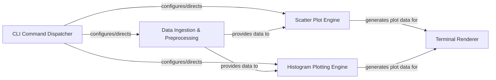

## Details

The `bashplotlib` architecture is designed as a modular pipeline, efficiently processing data from command-line input to terminal-based visualizations. It begins with the CLI Command Dispatcher acting as the orchestrator, interpreting user commands and initiating the appropriate data flow. Data is then ingested and preprocessed by the Data Ingestion & Preprocessing component, ensuring it's in a suitable format. This prepared data is subsequently fed into specialized Plotting Engines (either Scatter Plot or Histogram), which perform the core visualization logic. Finally, the Terminal Renderer translates the generated plot data into ASCII characters, delivering the visual output directly to the command line. This clear separation of concerns facilitates maintainability and provides a straightforward, linear data flow, making it ideal for diagrammatic representation as a series of interconnected processing stages.

### CLI Command Dispatcher
The entry point for the application, responsible for parsing command-line arguments, validating inputs, and directing control flow to the appropriate plotting engine based on user commands.

**Related Classes/Methods**:

- <a href="https://github.com/glamp/bashplotlib/blob/master/bashplotlib/scatterplot.py#L88-L109" target="_blank" rel="noopener noreferrer">`main`:88-109</a>
- <a href="https://github.com/glamp/bashplotlib/blob/master/bashplotlib/scatterplot.py#L88-L109" target="_blank" rel="noopener noreferrer">`main`:88-109</a>

### Data Ingestion & Preprocessing
Handles the reading of raw numerical data from standard input or files. It performs initial data cleaning, parsing, and basic transformations necessary before the data can be processed by the plotting engines.

**Related Classes/Methods**:

- <a href="https://github.com/glamp/bashplotlib/blob/master/bashplotlib/histogram.py#L37-L47" target="_blank" rel="noopener noreferrer">`read_numbers`:37-47</a>

### Scatter Plot Engine
Encapsulates all core logic for generating scatter plot data structures. This includes determining plot scales, mapping data points to terminal coordinates, and preparing the visual representation for rendering.

**Related Classes/Methods**:

- <a href="https://github.com/glamp/bashplotlib/blob/master/bashplotlib/scatterplot.py#L31-L50" target="_blank" rel="noopener noreferrer">`plot_scatter`:31-50</a>
- <a href="https://github.com/glamp/bashplotlib/blob/master/bashplotlib/scatterplot.py#L31-L50" target="_blank" rel="noopener noreferrer">`_plot_scatter`:31-50</a>
- <a href="https://github.com/glamp/bashplotlib/blob/master/bashplotlib/scatterplot.py#L16-L28" target="_blank" rel="noopener noreferrer">`get_scale`:16-28</a>

### Histogram Plotting Engine
Contains the core algorithms for calculating histogram bins and preparing data for histogram visualization. It determines frequency distributions and prepares the data structure for terminal rendering.

**Related Classes/Methods**:

- <a href="https://github.com/glamp/bashplotlib/blob/master/bashplotlib/histogram.py#L20-L34" target="_blank" rel="noopener noreferrer">`calc_bins`:20-34</a>
- <a href="https://github.com/glamp/bashplotlib/blob/master/bashplotlib/histogram.py#L91-L215" target="_blank" rel="noopener noreferrer">`plot_hist`:91-215</a>

### Terminal Renderer
Responsible for converting processed plot data (from either the Scatter Plot or Histogram Engine) into ASCII characters and rendering them to the terminal. This includes applying formatting, colors, and handling the final output display.

**Related Classes/Methods**:

- <a href="https://github.com/glamp/bashplotlib/blob/master/bashplotlib/utils/helpers.py#L81-L88" target="_blank" rel="noopener noreferrer">`box_text`:81-88</a>
- <a href="https://github.com/glamp/bashplotlib/blob/master/bashplotlib/utils/helpers.py#L36-L46" target="_blank" rel="noopener noreferrer">`printcolour`:36-46</a>
- <a href="https://github.com/glamp/bashplotlib/blob/master/bashplotlib/utils/helpers.py#L29-L33" target="_blank" rel="noopener noreferrer">`get_colour`:29-33</a>

### [FAQ](https://github.com/CodeBoarding/GeneratedOnBoardings/tree/main?tab=readme-ov-file#faq)