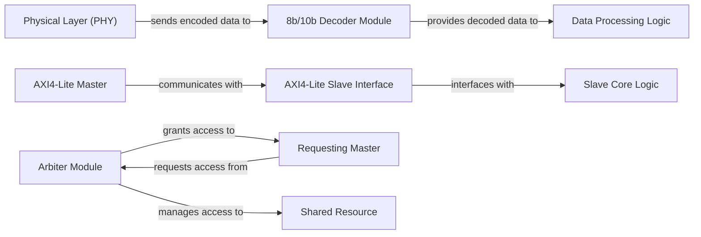

## Details

This hardware subsystem is composed of three core Verilog modules: an Arbiter Module, an 8b/10b Decoder Module, and an AXI4-Lite Slave Interface. The Arbiter Module is central to resource management, mediating Requesting Master access to a Shared Resource by granting exclusive access. Concurrently, the 8b/10b Decoder Module processes high-speed serial data, receiving encoded streams from the Physical Layer (PHY) and delivering decoded information to Data Processing Logic. The AXI4-Lite Slave Interface provides a standard communication bridge, enabling an AXI4-Lite Master to interact with the Slave Core Logic for memory-mapped operations. These components collectively demonstrate fundamental building blocks for robust and efficient hardware designs, facilitating controlled resource sharing, reliable data transmission, and standardized peripheral communication.

### Arbiter Module
Implements a hardware arbiter, a critical component for managing access to shared resources (e.g., memory, peripherals) by multiple requesting modules. It ensures that only one requester is granted access at a time, preventing data corruption or deadlocks. This component is fundamental for robust resource arbitration in hardware designs.

**Related Classes/Methods**:

- `arbiter.v`

### 8b/10b Decoder Module
Provides the decoding logic for the 8b/10b encoding scheme, commonly used in high-speed serial communication links (e.g., Gigabit Ethernet, Fibre Channel). It converts 10-bit encoded symbols back into their original 8-bit data, ensuring DC balance and sufficient transitions for clock recovery. This module is essential for high-speed serial communication interfaces.

**Related Classes/Methods**:

- `decoder_8b10b.v`

### AXI4-Lite Slave Interface
Represents a slave interface for the AXI4-Lite protocol, a lightweight version of ARM's AMBA AXI protocol. This module allows an AXI master (e.g., a processor or DMA controller) to read from and write to registers or memory within the slave component. It is a standard interface for memory-mapped peripherals in System-on-Chip (SoC) designs.

**Related Classes/Methods**:

- `S00_axi_lite.v`

### Requesting Master
Represents any module or entity that requires access to a shared resource, initiating requests to the Arbiter Module.

**Related Classes/Methods**: _None_

### Shared Resource
Represents a hardware resource (e.g., memory block, peripheral) whose access needs to be managed and arbitrated among multiple Requesting Masters.

**Related Classes/Methods**: _None_

### Physical Layer (PHY)
Handles the lowest level of data transmission, including serialization and deserialization of data, and sends encoded data to the 8b/10b Decoder Module.

**Related Classes/Methods**: _None_

### Data Processing Logic
Represents higher-level logic or modules that consume and process the decoded data provided by the 8b/10b Decoder Module.

**Related Classes/Methods**: _None_

### AXI4-Lite Master
Represents a master device (e.g., CPU, DMA controller) that initiates read and write transactions over the AXI4-Lite bus to communicate with slave devices.

**Related Classes/Methods**: _None_

### Slave Core Logic
Represents the internal logic or memory within a slave device that the AXI4-Lite Slave Interface interacts with to fulfill read/write requests from an AXI4-Lite Master.

**Related Classes/Methods**: _None_

### [FAQ](https://github.com/CodeBoarding/GeneratedOnBoardings/tree/main?tab=readme-ov-file#faq)