```mermaid
graph LR
    Board_Top_Level_Modules["Board Top-Level Modules"]
    Memory_Interface_Adapters["Memory Interface Adapters"]
    Peripheral_Interface_Adapters["Peripheral Interface Adapters"]
    Picoblaze_System_Integration["Picoblaze System Integration"]
    Board_Specific_Clock_and_Reset_Distribution["Board-Specific Clock and Reset Distribution"]
    AXI_Wishbone_Bus_Interconnects_Board_Level_["AXI/Wishbone Bus Interconnects (Board-Level)"]
    Board_Top_Level_Modules -- "instantiates" --> Memory_Interface_Adapters
    Board_Top_Level_Modules -- "instantiates" --> Peripheral_Interface_Adapters
    Board_Top_Level_Modules -- "instantiates" --> Picoblaze_System_Integration
    Board_Top_Level_Modules -- "instantiates" --> Board_Specific_Clock_and_Reset_Distribution
    Board_Top_Level_Modules -- "instantiates" --> AXI_Wishbone_Bus_Interconnects_Board_Level_
    Picoblaze_System_Integration -- "accesses" --> Memory_Interface_Adapters
    Memory_Interface_Adapters -- "connects to" --> AXI_Wishbone_Bus_Interconnects_Board_Level_
    Picoblaze_System_Integration -- "accesses" --> Peripheral_Interface_Adapters
    Peripheral_Interface_Adapters -- "connects to" --> AXI_Wishbone_Bus_Interconnects_Board_Level_
    Picoblaze_System_Integration -- "uses" --> AXI_Wishbone_Bus_Interconnects_Board_Level_
    Board_Specific_Clock_and_Reset_Distribution -- "provides clock/reset to" --> Board_Top_Level_Modules
    Board_Specific_Clock_and_Reset_Distribution -- "provides clock/reset to" --> Memory_Interface_Adapters
    Board_Specific_Clock_and_Reset_Distribution -- "provides clock/reset to" --> Peripheral_Interface_Adapters
    Board_Specific_Clock_and_Reset_Distribution -- "provides clock/reset to" --> Picoblaze_System_Integration
    Board_Specific_Clock_and_Reset_Distribution -- "provides clock/reset to" --> AXI_Wishbone_Bus_Interconnects_Board_Level_
    AXI_Wishbone_Bus_Interconnects_Board_Level_ -- "connects" --> Picoblaze_System_Integration
    AXI_Wishbone_Bus_Interconnects_Board_Level_ -- "connects" --> Memory_Interface_Adapters
    AXI_Wishbone_Bus_Interconnects_Board_Level_ -- "connects" --> Peripheral_Interface_Adapters
```

## Details

The basic_verilog project implements a modular FPGA design architecture, centered around Board Top-Level Modules that serve as the integration point for various hardware functionalities. These top-level modules instantiate specialized Memory Interface Adapters for interacting with on-board memory, and Peripheral Interface Adapters for managing external communication via standard protocols like UART, SPI, and Ethernet. A Picoblaze System Integration component handles the embedding of the Picoblaze soft processor, enabling software control over hardware. Board-Specific Clock and Reset Distribution ensures synchronized operation across all modules by providing essential clock and reset signals. Communication between these integrated IP blocks is facilitated by AXI/Wishbone Bus Interconnects (Board-Level), which manage data flow and arbitration. This layered approach allows for flexible and reusable hardware designs tailored to specific FPGA boards.

### Board Top-Level Modules
These are the highest-level Verilog modules that define the complete system for a specific FPGA board. They instantiate all necessary IP cores, memory controllers, peripheral interfaces, and custom logic, and map internal signals to external FPGA pins.

**Related Classes/Methods**:

- `basic_verilog/boards/arty/arty.v`
- `basic_verilog/boards/nexys_video/nexys_video.v`
- `basic_verilog/boards/`

### Memory Interface Adapters
Modules responsible for bridging generic memory controller IP (e.g., from verilog-mem-ctrl) to the specific physical memory devices (e.g., DDR3/DDR4 SDRAM, BRAM) and their interfaces present on a given FPGA board. This includes address decoding and data path width matching.

**Related Classes/Methods**:

- `basic_verilog/boards/`
- `basic_verilog/verilog-mem-ctrl/`

### Peripheral Interface Adapters
Modules that provide the necessary glue logic to connect standard communication IP cores (e.g., UART, SPI, I2C, Ethernet MAC, PCIe) to the physical transceivers and I/O pins of the FPGA board. This often involves clock domain crossing, serialization/deserialization, and electrical level translation.

**Related Classes/Methods**:

- `basic_verilog/boards/`
- `basic_verilog/verilog-uart/`
- `basic_verilog/verilog-spi/`
- `basic_verilog/verilog-i2c/`
- `basic_verilog/verilog-ethernet/`
- `basic_verilog/verilog-pcie/`

### Picoblaze System Integration
Modules specifically designed to integrate the Picoblaze soft processor with the board's memory map, peripherals, and interrupt controllers, providing the necessary bus interfaces and control logic.

**Related Classes/Methods**:

- `basic_verilog/picoblaze/`
- `basic_verilog/boards/`

### Board-Specific Clock and Reset Distribution
Modules that take the board's input clock(s) and generate all necessary derived clocks (e.g., using PLLs/MMCMs) and distribute synchronized reset signals across the entire FPGA design, tailored to the board's specific clock sources and reset mechanisms.

**Related Classes/Methods**:

- `basic_verilog/boards/`
- `basic_verilog/common/`

### AXI/Wishbone Bus Interconnects (Board-Level)
If a bus fabric like AXI or Wishbone is used at the top level to connect multiple IP cores on the board, this component includes the interconnect logic itself, responsible for routing transactions, arbitration, and address decoding.

**Related Classes/Methods**:

- `basic_verilog/verilog-wishbone/`
- `basic_verilog/boards/`

### [FAQ](https://github.com/CodeBoarding/GeneratedOnBoardings/tree/main?tab=readme-ov-file#faq)