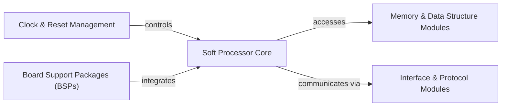

## Details

The subsystem is centered around a Soft Processor Core, which serves as the programmable computational engine. This core interacts directly with Memory & Data Structure Modules for instruction fetching and data manipulation, and with Interface & Protocol Modules to communicate with external peripherals. Clock & Reset Management provides the essential timing and initialization signals for the processor's synchronous operation. Finally, Board Support Packages (BSPs) represent the higher-level integration layer, where the Soft Processor Core is instantiated and configured within a complete system design.

### Soft Processor Core [[Expand]](./Soft_Processor_Core.md)
The central programmable element, capable of executing instructions and orchestrating complex operations. This is the core of the subsystem, directly aligning with the "Soft Processor Cores" architectural pattern.

**Related Classes/Methods**:

- `PACOBLAZE`

### Memory & Data Structure Modules
Modules responsible for instruction and data storage, essential for the processor's operation. This includes both program memory and data storage like stacks and scratchpads.

**Related Classes/Methods**:

- `pacoblaze_stack`
- `pacoblaze_scratch`

### Interface & Protocol Modules [[Expand]](./Interface_Protocol_Modules.md)
Modules for communication with peripherals and the external world, enabling the processor to interact with its environment through defined input/output ports.

**Related Classes/Methods**:

- `PACOBLAZE`

### Clock & Reset Management
Modules for operational timing and initialization, providing the fundamental clock signals and reset mechanisms required for synchronous digital logic.

**Related Classes/Methods**:

- `PACOBLAZE`

### Board Support Packages (BSPs)
Higher-level designs or Top-level Designs that integrate the Soft Processor Core as the primary computational engine, often including specific board-level configurations. These packages provide the necessary context for the processor to operate within a larger hardware system.

**Related Classes/Methods**: _None_

### [FAQ](https://github.com/CodeBoarding/GeneratedOnBoardings/tree/main?tab=readme-ov-file#faq)