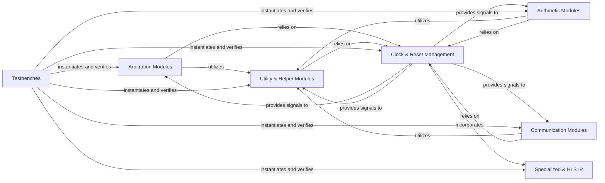

## Details

The `basic_verilog` project is structured around a collection of hardware design modules, primarily implemented in Verilog, intended for synthesis onto FPGAs or ASICs. The core functionality is segmented into distinct components: `Arbitration Modules` manage shared resource access, `Arithmetic Modules` perform optimized mathematical operations, and `Communication Modules` handle data encoding and decoding for inter-module data exchange. These functional blocks are underpinned by a `Clock & Reset Management` component, which provides essential timing and initialization signals, ensuring synchronous operation across the design. `Utility & Helper Modules` offer reusable logic blocks that support the primary components, enhancing design efficiency. `Specialized & HLS IP` represents highly optimized or automatically generated intellectual property, often leveraging vendor-specific features for performance gains. Finally, `Testbenches` are integral for verifying the functional correctness of all designed IP blocks, simulating their behavior and validating outputs. The architecture emphasizes modularity and reusability, with clear dependencies on clock and reset signals, and a robust testing framework.

### Arbitration Modules
Manage access to shared resources, prioritize requests, and ensure fair allocation among multiple requesters. These modules are critical for resource contention resolution in multi-master or multi-channel systems.

**Related Classes/Methods**:

- `Advanced Synthesis Cookbook/arbitration/arbiter.v`
- `Advanced Synthesis Cookbook/arbitration/tx_4channel_arbiter.v`
- `Advanced Synthesis Cookbook/arbitration/prio_encode.v`

### Arithmetic Modules
Implement fundamental mathematical operations as dedicated hardware blocks. These modules provide optimized solutions for common arithmetic computations, crucial for DSP, control, or data processing applications.

**Related Classes/Methods**:

- `Advanced Synthesis Cookbook/arithmetic/adder_tree.v`
- `Advanced Synthesis Cookbook/arithmetic/cordic.v`
- `Advanced Synthesis Cookbook/arithmetic/divider.v`
- `Advanced Synthesis Cookbook/arithmetic/karatsuba_mult.v`
- `Advanced Synthesis Cookbook/arithmetic/mult_shift.v`

### Communication Modules
Handle data encoding, decoding, and protocol-specific logic for inter-module or inter-chip communication. These modules ensure reliable and standardized data exchange within or between hardware systems.

**Related Classes/Methods**:

- `Advanced Synthesis Cookbook/communication/decoder_8b10b.v`

### Clock & Reset Management
Manages clock signals, generates reset signals, and handles clock domain crossings to ensure synchronous operation and proper system initialization. This component is foundational for the stability and correctness of any sequential logic.

**Related Classes/Methods**:

- `Advanced Synthesis Cookbook/synchronization/synchronizer.v`

### Utility & Helper Modules
Provide common, often parameterized, functions or small reusable logic blocks that support the functionality of other core modules. These modules enhance reusability and simplify the design of more complex IP.

**Related Classes/Methods**:

- `Advanced Synthesis Cookbook/arbitration/bitscan.v`
- `Advanced Synthesis Cookbook/arbitration/log2.inc`

### Specialized & HLS IP [[Expand]](./Specialized_HLS_IP.md)
Pre-designed, optimized, or automatically generated IP blocks, often specific to FPGA vendors or derived from High-Level Synthesis tools. These modules typically offer performance or resource advantages due to their specialized implementation.

**Related Classes/Methods**:

- `Advanced Synthesis Cookbook/synchronization/synchronizer.v`

### Testbenches [[Expand]](./Testbenches.md)
Stimulate and verify the functional correctness of the design under test (DUT) by applying input patterns and checking expected outputs. Testbenches are essential for validating the behavior and robustness of all IP blocks.

**Related Classes/Methods**:

- `Advanced Synthesis Cookbook/arbitration/arbiter_tb.v`
- `Advanced Synthesis Cookbook/arithmetic/cordic_tb.v`

### [FAQ](https://github.com/CodeBoarding/GeneratedOnBoardings/tree/main?tab=readme-ov-file#faq)