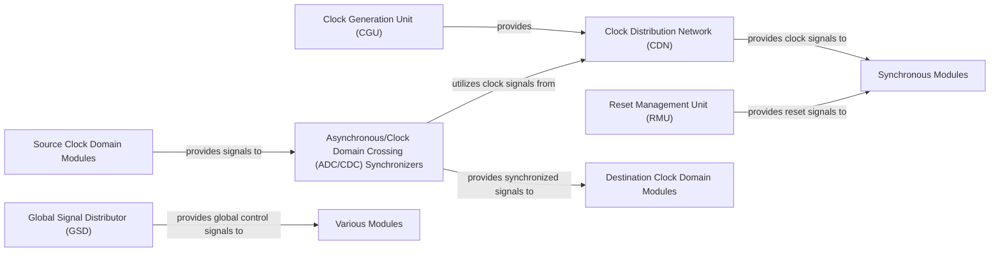

## Details

The core of this hardware subsystem revolves around precise clock and reset management, along with the distribution of critical global signals. The Clock Generation Unit (CGU) is responsible for synthesizing and generating all necessary clock signals, which are then efficiently distributed throughout the design by the Clock Distribution Network (CDN) to various Synchronous Modules. Concurrently, the Reset Management Unit (RMU) ensures a controlled system startup and state initialization by providing synchronized reset signals to these same synchronous modules. Beyond clocks and resets, the Global Signal Distributor (GSD) handles the broad dissemination of other essential control signals, such as enables and interrupts, to various Various Modules. For robust communication between different clock domains, the Asynchronous/Clock Domain Crossing (ADC/CDC) Synchronizers act as crucial intermediaries, safely transferring signals from Source Clock Domain Modules to Destination Clock Domain Modules, leveraging the distributed clock signals from the CDN to prevent metastability issues. This structured approach ensures reliable and synchronized operation across the entire hardware design.

### Clock Generation Unit (CGU)
Responsible for generating primary and derived clock signals from a reference clock. This includes functionalities like PLLs (Phase-Locked Loops) or DCMs (Digital Clock Managers) for frequency synthesis, clock multiplication/division, and phase shifting.

**Related Classes/Methods**:

- `example_projects/gowin_fmax_test_prj_template_v1/ip/sys_pll/sys_pll.v`
- `example_projects/quartus_test_prj_template_v4/ip/sys_pll/sys_pll.v`

### Clock Distribution Network (CDN)
Manages the low-skew, high-fanout distribution of clock signals from the CGU to various synchronous components throughout the design. This typically involves specialized clock buffers and global clock nets to ensure timing integrity.

**Related Classes/Methods**:

- `Advanced Synthesis Cookbook/synchronization/clock_mux.v`

### Reset Management Unit (RMU)
Generates and synchronizes system-wide reset signals (e.g., power-on reset, software reset, external reset). It ensures proper reset sequencing and synchronous de-assertion for all modules, bringing the system to a known initial state.

**Related Classes/Methods**:

- `Advanced Synthesis Cookbook/synchronization/reset_control.v`
- `example_projects/quartus_test_prj_template_v4/ip/jtag_io/synthesis/submodules/altera_reset_synchronizer.v`
- `example_projects/quartus_test_prj_template_v4/ip/jtag_io/synthesis/submodules/altera_reset_controller.v`

### Global Signal Distributor (GSD)
Handles the centralized distribution of other critical global control signals beyond clocks and resets, such as global enables, interrupts, or configuration signals, to various modules across the design.

**Related Classes/Methods**:

- `Advanced Synthesis Cookbook/arbitration/arbiter.v`

### Asynchronous/Clock Domain Crossing (ADC/CDC) Synchronizers
Provides robust mechanisms (e.g., double flip-flop synchronizers, asynchronous FIFOs) to safely transfer signals between different clock domains or asynchronous logic, preventing metastability and ensuring data integrity.

**Related Classes/Methods**:

- `Advanced Synthesis Cookbook/synchronization/synchronizer.v`
- `Advanced Synthesis Cookbook/debug/clock_crossing_fifo.v`
- `example_projects/quartus_test_prj_template_v4/ip/jtag_io/synthesis/submodules/altera_avalon_st_clock_crosser.v`

### Synchronous Modules
Represents various synchronous components throughout the design that receive clock and reset signals.

**Related Classes/Methods**: _None_

### Various Modules
Represents various modules throughout the design that receive global control signals.

**Related Classes/Methods**: _None_

### Source Clock Domain Modules
Represents modules in a source clock domain that send signals across clock domains.

**Related Classes/Methods**: _None_

### Destination Clock Domain Modules
Represents modules in a destination clock domain that receive signals from across clock domains.

**Related Classes/Methods**: _None_

### [FAQ](https://github.com/CodeBoarding/GeneratedOnBoardings/tree/main?tab=readme-ov-file#faq)