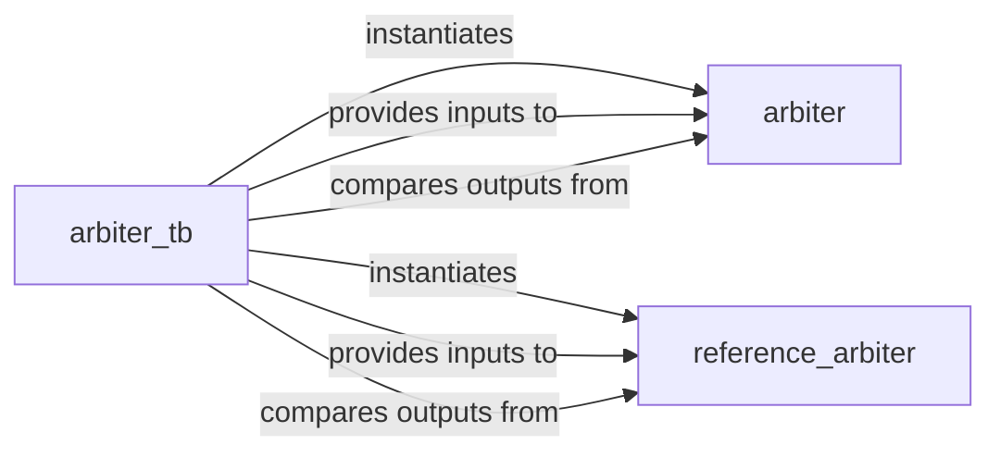

## Details

The arbitration subsystem is designed for verifying the functional correctness of an `arbiter` hardware design. The `arbiter_tb` module serves as the central testbench, responsible for generating stimuli and orchestrating the verification flow. It instantiates both the `arbiter` (Device Under Test) and a `reference_arbiter` (golden model). The `reference_arbiter` provides a known-good behavioral implementation for comparison. During simulation, `arbiter_tb` applies the same inputs to both the `arbiter` and `reference_arbiter`, then compares their outputs to detect any mismatches, ensuring the `arbiter` design functions as expected.

### arbiter_tb
This is the top-level verification component. It orchestrates the entire simulation process by instantiating the `arbiter` (Device Under Test - DUT) and the `reference_arbiter` (golden model). Its responsibilities include generating input stimuli, applying them to both the DUT and the reference model, and comparing their outputs to detect any functional discrepancies. It serves as the primary driver for functional verification.

**Related Classes/Methods**:

- `arbiter_tb`

### reference_arbiter
A simplified, behavioral, and functionally correct implementation of the arbiter logic. It acts as a "golden reference" against which the behavior of the actual `arbiter` DUT is compared during simulation. This model is typically optimized for clarity and correctness rather than synthesis efficiency.

**Related Classes/Methods**:

- `reference_arbiter`

### arbiter
This component represents the actual hardware design (IP core) whose functionality is being verified. It is the target of the testbench and its behavior is validated against the `reference_arbiter`. While not strictly part of the testbench itself, it is the essential component being tested within this subsystem's context.

**Related Classes/Methods**: _None_

### [FAQ](https://github.com/CodeBoarding/GeneratedOnBoardings/tree/main?tab=readme-ov-file#faq)