```mermaid
graph LR
    Core_Logic_Modules["Core Logic Modules"]
    Interface_Protocol_Modules["Interface & Protocol Modules"]
    Memory_Data_Path_Modules["Memory & Data Path Modules"]
    System_Infrastructure["System Infrastructure"]
    Soft_Processor_Core["Soft Processor Core"]
    Specialized_HLS_IP["Specialized & HLS IP"]
    Platform_Integration["Platform Integration"]
    Verification_Testbenches["Verification & Testbenches"]
    Soft_Processor_Core -- "Accesses" --> Memory_Data_Path_Modules
    Soft_Processor_Core -- "Communicates via" --> Interface_Protocol_Modules
    Core_Logic_Modules -- "Processes Data from/to" --> Interface_Protocol_Modules
    Core_Logic_Modules -- "Stores/Retrieves Data from" --> Memory_Data_Path_Modules
    Interface_Protocol_Modules -- "Buffers Data in" --> Memory_Data_Path_Modules
    Interface_Protocol_Modules -- "Exchanges Data with" --> Specialized_HLS_IP
    Memory_Data_Path_Modules -- "Accessed by" --> Specialized_HLS_IP
    Specialized_HLS_IP -- "Integrates with" --> Core_Logic_Modules
    System_Infrastructure -- "Enables" --> Core_Logic_Modules
    System_Infrastructure -- "Enables" --> Interface_Protocol_Modules
    System_Infrastructure -- "Enables" --> Memory_Data_Path_Modules
    System_Infrastructure -- "Enables" --> Soft_Processor_Core
    System_Infrastructure -- "Enables" --> Specialized_HLS_IP
    System_Infrastructure -- "Enables" --> Platform_Integration
    System_Infrastructure -- "Enables" --> Verification_Testbenches
    Platform_Integration -- "Connects" --> Core_Logic_Modules
    Platform_Integration -- "Connects" --> Interface_Protocol_Modules
    Platform_Integration -- "Connects" --> Memory_Data_Path_Modules
    Platform_Integration -- "Connects" --> Soft_Processor_Core
    Platform_Integration -- "Connects" --> Specialized_HLS_IP
    Platform_Integration -- "Connects" --> System_Infrastructure
    Verification_Testbenches -- "Tests" --> Core_Logic_Modules
    Verification_Testbenches -- "Tests" --> Interface_Protocol_Modules
    Verification_Testbenches -- "Tests" --> Memory_Data_Path_Modules
    Verification_Testbenches -- "Tests" --> Soft_Processor_Core
    Verification_Testbenches -- "Tests" --> Specialized_HLS_IP
    Verification_Testbenches -- "Tests" --> Platform_Integration
    Verification_Testbenches -- "Tests" --> System_Infrastructure
    click Interface_Protocol_Modules href "https://github.com/CodeBoarding/GeneratedOnBoardings/blob/main/basic_verilog/Interface_Protocol_Modules.md" "Details"
    click System_Infrastructure href "https://github.com/CodeBoarding/GeneratedOnBoardings/blob/main/basic_verilog/System_Infrastructure.md" "Details"
    click Soft_Processor_Core href "https://github.com/CodeBoarding/GeneratedOnBoardings/blob/main/basic_verilog/Soft_Processor_Core.md" "Details"
    click Specialized_HLS_IP href "https://github.com/CodeBoarding/GeneratedOnBoardings/blob/main/basic_verilog/Specialized_HLS_IP.md" "Details"
    click Platform_Integration href "https://github.com/CodeBoarding/GeneratedOnBoardings/blob/main/basic_verilog/Platform_Integration.md" "Details"
    click Verification_Testbenches href "https://github.com/CodeBoarding/GeneratedOnBoardings/blob/main/basic_verilog/Verification_Testbenches.md" "Details"
```

## Details

The project's architecture is structured around several key hardware description language (HDL) components, primarily focusing on digital logic design for FPGA implementation. The core of the system involves fundamental logic operations, communication interfaces, and data handling, all synchronized and supported by a central infrastructure. Specialized IP blocks and a soft processor enhance functionality, while platform integration modules ensure the design can be deployed on target hardware. Comprehensive verification components are in place to ensure the correctness of the design.

### Core Logic Modules
Fundamental building blocks for digital systems, including arithmetic operations and basic sequential/combinational logic.

**Related Classes/Methods**:

- `adder_tree.v`
- `cntr.v`

### Interface & Protocol Modules [[Expand]](./Interface_Protocol_Modules.md)
Handles communication between different modules or external interfaces, including arbitration for shared resources.

**Related Classes/Methods**:

- `arbiter.v`
- `decoder_8b10b.v`
- `S00_axi_lite.v`

### Memory & Data Path Modules
Provides various data storage and buffering capabilities essential for data path management.

**Related Classes/Methods**:

- `fifo.v`

### System Infrastructure [[Expand]](./System_Infrastructure.md)
Manages global system signals critical for synchronous operation and system stability.

**Related Classes/Methods**: _None_

### Soft Processor Core [[Expand]](./Soft_Processor_Core.md)
The central programmable element, capable of executing instructions and orchestrating complex operations.

**Related Classes/Methods**:

- `pacoblaze.v`

### Specialized & HLS IP [[Expand]](./Specialized_HLS_IP.md)
Pre-designed, optimized, or automatically generated IP blocks, often specific to FPGA vendors or derived from High-Level Synthesis tools.

**Related Classes/Methods**:

- `synchronizer.v`

### Platform Integration [[Expand]](./Platform_Integration.md)
Top-level modules and glue logic responsible for interfacing the designed IP with specific FPGA boards and platforms.

**Related Classes/Methods**: _None_

### Verification & Testbenches [[Expand]](./Verification_Testbenches.md)
Modules dedicated to functional verification and simulation of the design components.

**Related Classes/Methods**:

- `arbiter_tb.v`

### [FAQ](https://github.com/CodeBoarding/GeneratedOnBoardings/tree/main?tab=readme-ov-file#faq)