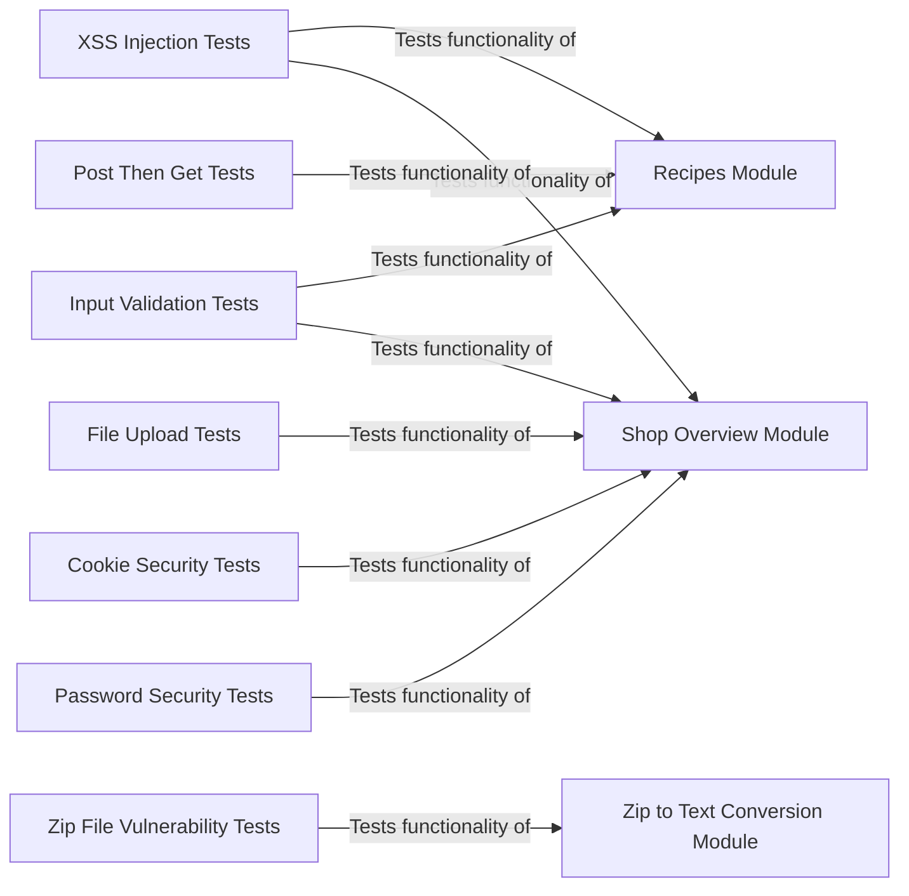

## Component Details

The Content Handling and Processing subsystem is responsible for securely managing user-generated content within the application. It encompasses modules for handling recipes, shop overviews, and zip file conversions, each with built-in security measures to prevent vulnerabilities like XSS injection, path traversal, and zip bomb attacks. The system includes functional and security tests to ensure that content is processed correctly and does not pose a threat to the application or its users.

### Recipes Module
This module manages recipe-related functionalities, including uploading, rating, and commenting on recipes. It incorporates security tests to prevent XSS injection and rating manipulation, ensuring that user-submitted recipe content is safe and does not compromise the application's security.
- **Related Classes/Methods**: `src.scenarios.recipes`

### Shop Overview Module
This module handles the shop overview functionality, covering aspects like user authentication, file uploads, cookie handling, and password security. It includes both functional and security tests to ensure that the shop overview features are secure and function as expected, protecting user data and preventing unauthorized access.
- **Related Classes/Methods**: `src.scenarios.shop_overview`

### Zip to Text Conversion Module
This module is responsible for converting zip files to text, with a strong focus on security aspects like path traversal and zip bomb attacks. It includes functional tests for conversion and security tests for various vulnerabilities, ensuring that zip files are processed safely and do not pose a threat to the application's resources or data.
- **Related Classes/Methods**: `src.scenarios.zip_to_txt`

### XSS Injection Tests
This component tests for XSS vulnerabilities by injecting XSS vectors into various user input fields, such as recipe titles, ingredients, instructions, and shop ware names and descriptions. It interacts with the Recipes and Shop Overview Modules to upload and retrieve content, checking for the presence of XSS vectors in the overview and details.
- **Related Classes/Methods**: `src.scenarios.recipes:sec_xss_injection_recipe`, `src.scenarios.recipes:sec_xss_recipe_comments`, `src.scenarios.shop_overview:sec_test_xss_injection`

### Input Validation Tests
This component tests for improper input validation by attempting to submit invalid data, such as zero or negative ratings for recipes. It interacts with the Recipes Module to post ratings and retrieve recipe details, checking if the invalid ratings are accepted. It also includes tests for valid and invalid logins.
- **Related Classes/Methods**: `src.scenarios.recipes:sec_zero_neg_rating`, `src.scenarios.shop_overview:func_test_valid_and_invalid_logins`

### File Upload Tests
This component tests the file upload functionality by uploading valid wares for merchants. It interacts with the Shop Overview Module to register merchants, log them in, and then upload wares, verifying that the wares are displayed correctly.
- **Related Classes/Methods**: `src.scenarios.shop_overview:func_test_valid_upload`

### Cookie Security Tests
This component tests if the server returns the same cookies for two users with the same password, which would indicate an incorrect authorization. It interacts with the Shop Overview Module to register two merchants with the same password and then log them in, comparing the cookies to ensure they are different.
- **Related Classes/Methods**: `src.scenarios.shop_overview:sec_test_same_cookies`

### Password Security Tests
This component tests the password security by checking if passwords are stored securely in the database. It interacts with the Shop Overview Module to register merchants and then checks the database to see if the passwords are stored in plain text.
- **Related Classes/Methods**: `src.scenarios.shop_overview:sec_test_password_security`

### Zip File Vulnerability Tests
This component tests for path traversal and zip bomb vulnerabilities by creating malicious zip files that attempt to access sensitive files or exhaust server resources. It interacts with the Zip to Text Conversion Module to send the zip files and then checks if the secret file is accessed or if server resources are exhausted.
- **Related Classes/Methods**: `src.scenarios.zip_to_txt:sec_test_path_traversal`, `src.scenarios.zip_to_txt:sec_test_zip_bomb`, `src.scenarios.zip_to_txt:sec_test_nested_zip_bomb`

### Post Then Get Tests
This component tests the basic functionality of posting recipes and then retrieving them to ensure the data is stored and displayed correctly. It interacts with the Recipes Module to upload recipes, add comments and ratings, and then retrieves the overview and individual recipe details to verify the content.
- **Related Classes/Methods**: `src.scenarios.recipes:func_test_post_then_get`
