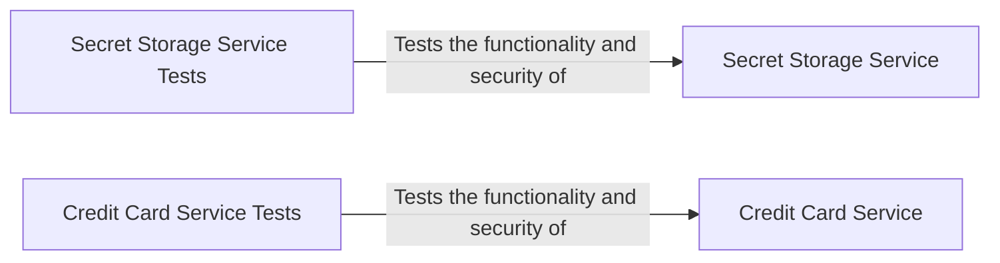

## Component Details

The Data Security and Integrity subsystem focuses on safeguarding sensitive data, including user secrets and credit card information, from unauthorized access, modification, or deletion. It encompasses components for secure storage, retrieval, and processing of this data, along with rigorous testing to identify and mitigate potential vulnerabilities like SQL injection and data breaches. The subsystem ensures the confidentiality and integrity of stored information through robust security measures and validation processes.

### Secret Storage Service
This component is responsible for securely storing and managing user secrets. It provides functionalities for user authentication, secret creation, retrieval, and deletion. It interacts with a database to persist secrets and implements security measures to protect against unauthorized access, ensuring the confidentiality of user credentials and other sensitive information.
- **Related Classes/Methods**: `src.scenarios.secret_storage`

### Credit Card Service
This component handles the secure management of credit card information. It provides functionalities for storing, retrieving, and processing credit card details. It interacts with a database to persist credit card data and implements security measures to protect against unauthorized access and data breaches, ensuring the integrity and confidentiality of financial information.
- **Related Classes/Methods**: `src.scenarios.credit_card_service`

### Secret Storage Service Tests
This component contains functional and security tests for the Secret Storage Service. These tests cover user login and secret management, unauthorized access attempts, weak password usage, and SQL injection vulnerabilities. The tests aim to ensure the service's reliability and security by identifying and addressing potential weaknesses.
- **Related Classes/Methods**: `src.scenarios.secret_storage:func_test_logins_and_own_secret_management`, `src.scenarios.secret_storage:sec_test_other_users_secrets`, `src.scenarios.secret_storage:sec_test_same_passwords`, `src.scenarios.secret_storage:sec_test_sql_injection_or_sensitive_data_exposure`, `src.scenarios.secret_storage:sec_test_password_security`

### Credit Card Service Tests
This component includes functional and security tests for the Credit Card Service. These tests cover SQL injection vulnerabilities, unauthorized access to credit card data, and potential leakage of credit card information. The tests are designed to validate the service's security measures and ensure the protection of sensitive financial data.
- **Related Classes/Methods**: `src.scenarios.credit_card_service:func_test_operation`, `src.scenarios.credit_card_service:sec_test_returns_cards_no_access`, `src.scenarios.credit_card_service:sec_test_leak_other_credit_card_with_overlapping_phone_number`, `src.scenarios.credit_card_service:sec_test_sql_injection_services`
