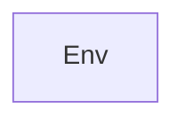

## Details

The `baxbench` project's environment management subsystem is fundamentally centered around the `Env` component. This component provides a comprehensive abstraction for defining, configuring, and orchestrating isolated execution environments. It integrates the responsibilities of dynamically building Docker images, instantiating and managing Docker containers, and continuously monitoring the health and status of processes running within these containers. This consolidated approach ensures a streamlined and robust lifecycle management for various programming language and framework environments, making `Env` the sole high-level architectural component for this subsystem.

### Env
This is the central component, acting as the core abstraction for defining, configuring, building, and running isolated execution environments. It encapsulates all necessary parameters for the environment's lifecycle, from dynamic Docker image construction to container execution and internal process monitoring.

**Related Classes/Methods**:

- <a href="https://github.com/logic-star-ai/baxbench/blob/main/src/env/base.py" target="_blank" rel="noopener noreferrer">`baxbench.env.base.Env`</a>

### [FAQ](https://github.com/CodeBoarding/GeneratedOnBoardings/tree/main?tab=readme-ov-file#faq)