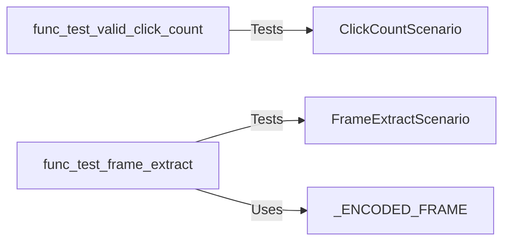

## Component Details

The Functional Testing and Utilities component focuses on providing specific functionalities like click counting and frame extraction, along with the necessary testing and validation mechanisms to ensure these features operate correctly. It encompasses scenarios for simulating user interactions (clicks) and processing video frames, and includes tests to verify the accuracy and reliability of these operations. The component serves as a utility for applications requiring these specific functionalities, offering a structured and tested approach to their implementation.

### ClickCountScenario
Represents the click count scenario, which involves simulating user clicks and recording the counts. It provides the environment and methods for testing click counting functionality.
- **Related Classes/Methods**: `src.scenarios.click_count`

### FrameExtractScenario
Represents the frame extraction scenario, which involves extracting frames from a video or frame sequence. It provides the environment and methods for testing frame extraction functionality.
- **Related Classes/Methods**: `src.scenarios.frame_extract`

### func_test_valid_click_count
Tests the validation of click counts within the `click_count` scenario. It sets up a scenario, simulates user clicks, and verifies that the recorded click counts meet expected criteria.
- **Related Classes/Methods**: `src.scenarios.click_count:func_test_valid_click_count`

### func_test_frame_extract
Tests the frame extraction functionality within the `frame_extract` scenario. This involves providing a video or frame sequence as input, running the frame extraction process, and verifying that the extracted frames are correct based on predefined criteria.
- **Related Classes/Methods**: `src.scenarios.frame_extract:func_test_frame_extract`

### _ENCODED_FRAME
Represents a constant, likely a string or byte sequence, that holds an encoded frame used in the `frame_extract` scenario. This could be a sample frame used for testing the frame extraction process.
- **Related Classes/Methods**: `src.scenarios.frame_extract:_ENCODED_FRAME`
