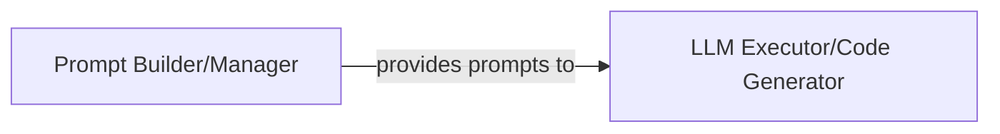

## Details

The core of this subsystem revolves around the Prompt Builder/Manager and the LLM Executor/Code Generator. The Prompt Builder/Manager acts as the initial processing unit, meticulously crafting and managing prompts by incorporating dynamic context and ensuring proper formatting. These prepared prompts are then passed to the LLM Executor/Code Generator, which serves as the orchestrator for interacting with external Large Language Model services. It handles the communication, sends the prompts, processes the responses, and ultimately saves the generated code. This clear separation of concerns ensures efficient prompt preparation and robust interaction with external LLM capabilities, forming a streamlined pipeline for code generation.

### Prompt Builder/Manager
This component is responsible for constructing and managing prompts for various LLM tasks. It defines templates, injects dynamic context, and ensures proper formatting before prompts are sent to LLMs. Its architectural importance lies in abstracting prompt complexity and ensuring consistency across different LLM interactions.

**Related Classes/Methods**:

- <a href="https://github.com/logic-star-ai/baxbench/blob/main/src/prompts.py" target="_blank" rel="noopener noreferrer">`src.prompts`</a>

### LLM Executor/Code Generator
This component handles the actual execution of LLM calls. It manages communication with external LLM services, sends prepared prompts, parses the responses received from the LLMs, and saves the generated code. Its architectural importance is in orchestrating the direct interaction with external LLM services and producing the core output (generated code) of this subsystem.

**Related Classes/Methods**:

- <a href="https://github.com/logic-star-ai/baxbench/blob/main/src/tasks.py" target="_blank" rel="noopener noreferrer">`src.tasks`</a>

### [FAQ](https://github.com/CodeBoarding/GeneratedOnBoardings/tree/main?tab=readme-ov-file#faq)