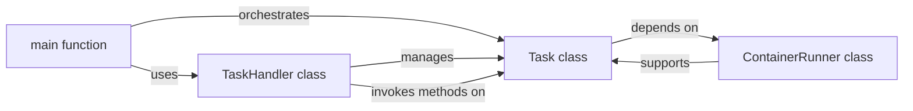

## Details

Analysis of the Orchestration & Task Management subsystem, focusing on its central components and their interactions.

### main function
The central orchestrator of the entire benchmarking process. It parses command-line arguments, selects and filters environments and scenarios, creates a list of Task objects, and invokes the appropriate TaskHandler method based on the chosen mode (generate, test, evaluate). It manages overall flow control and result display.

**Related Classes/Methods**:

- <a href="https://github.com/logic-star-ai/baxbench/blob/main/src/main.py#L38-L101" target="_blank" rel="noopener noreferrer">`main`:38-101</a>

### Task class
Defines a single benchmarking task, encapsulating its associated environment, scenario, model, and parameters. It provides methods for generating code samples, saving/loading results, and testing generated code by interacting with the ContainerRunner.

**Related Classes/Methods**:

- <a href="https://github.com/logic-star-ai/baxbench/blob/main/src/tasks.py" target="_blank" rel="noopener noreferrer">`Task`</a>

### TaskHandler class
Manages the execution of a collection of Task objects. It coordinates their execution, potentially in parallel, and handles overall progress tracking for the benchmarking run.

**Related Classes/Methods**:

- <a href="https://github.com/logic-star-ai/baxbench/blob/main/src/tasks.py#L626-L716" target="_blank" rel="noopener noreferrer">`TaskHandler`:626-716</a>

### ContainerRunner class
Manages the lifecycle of Docker containers essential for running tests within an environment. It handles port allocation, container startup, logging, and cleanup, providing the execution environment for tasks.

**Related Classes/Methods**:

- <a href="https://github.com/logic-star-ai/baxbench/blob/main/src/tasks.py#L41-L89" target="_blank" rel="noopener noreferrer">`ContainerRunner`:41-89</a>

### [FAQ](https://github.com/CodeBoarding/GeneratedOnBoardings/tree/main?tab=readme-ov-file#faq)