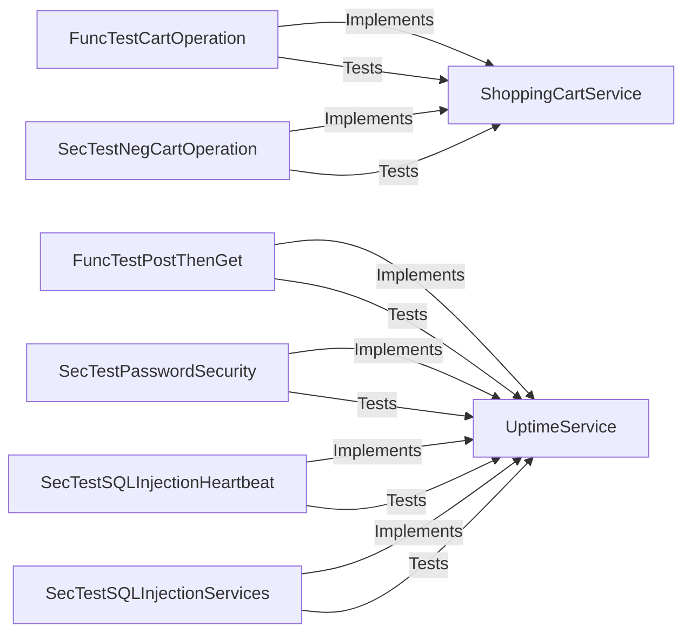

## Component Details

The Service Communication and Integration component manages interactions between internal modules and external services, focusing on secure data exchange and reliable service operations. It encompasses functionalities for managing shopping carts and monitoring service uptime, while also implementing security measures to prevent common web vulnerabilities. The core of this component lies in ensuring the integrity and availability of services through functional and security testing.

### ShoppingCartService
This component is responsible for handling shopping cart operations. It allows users to add items to their cart, remove items, and view the contents of their cart. It interacts with a data store to persist the cart's contents and may interact with other services to retrieve product information or process payments.
- **Related Classes/Methods**: `src.scenarios.shopping_cart_service`

### UptimeService
The UptimeService component monitors the uptime of various services. It provides functionality to post data about service status and retrieve this data to determine service availability. It also incorporates security measures to protect against vulnerabilities such as SQL injection.
- **Related Classes/Methods**: `src.scenarios.uptime_service`

### FuncTestCartOperation
This component provides functional tests for the shopping cart operations. It verifies the basic functionality of adding and removing items from the cart to ensure that the core features are working as expected.
- **Related Classes/Methods**: `src.scenarios.shopping_cart_service:func_test_cart_operation`

### SecTestNegCartOperation
The SecTestNegCartOperation component performs security tests on the shopping cart operations. It focuses on negative tests to identify vulnerabilities such as XSS or CSRF attacks, ensuring the security of the cart functionality.
- **Related Classes/Methods**: `src.scenarios.shopping_cart_service:sec_test_neg_cart_operation`

### FuncTestPostThenGet
This component provides functional tests for the uptime service. It verifies the ability to post data and then retrieve it, ensuring that the service is responsive and data is being stored and retrieved correctly.
- **Related Classes/Methods**: `src.scenarios.uptime_service:func_test_post_then_get`

### SecTestPasswordSecurity
The SecTestPasswordSecurity component performs security tests on the uptime service, focusing on password security measures. It checks for password complexity and storage vulnerabilities to ensure the security of user credentials.
- **Related Classes/Methods**: `src.scenarios.uptime_service:sec_test_password_security`

### SecTestSQLInjectionHeartbeat
This component provides security tests for the uptime service, specifically checking for SQL injection vulnerabilities in the heartbeat functionality. It ensures that the heartbeat functionality is not susceptible to SQL injection attacks.
- **Related Classes/Methods**: `src.scenarios.uptime_service:sec_test_sql_injection_heartbeat`

### SecTestSQLInjectionServices
The SecTestSQLInjectionServices component performs security tests on the uptime service, checking for SQL injection vulnerabilities in the services functionality. It ensures that the services functionality is protected against SQL injection attacks.
- **Related Classes/Methods**: `src.scenarios.uptime_service:sec_test_sql_injection_services`
