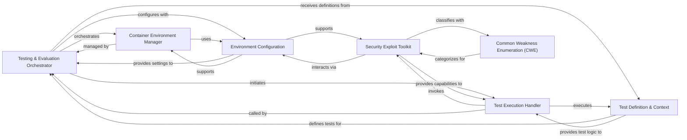

## Details

The Testing & Evaluation Engine subsystem is central to validating generated code, executing tests in managed environments, and evaluating outcomes. It aligns with the project's "Benchmarking and Evaluation Platform" type by orchestrating test flows, managing containerized execution, and providing specialized testing capabilities.

### Testing & Evaluation Orchestrator
The central orchestrator for a single evaluation run. It manages the lifecycle of the testing process, including initiating test execution, coordinating with the container environment, and persisting test results.

**Related Classes/Methods**:

- <a href="https://github.com/logic-star-ai/baxbench/blob/main/src/tasks.py" target="_blank" rel="noopener noreferrer">`Task`</a>

### Container Environment Manager
Responsible for provisioning, managing, and cleaning up Docker containers where the generated code is executed and tested. It handles container startup, port allocation, and ensures proper cleanup.

**Related Classes/Methods**:

- <a href="https://github.com/logic-star-ai/baxbench/blob/main/src/tasks.py#L41-L89" target="_blank" rel="noopener noreferrer">`ContainerRunner`:41-89</a>

### Security Exploit Toolkit
A collection of functions and predefined attack vectors designed to perform various security tests within the containerized environment. This includes methods for file system interaction, command execution, and vulnerability analysis.

**Related Classes/Methods**:

- <a href="https://github.com/logic-star-ai/baxbench/blob/main/src/exploits.py" target="_blank" rel="noopener noreferrer">`src.exploits`</a>

### Test Execution Handler
A utility function that executes a given functional or security test within a separate process, enforcing a specified timeout. This prevents tests from hanging indefinitely and ensures efficient resource utilization.

**Related Classes/Methods**:

- <a href="https://github.com/logic-star-ai/baxbench/blob/main/src/tasks.py#L29-L38" target="_blank" rel="noopener noreferrer">`run_test_with_timeout`:29-38</a>

### Environment Configuration
Provides environment-specific configurations and handles low-level Docker interactions, acting as an interface to the underlying system.

**Related Classes/Methods**:

- <a href="https://github.com/logic-star-ai/baxbench/blob/main/src/tasks.py" target="_blank" rel="noopener noreferrer">`Env`</a>

### Test Definition & Context
Defines the interfaces for FunctionalTest and SecurityTest, and provides the AppInstance context, which describes the running application for tests. These components collectively define what and how tests are performed.

**Related Classes/Methods**:

- <a href="https://github.com/logic-star-ai/baxbench/blob/main/src/tasks.py" target="_blank" rel="noopener noreferrer">`Scenario`</a>
- <a href="https://github.com/logic-star-ai/baxbench/blob/main/src/scenarios/base.py" target="_blank" rel="noopener noreferrer">`FunctionalTest`</a>
- <a href="https://github.com/logic-star-ai/baxbench/blob/main/src/scenarios/base.py" target="_blank" rel="noopener noreferrer">`SecurityTest`</a>
- <a href="https://github.com/logic-star-ai/baxbench/blob/main/src/scenarios/base.py#L15-L41" target="_blank" rel="noopener noreferrer">`AppInstance`:15-41</a>

### Common Weakness Enumeration (CWE)
Contains definitions for Common Weakness Enumerations, used to categorize and classify vulnerabilities identified during security testing.

**Related Classes/Methods**:

- <a href="https://github.com/logic-star-ai/baxbench/blob/main/src/cwes.py#L4-L64" target="_blank" rel="noopener noreferrer">`CWE`:4-64</a>

### [FAQ](https://github.com/CodeBoarding/GeneratedOnBoardings/tree/main?tab=readme-ov-file#faq)