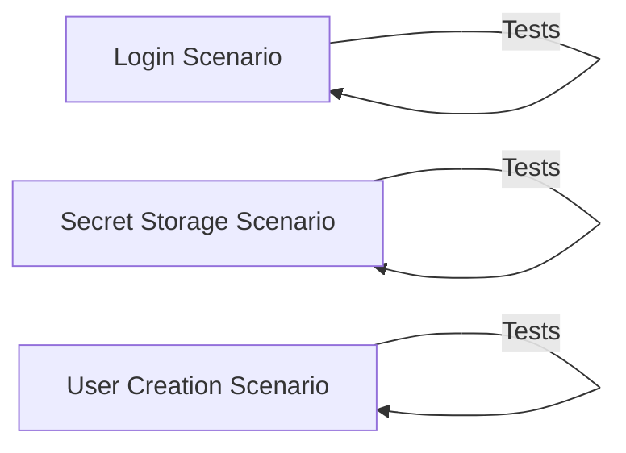

## Component Details

The User Authentication and Authorization subsystem focuses on managing user identities, securing access to resources, and ensuring data protection. It encompasses user registration, login, session management, and secure password handling. The core flow involves a user attempting to access a protected resource, which triggers an authentication check. Upon successful authentication, the system verifies the user's authorization level to determine if they have the necessary permissions. This process prevents unauthorized access and safeguards sensitive information.

### Login Scenario
This component focuses on testing the login functionality, including valid and invalid login attempts, password security, and potential vulnerabilities like SQL injection. It simulates various login scenarios to ensure the system's robustness and security.
- **Related Classes/Methods**: `src.scenarios.login:func_test_valid_and_invalid_logins`, `src.scenarios.login:sec_test_same_passwords`, `src.scenarios.login:sec_test_sql_injection_or_sensitive_data_exposure`, `src.scenarios.login:sec_test_password_security`

### Secret Storage Scenario
This component focuses on testing the security and functionality of secret storage, including managing user secrets, preventing unauthorized access, and checking for vulnerabilities. It ensures that user secrets are stored securely and that only authorized users can access them.
- **Related Classes/Methods**: `src.scenarios.secret_storage:func_test_logins_and_own_secret_management`, `src.scenarios.secret_storage:sec_test_other_users_secrets`, `src.scenarios.secret_storage:sec_test_same_passwords`, `src.scenarios.secret_storage:sec_test_sql_injection_or_sensitive_data_exposure`, `src.scenarios.secret_storage:sec_test_password_security`

### User Creation Scenario
This component focuses on testing the security aspects of user creation, specifically password security to prevent weak or easily guessable passwords. It ensures that the system enforces strong password policies during user registration.
- **Related Classes/Methods**: `src.scenarios.user_creation:sec_test_password_security`
