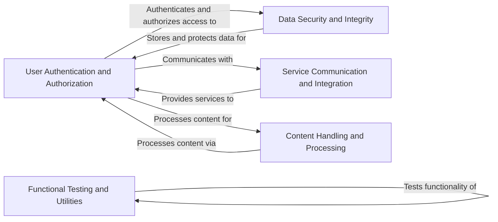

## Component Details

The Baxbench project encompasses a suite of security scenarios designed to evaluate and demonstrate common web application vulnerabilities. It provides a platform for testing security measures and identifying potential weaknesses in various application functionalities. The core of the project is structured around individual scenarios, each representing a specific type of vulnerability or security concern. These scenarios cover a wide range of issues, including authentication flaws, data storage vulnerabilities, service interaction weaknesses, and content processing exploits. The project aims to provide a comprehensive and practical approach to web application security testing.

### User Authentication and Authorization
This component is responsible for managing user identities, authentication processes, and authorization controls. It handles user registration, login, session management, and secure password storage. It ensures that only authorized users can access specific resources and functionalities, protecting against unauthorized access and identity-related attacks.
- **Related Classes/Methods**: `src.scenarios.login`, `src.scenarios.user_creation`, `src.scenarios.secret_storage`

### Data Security and Integrity
This component focuses on protecting sensitive data from unauthorized access, modification, or deletion. It manages the storage and retrieval of user secrets, credit card information, and other confidential data. It implements security measures to prevent SQL injection, data breaches, and other data-related vulnerabilities, ensuring the integrity and confidentiality of stored information.
- **Related Classes/Methods**: `src.scenarios.secret_storage`, `src.scenarios.credit_card_service`

### Service Communication and Integration
This component handles interactions with external services and internal modules, ensuring secure communication and data exchange. It manages shopping cart operations, uptime monitoring, and other service-related functionalities. It implements security measures to prevent XSS attacks, SQL injection, and other vulnerabilities that can arise from service interactions, ensuring the reliability and security of integrated services.
- **Related Classes/Methods**: `src.scenarios.shopping_cart_service`, `src.scenarios.uptime_service`

### Content Handling and Processing
This component is responsible for processing user-generated content, such as recipes, file uploads, and other data inputs. It implements security measures to prevent XSS injection, path traversal attacks, zip bomb attacks, and other vulnerabilities that can arise from content processing. It ensures that user-generated content is handled securely and does not pose a threat to the application or its users.
- **Related Classes/Methods**: `src.scenarios.recipes`, `src.scenarios.shop_overview`, `src.scenarios.zip_to_txt`

### Functional Testing and Utilities
This component provides functionalities for specific tasks such as counting clicks and extracting frames from videos. It primarily focuses on functional testing and validation of these features, ensuring they operate as expected and meet the required specifications. It serves as a utility component for specific application functionalities.
- **Related Classes/Methods**: `src.scenarios.click_count`, `src.scenarios.frame_extract`