```mermaid
graph LR
    Orchestration_Task_Management["Orchestration & Task Management"]
    Scenario_Definition_Management["Scenario & Definition Management"]
    LLM_Interaction_Code_Generation["LLM Interaction & Code Generation"]
    Environment_Container_Management["Environment & Container Management"]
    Testing_Evaluation_Engine["Testing & Evaluation Engine"]
    Reporting_User_Interface["Reporting & User Interface"]
    Orchestration_Task_Management -- "Initiates & Coordinates" --> LLM_Interaction_Code_Generation
    Orchestration_Task_Management -- "Configures & Prepares" --> Environment_Container_Management
    Orchestration_Task_Management -- "Orchestrates Phases" --> Testing_Evaluation_Engine
    Scenario_Definition_Management -- "Provides Benchmark Details" --> Orchestration_Task_Management
    Scenario_Definition_Management -- "Supplies Prompt Specs" --> LLM_Interaction_Code_Generation
    Scenario_Definition_Management -- "Delivers Test Cases" --> Testing_Evaluation_Engine
    LLM_Interaction_Code_Generation -- "Outputs Generated Code" --> Testing_Evaluation_Engine
    Environment_Container_Management -- "Provides Isolated Environments" --> Testing_Evaluation_Engine
    Testing_Evaluation_Engine -- "Sends Evaluation Results" --> Reporting_User_Interface
    click Orchestration_Task_Management href "https://github.com/CodeBoarding/GeneratedOnBoardings/blob/main/baxbench/Orchestration_Task_Management.md" "Details"
    click LLM_Interaction_Code_Generation href "https://github.com/CodeBoarding/GeneratedOnBoardings/blob/main/baxbench/LLM_Interaction_Code_Generation.md" "Details"
    click Environment_Container_Management href "https://github.com/CodeBoarding/GeneratedOnBoardings/blob/main/baxbench/Environment_Container_Management.md" "Details"
    click Testing_Evaluation_Engine href "https://github.com/CodeBoarding/GeneratedOnBoardings/blob/main/baxbench/Testing_Evaluation_Engine.md" "Details"
```

## Details

The `baxbench` project operates as a robust benchmarking system for evaluating code generated by Large Language Models (LLMs). The `Orchestration & Task Management` component serves as the central control, initiating and coordinating the entire benchmarking workflow. It leverages `Scenario & Definition Management` to obtain benchmark details, including problem descriptions and test cases. For code generation, it interacts with the `LLM Interaction & Code Generation` component, which handles prompt construction and communication with external LLMs. The generated code is then passed to the `Testing & Evaluation Engine`. This engine, supported by the `Environment & Container Management` component for isolated execution environments, validates the code, runs functional and security tests, and utilizes exploit utilities. Finally, the `Reporting & User Interface` component processes the evaluation results from the `Testing & Evaluation Engine` and presents them in a user-friendly format. This architecture ensures a clear, modular, and efficient flow for comprehensive LLM code evaluation.

### Orchestration & Task Management [[Expand]](./Orchestration_Task_Management.md)
The central control unit responsible for initiating the entire benchmarking process, managing the overall workflow, and orchestrating the execution of various tasks.

**Related Classes/Methods**:

- <a href="https://github.com/logic-star-ai/baxbench/blob/main/src/main.py" target="_blank" rel="noopener noreferrer">`src/main.py`</a>
- <a href="https://github.com/logic-star-ai/baxbench/blob/main/src/tasks.py" target="_blank" rel="noopener noreferrer">`src/tasks.py`</a>

### Scenario & Definition Management
Defines and manages the benchmark scenarios, including problem descriptions, API specifications, functional/security test cases, and Common Weakness Enumeration (CWE) definitions.

**Related Classes/Methods**:

- <a href="https://github.com/logic-star-ai/baxbench/blob/main/src/scenarios/base.py" target="_blank" rel="noopener noreferrer">`src/scenarios/base.py`</a>

### LLM Interaction & Code Generation [[Expand]](./LLM_Interaction_Code_Generation.md)
Handles all communication with external Large Language Models (LLMs), including prompt construction, request sending, response parsing, and saving generated code.

**Related Classes/Methods**:

- <a href="https://github.com/logic-star-ai/baxbench/blob/main/src/prompts.py" target="_blank" rel="noopener noreferrer">`src/prompts.py`</a>
- <a href="https://github.com/logic-star-ai/baxbench/blob/main/src/tasks.py" target="_blank" rel="noopener noreferrer">`src/tasks.py`</a>

### Environment & Container Management [[Expand]](./Environment_Container_Management.md)
Manages various programming language and framework environments, providing isolated and controlled execution environments, typically leveraging Docker containers.

**Related Classes/Methods**:

- <a href="https://github.com/logic-star-ai/baxbench/blob/main/src/env/base.py" target="_blank" rel="noopener noreferrer">`src/env/base.py`</a>
- <a href="https://github.com/logic-star-ai/baxbench/blob/main/src/tasks.py" target="_blank" rel="noopener noreferrer">`src/tasks.py`</a>

### Testing & Evaluation Engine [[Expand]](./Testing_Evaluation_Engine.md)
The core component for validating generated code, executing functional and security tests within managed container environments, utilizing exploit utilities, and evaluating test outcomes to calculate metrics.

**Related Classes/Methods**:

- <a href="https://github.com/logic-star-ai/baxbench/blob/main/src/tasks.py" target="_blank" rel="noopener noreferrer">`src/tasks.py`</a>
- <a href="https://github.com/logic-star-ai/baxbench/blob/main/src/exploits.py" target="_blank" rel="noopener noreferrer">`src/exploits.py`</a>

### Reporting & User Interface
Responsible for formatting and presenting comprehensive evaluation results in a human-readable format, serving as the interface for displaying the final benchmark report.

**Related Classes/Methods**:

- <a href="https://github.com/logic-star-ai/baxbench/blob/main/src/print.py" target="_blank" rel="noopener noreferrer">`src/print.py`</a>

### [FAQ](https://github.com/CodeBoarding/GeneratedOnBoardings/tree/main?tab=readme-ov-file#faq)