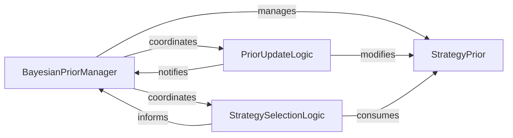

## Details

The Bayesian Meta-Learning subsystem is designed to enable adaptive strategy selection based on learned performance priors. At its core, the `BayesianPriorManager` orchestrates the entire learning process, maintaining and managing `StrategyPrior` objects for various strategies and task types. It leverages `PriorUpdateLogic` to refine these priors with new performance data and `StrategySelectionLogic` to intelligently choose strategies for future execution. This closed-loop system continuously learns and optimizes strategy effectiveness, ensuring that the most promising strategies are prioritized while also allowing for exploration of less-known but potentially high-performing alternatives.

### BayesianPriorManager
The central orchestrator of the Bayesian learning process. It manages the lifecycle of strategy priors, including initialization, loading, saving, and coordinating updates and strategy selection. It acts as the primary interface for external components to interact with the learning engine.

**Related Classes/Methods**:

- <a href="https://github.com/allthingssecurity/bayesian_meta_learning/blob/main/core/bayesian_prior.py#L49-L172" target="_blank" rel="noopener noreferrer">`core.bayesian_prior.BayesianPriorManager`:49-172</a>

### StrategyPrior
The fundamental data model representing the probabilistic prior distribution for a single strategy. It encapsulates the parameters (e.g., alpha, beta for a Beta distribution) that define a strategy's learned performance characteristics.

**Related Classes/Methods**:

- <a href="https://github.com/allthingssecurity/bayesian_meta_learning/blob/main/core/bayesian_prior.py#L11-L46" target="_blank" rel="noopener noreferrer">`core.bayesian_prior.StrategyPrior`:11-46</a>

### PriorUpdateLogic
Responsible for incorporating new performance observations into a strategy's prior distribution, updating its probabilistic model. It also calculates confidence metrics associated with these priors. This component embodies the "Bayesian Update" mechanism.

**Related Classes/Methods**:

- <a href="https://github.com/allthingssecurity/bayesian_meta_learning/blob/main/core/bayesian_prior.py" target="_blank" rel="noopener noreferrer">`core.bayesian_prior.StrategyPrior:update`</a>
- <a href="https://github.com/allthingssecurity/bayesian_meta_learning/blob/main/core/bayesian_prior.py" target="_blank" rel="noopener noreferrer">`core.bayesian_prior.StrategyPrior:confidence`</a>

### StrategySelectionLogic
Implements the mechanisms for selecting strategies based on their current prior distributions. This includes sampling strategies (Thompson sampling), ranking them by expected performance, and deciding whether to prioritize exploration of new strategies or exploitation of known good ones.

**Related Classes/Methods**:

- <a href="https://github.com/allthingssecurity/bayesian_meta_learning/blob/main/core/bayesian_prior.py" target="_blank" rel="noopener noreferrer">`core.bayesian_prior.BayesianPriorManager:thompson_sample`</a>
- <a href="https://github.com/allthingssecurity/bayesian_meta_learning/blob/main/core/bayesian_prior.py" target="_blank" rel="noopener noreferrer">`core.bayesian_prior.BayesianPriorManager:get_strategy_ranking`</a>
- <a href="https://github.com/allthingssecurity/bayesian_meta_learning/blob/main/core/bayesian_prior.py" target="_blank" rel="noopener noreferrer">`core.bayesian_prior.BayesianPriorManager:should_explore`</a>

### [FAQ](https://github.com/CodeBoarding/GeneratedOnBoardings/tree/main?tab=readme-ov-file#faq)