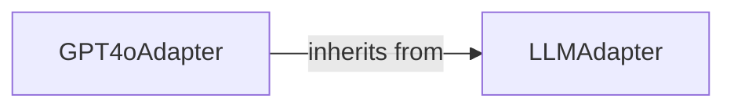

## Details

The `LLM Adapters` subsystem is encapsulated within the `bayesian_meta_learning.adapters` package. Its core components are defined by `bayesian_meta_learning/adapters/base_adapter.py` and `bayesian_meta_learning/adapters/gpt4o_adapter.py`. This subsystem provides a standardized interface for interacting with various Large Language Models, abstracting away the specifics of each LLM's API.

### LLMAdapter
This is an abstract base class that serves as the core interface for all Large Language Model (LLM) interactions within the `bayesian_meta_learning` project. It defines the common methods and contract that any concrete LLM adapter must implement, ensuring modularity and extensibility. This aligns with the "Strategy Pattern" by providing a common interface for different LLM strategies.

**Related Classes/Methods**:

- <a href="https://github.com/allthingssecurity/bayesian_meta_learning/blob/main/adapters/base_adapter.py#L8-L45" target="_blank" rel="noopener noreferrer">`LLMAdapter`:8-45</a>

### GPT4oAdapter
A concrete implementation of the `LLMAdapter` interface, specifically designed to interact with the OpenAI GPT-4o Large Language Model. Its responsibilities include handling the specifics of the GPT-4o API, such as formatting requests, making API calls, and parsing the responses. This component allows the system to leverage GPT-4o's capabilities while adhering to the unified `LLMAdapter` interface.

**Related Classes/Methods**:

- <a href="https://github.com/allthingssecurity/bayesian_meta_learning/blob/main/adapters/gpt4o_adapter.py#L12-L154" target="_blank" rel="noopener noreferrer">`GPT4oAdapter`:12-154</a>

### [FAQ](https://github.com/CodeBoarding/GeneratedOnBoardings/tree/main?tab=readme-ov-file#faq)