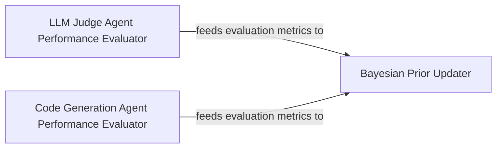

## Details

The Performance Evaluator subsystem is defined by the functions responsible for assessing the quality of LLM outputs and feeding these assessments into the Bayesian update process.

### LLM Judge Agent Performance Evaluator
This component is specifically responsible for evaluating the performance and quality of outputs generated by the LLM Judge Agent. It quantifies the effectiveness of the judge's assessments, providing metrics crucial for feedback.

**Related Classes/Methods**:

- <a href="https://github.com/allthingssecurity/bayesian_meta_learning/blob/main/examples/llm_judge_agent.py#L53-L64" target="_blank" rel="noopener noreferrer">`llm_judge_agent.evaluate_performance`:53-64</a>

### Code Generation Agent Performance Evaluator
This component focuses on assessing the quality and correctness of code generated by the Code Generation Agent. It provides metrics on the generated code's adherence to requirements, functionality, and efficiency.

**Related Classes/Methods**:

- <a href="https://github.com/allthingssecurity/bayesian_meta_learning/blob/main/examples/code_generation_agent.py#L59-L68" target="_blank" rel="noopener noreferrer">`code_generation_agent.evaluate_performance`:59-68</a>

### Bayesian Prior Updater
This component receives performance metrics from various evaluators and uses them to update the Bayesian priors. These updated priors then inform subsequent strategy selections, closing the meta-learning feedback loop.

**Related Classes/Methods**:

- <a href="https://github.com/allthingssecurity/bayesian_meta_learning/blob/main/core/bayesian_prior.py" target="_blank" rel="noopener noreferrer">`core.bayesian_prior`</a>

### [FAQ](https://github.com/CodeBoarding/GeneratedOnBoardings/tree/main?tab=readme-ov-file#faq)