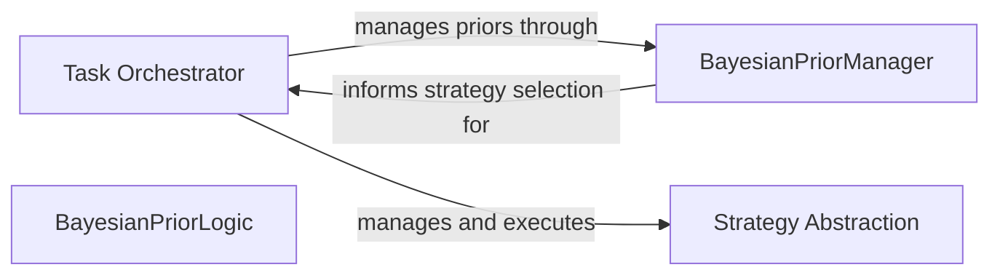

## Details

The `bayesian_meta_learning` subsystem is orchestrated by the **Task Orchestrator** (`BayesianController`), which serves as the central control unit for the adaptive meta-learning process. It is responsible for managing the selection and execution of various **Strategies** (`Strategy`) tailored for different task types. The Task Orchestrator interacts closely with the **Bayesian Prior Manager** (`BayesianPriorManager`), which is responsible for maintaining and persisting the probabilistic beliefs (priors) about the performance of different strategies. The core **Bayesian Prior Logic** (also implemented within the `BayesianPriorManager`) guides the Task Orchestrator's decision-making by providing strategy recommendations based on Thompson sampling and updating priors with observed performance feedback. This creates a continuous learning loop where the Task Orchestrator leverages the Bayesian Prior Manager for informed strategy selection, executes the chosen strategies, and then provides performance data back to the Bayesian Prior Manager to refine its probabilistic models, enabling the system to continuously learn and improve.

### Task Orchestrator [[Expand]](./Task_Orchestrator.md)
The central control unit managing the entire meta-learning feedback loop. It coordinates strategy selection, LLM interaction, performance evaluation, and Bayesian updates, overseeing the overall flow of the adaptive and self-improving system.

**Related Classes/Methods**:

- <a href="https://github.com/allthingssecurity/bayesian_meta_learning/blob/main/core/controller.py#L16-L299" target="_blank" rel="noopener noreferrer">`bayesian_meta_learning.core.controller.BayesianController`:16-299</a>

### BayesianPriorManager
Manages the persistence and loading of Bayesian priors. This component is crucial for maintaining the system's learned knowledge across different runs and ensuring the continuity of the meta-learning process.

**Related Classes/Methods**:

- <a href="https://github.com/allthingssecurity/bayesian_meta_learning/blob/main/core/bayesian_prior.py#L49-L172" target="_blank" rel="noopener noreferrer">`bayesian_meta_learning.core.bayesian_prior.BayesianPriorManager`:49-172</a>

### BayesianPriorLogic
Handles the core Bayesian inference processes, including sampling strategies based on current priors, updating priors based on observed performance, and providing informed strategy recommendations. This component's functionality is encapsulated within the `BayesianPriorManager`.

**Related Classes/Methods**:

- <a href="https://github.com/allthingssecurity/bayesian_meta_learning/blob/main/core/bayesian_prior.py#L49-L172" target="_blank" rel="noopener noreferrer">`bayesian_meta_learning.core.bayesian_prior.BayesianPriorManager`:49-172</a>

### Strategy Abstraction
An abstract base class that defines the common interface for all executable strategies within the system. Concrete implementations of this abstraction encapsulate specific approaches for interacting with LLMs or performing tasks, adhering to the Strategy Pattern.

**Related Classes/Methods**:

- <a href="https://github.com/allthingssecurity/bayesian_meta_learning/blob/main/core/strategy.py#L22-L45" target="_blank" rel="noopener noreferrer">`bayesian_meta_learning.core.strategy.Strategy`:22-45</a>

### [FAQ](https://github.com/CodeBoarding/GeneratedOnBoardings/tree/main?tab=readme-ov-file#faq)