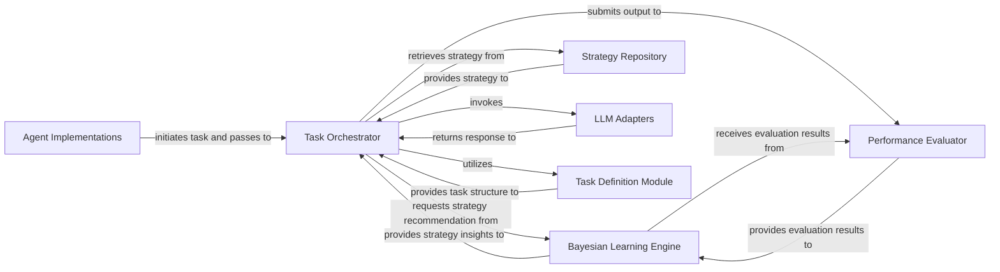

## Details

The `bayesian_meta_learning` project is architected as a self-improving AI system, designed around a robust feedback loop for optimizing strategy selection in LLM-driven tasks. At its core, the Task Orchestrator acts as the central coordinator, initiating task execution based on inputs from Agent Implementations. It dynamically selects strategies by consulting the Bayesian Learning Engine, which maintains and updates probabilistic priors based on past performance, and retrieves these strategies from the Strategy Repository. Interactions with external Large Language Models are abstracted through LLM Adapters. The outputs are then rigorously evaluated by the Performance Evaluator, with results feeding back into the Bayesian Learning Engine to refine future strategy choices. This continuous cycle, supported by the structured task definitions from the Task Definition Module, enables the system to adapt and improve its performance over time, making it highly suitable for dynamic AI/ML applications requiring adaptive strategy management.

### Agent Implementations
Entry points for specific applications (e.g., LLM judging, code generation) that initiate the meta-learning process.

**Related Classes/Methods**:

- <a href="https://github.com/allthingssecurity/bayesian_meta_learning/blob/main/examples/llm_judge_agent.py" target="_blank" rel="noopener noreferrer">`examples/llm_judge_agent.py`</a>
- <a href="https://github.com/allthingssecurity/bayesian_meta_learning/blob/main/examples/code_generation_agent.py" target="_blank" rel="noopener noreferrer">`examples/code_generation_agent.py`</a>

### Task Orchestrator [[Expand]](./Task_Orchestrator.md)
The central control unit managing the entire meta-learning feedback loop, coordinating strategy selection, LLM interaction, performance evaluation, and Bayesian updates.

**Related Classes/Methods**:

- <a href="https://github.com/allthingssecurity/bayesian_meta_learning/blob/main/core/controller.py" target="_blank" rel="noopener noreferrer">`core/controller.py`</a>

### Bayesian Learning Engine [[Expand]](./Bayesian_Learning_Engine.md)
Implements the core meta-learning algorithm, maintaining and updating probabilistic priors for strategies based on their observed performance, guiding strategy selection.

**Related Classes/Methods**:

- <a href="https://github.com/allthingssecurity/bayesian_meta_learning/blob/main/core/bayesian_prior.py" target="_blank" rel="noopener noreferrer">`core/bayesian_prior.py`</a>

### Strategy Repository
A module responsible for storing, managing, and providing access to a collection of predefined strategies.

**Related Classes/Methods**:

- <a href="https://github.com/allthingssecurity/bayesian_meta_learning/blob/main/strategies/default_strategies.py" target="_blank" rel="noopener noreferrer">`strategies/default_strategies.py`</a>

### LLM Adapters [[Expand]](./LLM_Adapters.md)
A set of interfaces that abstract interactions with various external Large Language Models (e.g., GPT-4o), ensuring modularity and extensibility.

**Related Classes/Methods**:

- <a href="https://github.com/allthingssecurity/bayesian_meta_learning/blob/main/adapters/base_adapter.py" target="_blank" rel="noopener noreferrer">`adapters/base_adapter.py`</a>
- <a href="https://github.com/allthingssecurity/bayesian_meta_learning/blob/main/adapters/gpt4o_adapter.py" target="_blank" rel="noopener noreferrer">`adapters/gpt4o_adapter.py`</a>

### Performance Evaluator [[Expand]](./Performance_Evaluator.md)
Assesses the quality and effectiveness of the outputs generated by the LLM based on the chosen strategy, providing crucial feedback for the Bayesian update process.

**Related Classes/Methods**:

- <a href="https://github.com/allthingssecurity/bayesian_meta_learning/blob/main/examples/llm_judge_agent.py" target="_blank" rel="noopener noreferrer">`examples/llm_judge_agent.py`</a>
- <a href="https://github.com/allthingssecurity/bayesian_meta_learning/blob/main/examples/code_generation_agent.py" target="_blank" rel="noopener noreferrer">`examples/code_generation_agent.py`</a>

### Task Definition Module
Defines the data structures, schemas, and types for various tasks, ensuring consistent input and output formats across the system.

**Related Classes/Methods**:

- <a href="https://github.com/allthingssecurity/bayesian_meta_learning/blob/main/core/task.py" target="_blank" rel="noopener noreferrer">`core/task.py`</a>

### [FAQ](https://github.com/CodeBoarding/GeneratedOnBoardings/tree/main?tab=readme-ov-file#faq)