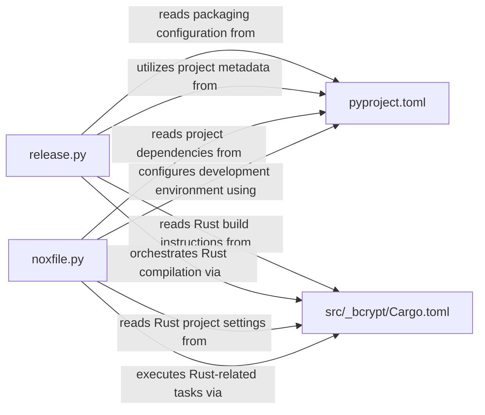

## Details

This subsystem orchestrates the build, testing, and release processes for the `bcrypt` project, which integrates Python and Rust components. The `pyproject.toml` and `src/_bcrypt/Cargo.toml` files serve as the foundational configuration layers, defining project metadata, dependencies, and build instructions for both the Python API and the native Rust core, respectively. The `release.py` script acts as the primary automation tool for the release pipeline, reading configurations from both TOML files to compile the Rust backend, generate necessary Python bindings, and package the final distributable. Concurrently, `noxfile.py` manages the development and continuous integration workflows, leveraging the same configuration files to execute automated tests, linting, and local builds, ensuring code quality and consistency throughout the development lifecycle. This setup ensures a clear separation of concerns between configuration and execution, with scripts dynamically adapting to the definitions provided by the TOML files.

### pyproject.toml
This file serves as the central configuration for the Python project, defining metadata, dependencies, and the build system (e.g., setuptools). It dictates how the Python API layer is structured and packaged.

**Related Classes/Methods**:

- <a href="https://github.com/pyca/bcrypt/blob/main/pyproject.toml" target="_blank" rel="noopener noreferrer">`pyproject.toml`</a>

### src/_bcrypt/Cargo.toml
This file is the manifest for the Rust crate, defining the native cryptographic core's metadata, dependencies, and compilation settings. It is essential for building the high-performance Rust backend.

**Related Classes/Methods**:

- <a href="https://github.com/pyca/bcrypt/blob/main/src/_bcrypt/Cargo.toml" target="_blank" rel="noopener noreferrer">`src/_bcrypt/Cargo.toml`</a>

### release.py
This script automates the end-to-end release process, encompassing steps like compiling the native Rust code, generating Python bindings, running final checks, and creating the distributable Python package.

**Related Classes/Methods**:

- <a href="https://github.com/pyca/bcrypt/blob/main/release.py" target="_blank" rel="noopener noreferrer">`release.py`</a>

### noxfile.py
This script defines a set of automated tasks for development and continuous integration, such as running tests, linting, and local builds. It ensures a consistent and efficient development workflow.

**Related Classes/Methods**:

- <a href="https://github.com/pyca/bcrypt/blob/main/noxfile.py" target="_blank" rel="noopener noreferrer">`noxfile.py`</a>

### [FAQ](https://github.com/CodeBoarding/GeneratedOnBoardings/tree/main?tab=readme-ov-file#faq)