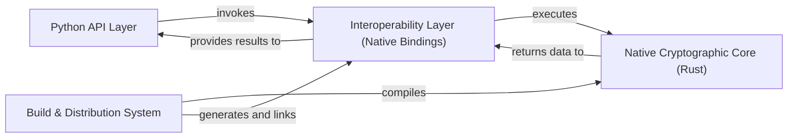

## Details

The `bcrypt` library is architected as a layered system, effectively separating concerns to achieve both ease of use and high performance. At its highest level, the **Python API Layer** provides a user-friendly facade, abstracting the complexities of the underlying cryptographic operations. This layer communicates with the **Interoperability Layer (Native Bindings)**, which acts as a crucial intermediary, translating Python requests into calls to the highly optimized **Native Cryptographic Core (Rust)**. The Rust core performs the computationally intensive hashing and verification, returning results back through the Interoperability Layer to the Python API. This entire mixed-language system is seamlessly integrated and distributed thanks to the robust **Build & Distribution System**, which handles the compilation of native code and the generation of necessary bindings. This architecture ensures that `bcrypt` delivers secure and efficient password management capabilities within a Python environment.

### Python API Layer
The public-facing Python interface for `bcrypt`, providing high-level functions for password hashing and verification.

**Related Classes/Methods**:

- <a href="https://github.com/pyca/bcrypt/blob/main/src/bcrypt/__init__.py" target="_blank" rel="noopener noreferrer">`src/bcrypt/__init__.py`</a>

### Interoperability Layer (Native Bindings) [[Expand]](./Interoperability_Layer_Native_Bindings_.md)
The bridge between Python and the native Rust code, handling data marshalling and direct calls to the cryptographic core.

**Related Classes/Methods**:

- <a href="https://github.com/pyca/bcrypt/blob/main/src/_bcrypt/src/lib.rs" target="_blank" rel="noopener noreferrer">`src/_bcrypt/src/lib.rs`</a>

### Native Cryptographic Core (Rust)
The highly optimized Rust implementation of the bcrypt algorithm, responsible for all core cryptographic operations.

**Related Classes/Methods**:

- <a href="https://github.com/pyca/bcrypt/blob/main/src/_bcrypt/src/lib.rs" target="_blank" rel="noopener noreferrer">`src/_bcrypt/src/lib.rs`</a>

### Build & Distribution System [[Expand]](./Build_Distribution_System.md)
Manages the compilation of native code, generation of bindings, and packaging of the library for distribution.

**Related Classes/Methods**:

- <a href="https://github.com/pyca/bcrypt/blob/main/pyproject.toml" target="_blank" rel="noopener noreferrer">`pyproject.toml`</a>
- <a href="https://github.com/pyca/bcrypt/blob/main/release.py" target="_blank" rel="noopener noreferrer">`release.py`</a>
- <a href="https://github.com/pyca/bcrypt/blob/main/src/_bcrypt/Cargo.toml" target="_blank" rel="noopener noreferrer">`src/_bcrypt/Cargo.toml`</a>
- <a href="https://github.com/pyca/bcrypt/blob/main/noxfile.py" target="_blank" rel="noopener noreferrer">`noxfile.py`</a>

### [FAQ](https://github.com/CodeBoarding/GeneratedOnBoardings/tree/main?tab=readme-ov-file#faq)