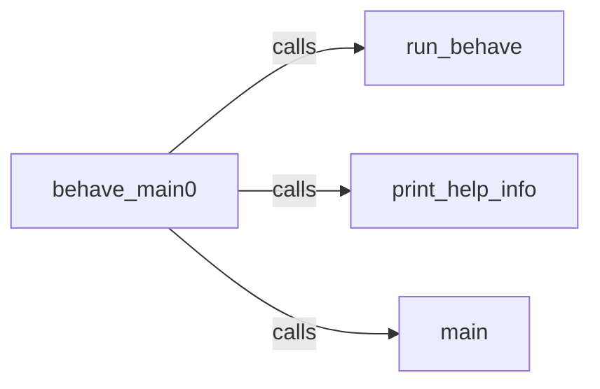

## Component Details

The Command-Line Interface (CLI) provides the entry point for running Behave. It parses command-line arguments, loads the configuration, and initiates the test execution. The CLI handles various options such as printing language lists, formatters, or executing tests, acting as the user interface for interacting with Behave and controlling the test execution process.

### behave_main0
This component serves as the primary entry point for the `behave` command-line tool. It utilizes `argparse` to parse command-line arguments and then dispatches control to the appropriate function based on these arguments. It is responsible for handling options such as printing the list of languages, formatters, or initiating the test execution process.
- **Related Classes/Methods**: `behave.bin.behave_cmd:behave_main0`

### run_behave
This component is the core function responsible for executing the Behave tests. It sets up the testing environment, loads the feature files, executes the scenarios within those features, and then reports the results. It orchestrates the entire testing process, from setup to reporting.
- **Related Classes/Methods**: `behave.behave.__main__:run_behave`

### print_help_info
This component provides help information to the user. It includes printing the list of supported languages, help information about language options, the list of available formatters, and the list of available runners.
- **Related Classes/Methods**: `behave.behave.__main__:print_language_list`, `behave.behave.__main__:print_language_help`, `behave.behave.__main__:print_formatters`, `behave.behave.__main__:print_runners`

### main
This component serves as an alternative entry point for the `behave` command-line tool. It is invoked by `behave_main0` and duplicates some of its functionality. It essentially provides another way to initiate the test execution and handle command-line options.
- **Related Classes/Methods**: `behave.behave.__main__:main`
