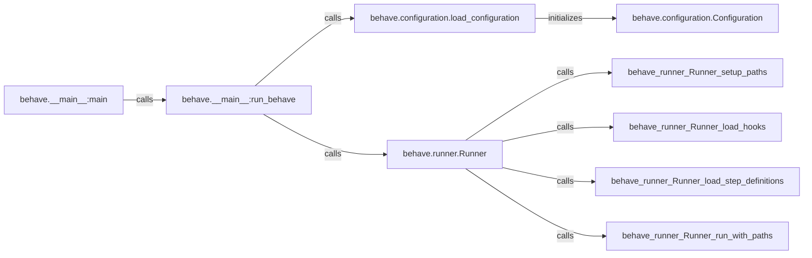

## Component Details

The Behave Configuration Manager is responsible for loading, managing, and providing access to configuration settings for Behave test executions. It handles configurations from various sources, including command-line arguments, configuration files, and environment variables. The configuration manager ensures that all components of Behave have access to the necessary settings to customize the test execution behavior.

### behave.__main__:main
The main entry point of the Behave application. It orchestrates the test execution by calling the `run_behave` function, initiating the configuration loading and test execution process.
- **Related Classes/Methods**: `behave.__main__:main`

### behave.__main__:run_behave
This function orchestrates the configuration loading and the test execution by calling the `Runner:run` method. It receives command line arguments and passes them to the configuration loader.
- **Related Classes/Methods**: `behave.__main__:run_behave`

### behave.configuration.load_configuration
Responsible for loading the configuration from various sources like config files and command-line arguments. It initializes the `Configuration` object, which stores all the configuration settings.
- **Related Classes/Methods**: `behave.configuration.load_configuration`

### behave.configuration.Configuration
Represents the configuration of the Behave test run. It handles command-line arguments, reporters, tag expressions, outputs, formats, and userdata. It provides methods to setup these configurations and acts as a central repository for all configuration settings.
- **Related Classes/Methods**: `behave.configuration.Configuration:__init__`, `behave.configuration.Configuration:init`, `behave.configuration.Configuration:make_command_args`, `behave.configuration.Configuration:setup_select_by_filters`, `behave.configuration.Configuration:setup_reporters`, `behave.configuration.Configuration:setup_tag_expression`, `behave.configuration.Configuration:setup_outputs`, `behave.configuration.Configuration:setup_formats`, `behave.configuration.Configuration:setup_userdata`

### behave.runner.Runner
The core component responsible for running the Behave tests. It receives the configuration object to customize the test execution, sets up the paths, loads hooks and step definitions, and executes the tests based on the provided configuration.
- **Related Classes/Methods**: `behave.runner.Runner:run`, `behave.runner.Runner:setup_paths`, `behave.runner.Runner:load_hooks`, `behave.runner.Runner:load_step_definitions`, `behave.runner.Runner:run_with_paths`
