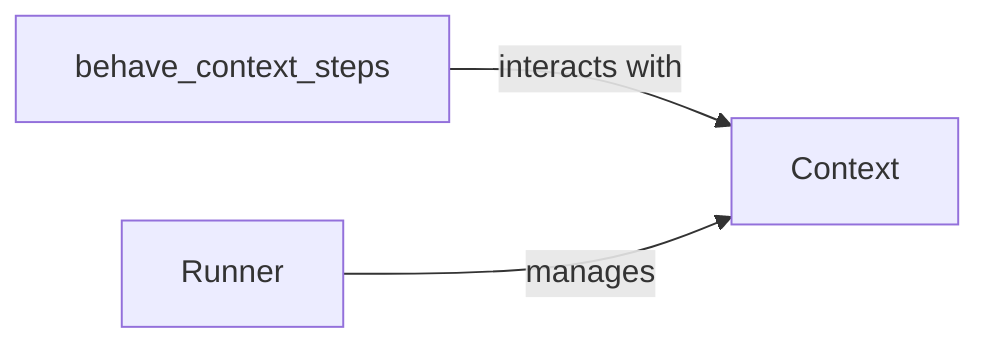

## Component Details

The Context Manager in Behave provides a mechanism for sharing data and managing state during test execution. The `Context` class acts as a central data store, allowing steps to communicate and share data. Predefined steps in `behave_context_steps` module enable users to interact with the Behave context directly from feature files. The `Runner` class orchestrates the execution of features, scenarios, and steps, utilizing the context to maintain state and manage cleanup functions.

### Context
The Context class in Behave serves as a central data store for scenario-related information. It allows steps to share data, manage resources, and interact with the environment. It provides methods for setting, getting, and deleting attributes, as well as managing cleanup functions.
- **Related Classes/Methods**: `behave.runner.Context`

### behave_context_steps
This module defines a set of predefined steps that allow users to interact with the Behave context directly from feature files. These steps provide a convenient way to set, check, and use parameters within the context, making it easier to manage state and data during scenario execution.
- **Related Classes/Methods**: `behave.features.steps.behave_context_steps`

### Runner
The Runner class is responsible for orchestrating the execution of Behave features, scenarios, and steps. It manages the overall test execution flow, including loading features, running hooks, and reporting results. The Runner interacts with the Context to maintain state and manage cleanup functions.
- **Related Classes/Methods**: `behave.runner.Runner`
