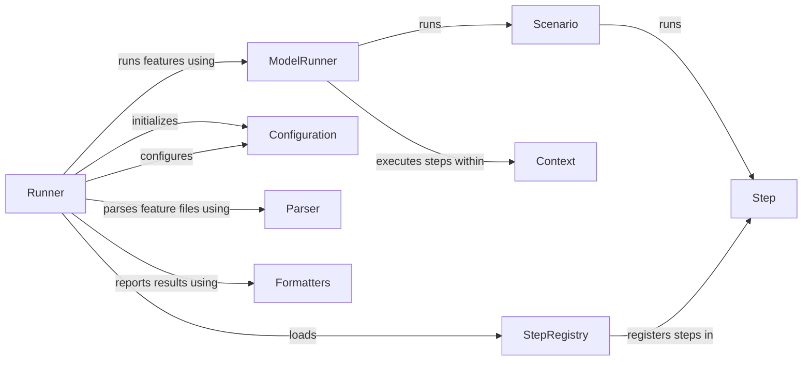

## Component Details

The Behave Execution Runner orchestrates the execution of behavior-driven tests defined in feature files. It parses these files, manages the test execution flow, and reports the results. The core process involves loading configurations, discovering and matching step definitions, executing scenarios and steps, managing the context, and generating reports. It uses various components to achieve this, including the Runner, ModelRunner, Scenario, Step, Context, Configuration, StepRegistry, Parser, and Formatters.

### Runner
The Runner class is the central orchestrator of the Behave test execution process. It loads configurations, hooks, and step definitions, and then runs the features. It initializes the environment and coordinates the execution flow.
- **Related Classes/Methods**: `behave.runner.Runner`

### ModelRunner
The ModelRunner class manages the execution of a specific feature or scenario model. It handles setup and teardown, runs hooks, and captures output. It provides the context in which the scenarios and steps are executed.
- **Related Classes/Methods**: `behave.runner.ModelRunner`

### Scenario
The Scenario class represents a single test scenario. It contains a list of steps to be executed. The Scenario class is responsible for running its steps and managing the scenario's state.
- **Related Classes/Methods**: `behave.model.Scenario`

### Step
The Step class represents a single step in a scenario. It contains the step's text, arguments, and associated step definition. The Step class is responsible for executing the step definition and managing the step's state.
- **Related Classes/Methods**: `behave.model.Step`

### Context
The Context class provides a shared namespace for data and functions that are accessible during test execution. It allows steps to share information and interact with the test environment. It is passed to the step definitions.
- **Related Classes/Methods**: `behave.runner.Context`

### Configuration
The Configuration class manages the Behave configuration settings. It parses command-line arguments, reads configuration files, and provides access to configuration options. It is used to customize the test execution behavior.
- **Related Classes/Methods**: `behave.configuration.Configuration`

### StepRegistry
The StepRegistry class manages the registered step definitions. It provides methods for adding step definitions and matching steps to their definitions. It is used to map steps in the feature files to the corresponding Python functions.
- **Related Classes/Methods**: `behave.step_registry.StepRegistry`

### Parser
The Parser module is responsible for parsing feature files and creating the Behave model. It reads the feature files, interprets the Gherkin syntax, and constructs the corresponding data structures (features, scenarios, steps).
- **Related Classes/Methods**: `behave.parser`

### Formatters
The Formatters module provides a mechanism for generating reports in various formats (e.g., plain text, HTML, JSON). It defines the interface for formatters and provides implementations for common formats.
- **Related Classes/Methods**: `behave.formatter.formatters`, `behave.formatter._builtins`
