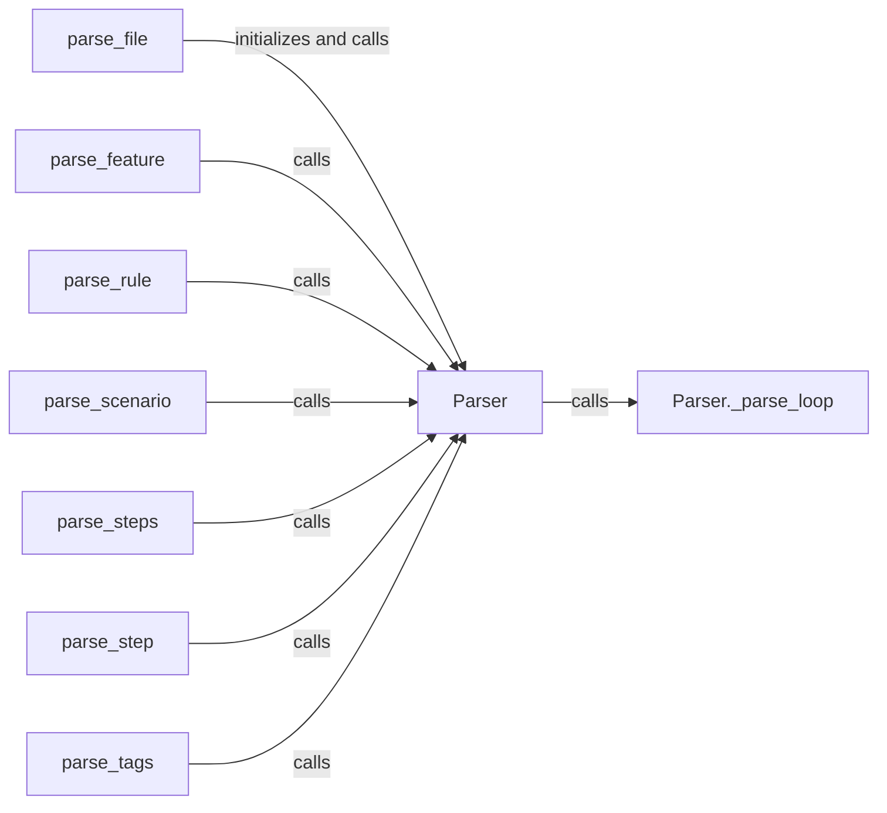

## Component Details

The Feature Parser is responsible for reading and parsing feature files written in Gherkin into an internal representation (model). It handles the syntax and structure of the feature files, including features, rules, scenarios, steps, and tables. The parser transforms the Gherkin syntax into a structured object model that can be used by the Execution Runner. The parsing process starts with `parse_file` which initializes the `Parser` and calls its `parse` method. The `parse` method then uses `_parse_loop` to iterate through the file content and identify different elements. Based on the identified element, the appropriate parsing functions are called to construct the corresponding objects.

### parse_file
This function serves as the entry point for parsing a feature file. It initializes the parsing process by creating a `Parser` instance and calling its `parse` method to begin the parsing operation.
- **Related Classes/Methods**: `behave/parser.py`

### Parser
The Parser class is the core component responsible for orchestrating the parsing process. It contains the `parse` method, which drives the parsing of the feature file. It also includes helper methods like `_parse_loop` for iterating through the file content.
- **Related Classes/Methods**: `behave/parser.py`

### Parser._parse_loop
This method iterates through the lines of the feature file, identifying different elements such as features, scenarios, and steps. It calls the appropriate parsing functions based on the identified element.
- **Related Classes/Methods**: `behave/parser.py`

### parse_feature
This function parses a feature section of the file using the `Parser:parse` method.
- **Related Classes/Methods**: `behave/parser.py`

### parse_rule
This function parses a rule section of the file using the `Parser:parse` method.
- **Related Classes/Methods**: `behave/parser.py`

### parse_scenario
This function parses a scenario section of the file using the `Parser:parse` method.
- **Related Classes/Methods**: `behave/parser.py`

### parse_steps
This function parses the steps within a scenario using the `Parser:parse` method.
- **Related Classes/Methods**: `behave/parser.py`

### parse_step
This function parses a single step using the `Parser:parse` method.
- **Related Classes/Methods**: `behave/parser.py`

### parse_tags
This function parses the tags associated with a feature, scenario, or step using the `Parser:parse` method.
- **Related Classes/Methods**: `behave/parser.py`
