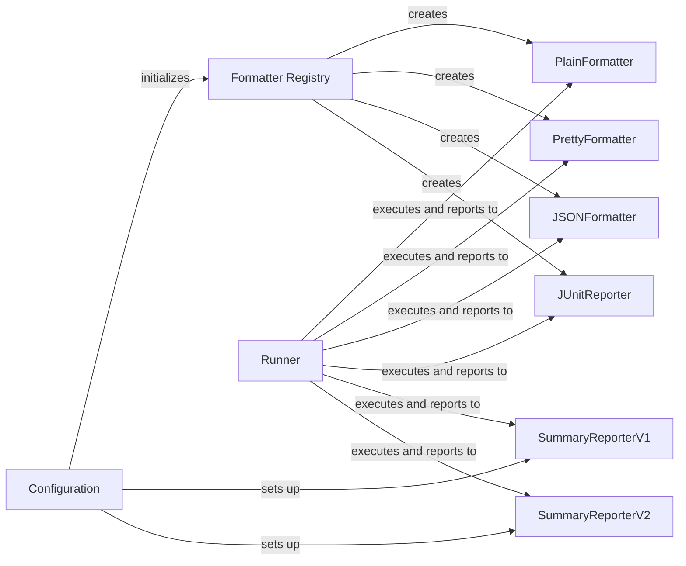

## Component Details

The Report Formatter subsystem in `behave` is responsible for transforming raw test execution results into various output formats, such as plain text, JUnit XML, JSON, or HTML. It allows users to analyze and report on test results in a human-readable or machine-parseable format. The core components involved in this process include formatters, which handle the actual formatting of the output, and reporters, which provide summaries and other high-level information about the test run. The configuration settings determine which formatters and reporters are used, and the runner orchestrates the execution of the tests and the reporting of results.

### Configuration
The Configuration component is responsible for loading and storing configuration settings for the `behave` run. It parses command-line arguments and configuration files, and initializes formatters and reporters based on these settings. It acts as a central repository for all configuration information.
- **Related Classes/Methods**: `behave.configuration:load_configuration`, `behave.configuration.Configuration:__init__`, `behave.configuration.Configuration:init`, `behave.configuration.Configuration:setup_formats`, `behave.configuration.Configuration:setup_reporters`

### Formatter Registry
The Formatter Registry component manages the available formatters and creates formatter instances based on the configuration. It provides a central point for registering and accessing formatters.
- **Related Classes/Methods**: `behave.formatter.formatters:setup_formatters`, `behave.formatter._registry:make_formatters`

### Runner
The Runner component is the core test runner for `behave`. It executes the features, scenarios, and steps, and reports the results to the formatters and reporters. It orchestrates the entire test execution process.
- **Related Classes/Methods**: `behave.runner.Runner:run`, `behave.runner.Runner:run_with_paths`

### PlainFormatter
The PlainFormatter component outputs test results in a plain text format. It receives events from the runner and formats them into plain text output. It is a simple and straightforward formatter for basic reporting.
- **Related Classes/Methods**: `behave.formatter.plain.PlainFormatter:__init__`, `behave.formatter.plain.PlainFormatter:feature`, `behave.formatter.plain.PlainFormatter:rule`, `behave.formatter.plain.PlainFormatter:background`, `behave.formatter.plain.PlainFormatter:scenario`, `behave.formatter.plain.PlainFormatter:result`, `behave.formatter.plain.PlainFormatter:doc_string`, `behave.formatter.plain.PlainFormatter:table`

### PrettyFormatter
The PrettyFormatter component outputs test results in a more visually appealing format. It receives events from the runner and formats them into a pretty output. It provides a more user-friendly and informative report.
- **Related Classes/Methods**: `behave.formatter.pretty.PrettyFormatter:__init__`, `behave.formatter.pretty.PrettyFormatter:uri`, `behave.formatter.pretty.PrettyFormatter:feature`, `behave.formatter.pretty.PrettyFormatter:rule`, `behave.formatter.pretty.PrettyFormatter:background`, `behave.formatter.pretty.PrettyFormatter:scenario`, `behave.formatter.pretty.PrettyFormatter:replay`, `behave.formatter.pretty.PrettyFormatter:match`, `behave.formatter.pretty.PrettyFormatter:result`, `behave.formatter.pretty.PrettyFormatter:arg_format`, `behave.formatter.pretty.PrettyFormatter:format`, `behave.formatter.pretty.PrettyFormatter:eof`, `behave.formatter.pretty.PrettyFormatter:table`, `behave.formatter.pretty.PrettyFormatter:doc_string`

### JSONFormatter
The JSONFormatter component outputs test results in JSON format. It receives events from the runner and serializes them into JSON. It is useful for machine-readable output and integration with other tools.
- **Related Classes/Methods**: `behave.formatter.json.JSONFormatter:__init__`, `behave.formatter.json.JSONFormatter:feature`, `behave.formatter.json.JSONFormatter:background`, `behave.formatter.json.JSONFormatter:scenario`, `behave.formatter.json.JSONFormatter:step`, `behave.formatter.json.JSONFormatter:eof`, `behave.formatter.json.JSONFormatter:close`

### JUnitReporter
The JUnitReporter component outputs test results in JUnit XML format. It receives events from the runner and generates JUnit XML output. It is compatible with JUnit-based tools and CI systems.
- **Related Classes/Methods**: `behave.formatter.junit.JUnitReporter:__init__`, `behave.formatter.junit.JUnitReporter:setup_with_userdata`, `behave.formatter.junit.JUnitReporter:feature`, `behave.formatter.junit.JUnitReporter:describe_step`, `behave.formatter.junit.JUnitReporter:describe_scenario`, `behave.formatter.junit.JUnitReporter:close`

### SummaryReporterV1
The SummaryReporterV1 component provides a summary of the test results. It aggregates results and prints a summary at the end of the test run. It provides a high-level overview of the test execution.
- **Related Classes/Methods**: `behave.reporter.summary.SummaryReporterV1:__init__`, `behave.reporter.summary.SummaryReporterV1:on_feature`, `behave.reporter.summary.SummaryReporterV1:process_feature`, `behave.reporter.summary.SummaryReporterV1:process_rule`, `behave.reporter.summary.SummaryReporterV1:process_scenario`, `behave.reporter.summary.SummaryReporterV1:process_scenario_outline`

### SummaryReporterV2
The SummaryReporterV2 component provides a summary of the test results. It aggregates results and prints a summary at the end of the test run. It provides a high-level overview of the test execution.
- **Related Classes/Methods**: `behave.reporter.summary.SummaryReporterV2:__init__`, `behave.reporter.summary.SummaryReporterV2:on_feature`
