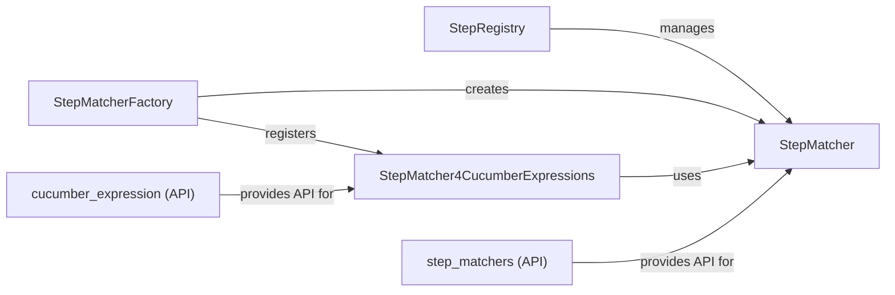

## Component Details

The Step Registry is a central component in Behave that manages and matches step definitions with the steps defined in feature files. It utilizes different matching strategies, including regular expressions and Cucumber Expressions, to find the appropriate step implementation for each step in a scenario. The registry provides an API for registering step definitions and customizing step matching behavior.

### StepRegistry
The StepRegistry class stores and manages step definitions. It provides methods for adding new step definitions, clearing the registry, and finding step definitions that match a given step name. It uses a StepMatcher to find matching steps.
- **Related Classes/Methods**: `behave.step_registry.StepRegistry`

### StepMatcherFactory
The StepMatcherFactory class is responsible for creating step matchers. It allows registering different step matcher classes and creating instances of them. It also manages the default step matcher.
- **Related Classes/Methods**: `behave.matchers.StepMatcherFactory`

### StepMatcher
The StepMatcher is an abstract class for matching step definitions. Different implementations can be registered and used. The default implementation uses regular expressions.
- **Related Classes/Methods**: `behave.matchers.StepMatcher`

### StepMatcher4CucumberExpressions
The StepMatcher4CucumberExpressions class is a specific implementation of StepMatcher that uses Cucumber Expressions for matching step definitions. It provides methods for checking if a step definition matches a given step name and extracting arguments from the step name.
- **Related Classes/Methods**: `behave.cucumber_expression.StepMatcher4CucumberExpressions`

### step_matchers (API)
The behave.api.step_matchers module provides a high-level API for registering step matchers and defining parameter types. It simplifies the process of customizing step matching behavior.
- **Related Classes/Methods**: `behave.api.step_matchers`

### cucumber_expression (API)
The behave.cucumber_expression module provides a high-level API for defining parameter types with cucumber expressions.
- **Related Classes/Methods**: `behave.cucumber_expression`
