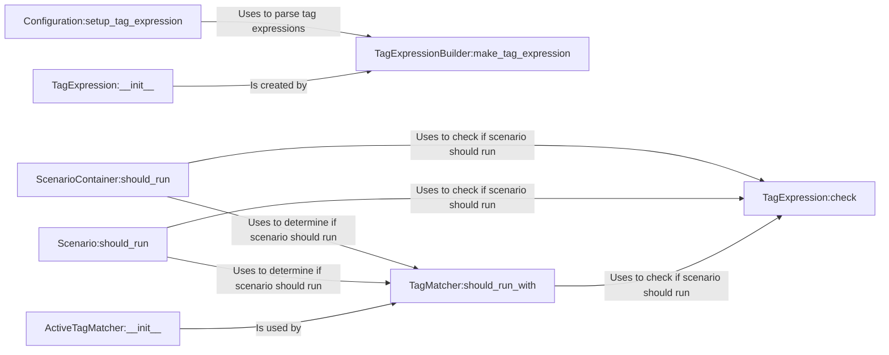

## Component Details

The Tag Expression Evaluator subsystem in Behave is responsible for filtering and selectively executing scenarios based on tags. It parses tag expressions from the configuration, evaluates them against scenario tags, and determines whether a scenario should be included in the test run. The core functionality involves parsing the tag expression string, creating a structured representation, and then checking if a scenario's tags satisfy the expression. This allows users to focus test execution on specific scenarios based on their tags.

### Configuration:setup_tag_expression
This component is responsible for setting up the tag expression from the configuration. It parses the tag expression string and makes it available for filtering scenarios.
- **Related Classes/Methods**: `behave.configuration.Configuration:setup_tag_expression`

### TagExpressionBuilder:make_tag_expression
This component builds a TagExpression object from a tag expression string. It uses a parser to convert the string into an internal representation suitable for evaluation.
- **Related Classes/Methods**: `behave.tag_expression.builder:make_tag_expression`

### TagExpression:__init__
This component initializes a TagExpression object, storing the parsed tag expression in a structured format for efficient evaluation.
- **Related Classes/Methods**: `behave.tag_expression.v1.TagExpression:__init__`

### TagExpression:check
This component checks if a scenario's tags satisfy the tag expression. It's the core evaluation function that determines whether a scenario should be included in the test run.
- **Related Classes/Methods**: `behave.tag_expression.v1.TagExpression:check`

### ScenarioContainer:should_run
This component determines if a scenario container (e.g., a feature or scenario outline) should run based on its tags and the active tag values, utilizing the TagExpression:check to determine if the container matches the tag expression.
- **Related Classes/Methods**: `behave.model.ScenarioContainer:should_run`

### Scenario:should_run
This component determines if a scenario should run based on its tags and the active tag values, utilizing the TagExpression:check to determine if the scenario matches the tag expression.
- **Related Classes/Methods**: `behave.model.Scenario:should_run`

### TagMatcher:should_run_with
This component determines if a scenario should run based on the provided tags and active tag values. It uses the parsed tag expression to perform the matching.
- **Related Classes/Methods**: `behave.tag_matcher.TagMatcher:should_run_with`

### ActiveTagMatcher:__init__
This component initializes an ActiveTagMatcher, which manages the active tag values and provides methods for checking if a scenario should be included or excluded based on these values.
- **Related Classes/Methods**: `behave.tag_matcher.ActiveTagMatcher:__init__`
