```mermaid
graph LR
    Feature_Parser["Feature Parser"]
    Step_Registry["Step Registry"]
    Configuration_Manager["Configuration Manager"]
    Execution_Runner["Execution Runner"]
    Report_Formatter["Report Formatter"]
    Context_Manager["Context Manager"]
    Tag_Expression_Evaluator["Tag Expression Evaluator"]
    Command_Line_Interface["Command-Line Interface"]
    Feature_Parser -- "parses feature files and creates an internal model for" --> Execution_Runner
    Step_Registry -- "matches steps in the feature files with their definitions for" --> Execution_Runner
    Configuration_Manager -- "provides configuration settings for the test execution to" --> Execution_Runner
    Execution_Runner -- "executes the feature files and scenarios and provides data to" --> Report_Formatter
    Report_Formatter -- "generates reports of the test execution and is triggered by" --> Command_Line_Interface
    Context_Manager -- "provides a way to share data between steps for" --> Execution_Runner
    Tag_Expression_Evaluator -- "determines whether a scenario or feature should be executed based on its tags for" --> Execution_Runner
    Command_Line_Interface -- "initiates the test execution and loads the" --> Configuration_Manager
    Command_Line_Interface -- "initiates the test execution and uses the" --> Feature_Parser
    click Feature_Parser href "https://github.com/CodeBoarding/GeneratedOnBoardings/blob/main/behave/Feature Parser.md" "Details"
    click Step_Registry href "https://github.com/CodeBoarding/GeneratedOnBoardings/blob/main/behave/Step Registry.md" "Details"
    click Configuration_Manager href "https://github.com/CodeBoarding/GeneratedOnBoardings/blob/main/behave/Configuration Manager.md" "Details"
    click Execution_Runner href "https://github.com/CodeBoarding/GeneratedOnBoardings/blob/main/behave/Execution Runner.md" "Details"
    click Report_Formatter href "https://github.com/CodeBoarding/GeneratedOnBoardings/blob/main/behave/Report Formatter.md" "Details"
    click Context_Manager href "https://github.com/CodeBoarding/GeneratedOnBoardings/blob/main/behave/Context Manager.md" "Details"
    click Tag_Expression_Evaluator href "https://github.com/CodeBoarding/GeneratedOnBoardings/blob/main/behave/Tag Expression Evaluator.md" "Details"
    click Command_Line_Interface href "https://github.com/CodeBoarding/GeneratedOnBoardings/blob/main/behave/Command-Line Interface.md" "Details"
```

## Component Details

Behave is a Behavior-Driven Development (BDD) framework that allows users to define software behavior in a human-readable format (Gherkin) and then automate the execution of these specifications. The core flow involves parsing feature files, matching steps with their implementations, executing the scenarios, and generating reports. The framework provides a way to bridge the gap between business stakeholders and developers by using a common language to describe the desired behavior of the system.

### Feature Parser
The Feature Parser is responsible for reading and parsing feature files written in Gherkin into an internal representation (model). It handles the syntax and structure of the feature files, including features, rules, scenarios, steps, and tables. The parser transforms the Gherkin syntax into a structured object model that can be used by the Execution Runner.
- **Related Classes/Methods**: `behave.parser`, `behave.model`

### Step Registry
The Step Registry stores the step definitions (Python functions decorated with `given`, `when`, `then`) and provides a mechanism to match steps in the feature files with their corresponding definitions. It manages the registration and lookup of step definitions, using matchers to find the appropriate step implementation for each step in a scenario. It acts as a bridge between the parsed feature files and the actual code that executes the steps.
- **Related Classes/Methods**: `behave.step_registry`, `behave.matchers`, `behave.cucumber_expression`

### Configuration Manager
The Configuration Manager handles the loading and management of configuration settings for Behave. It reads configuration files, command-line arguments, and environment variables to determine how Behave should behave during execution. It provides a centralized access point for all configuration options, ensuring that all components have access to the necessary settings.
- **Related Classes/Methods**: `behave.configuration`

### Execution Runner
The Execution Runner orchestrates the execution of feature files and scenarios. It traverses the internal representation of the features, runs the steps, and manages the context object that is passed between steps. It also handles hooks (before/after scenarios, features, etc.). It is the central component that drives the test execution process.
- **Related Classes/Methods**: `behave.runner`, `behave.model`, `behave.runner_util`

### Report Formatter
The Report Formatter is responsible for generating reports of the test execution. It takes the results of the test runs and outputs them in various formats, such as plain text, JUnit XML, JSON, or HTML. It transforms the raw test results into a human-readable or machine-parseable format for analysis and reporting.
- **Related Classes/Methods**: `behave.formatter`, `behave.reporter`

### Context Manager
The Context Manager provides a way to share data between steps and manage the state of the test execution. It provides methods for setting and getting attributes, and for executing cleanup functions. It acts as a shared memory space for steps, allowing them to communicate and share data.
- **Related Classes/Methods**: `behave.runner`

### Tag Expression Evaluator
The Tag Expression Evaluator is responsible for evaluating tag expressions and determining whether a scenario or feature should be executed based on its tags. It supports complex tag expressions with logical operators. It allows users to selectively run scenarios based on their tags, providing a way to filter and focus test execution.
- **Related Classes/Methods**: `behave.tag_expression`

### Command-Line Interface
The Command-Line Interface (CLI) provides the entry point for running Behave. It parses command-line arguments, loads the configuration, and initiates the test execution. It acts as the user interface for interacting with Behave, allowing users to specify options and control the test execution process.
- **Related Classes/Methods**: `behave.__main__`, `behave.bin.behave_cmd`