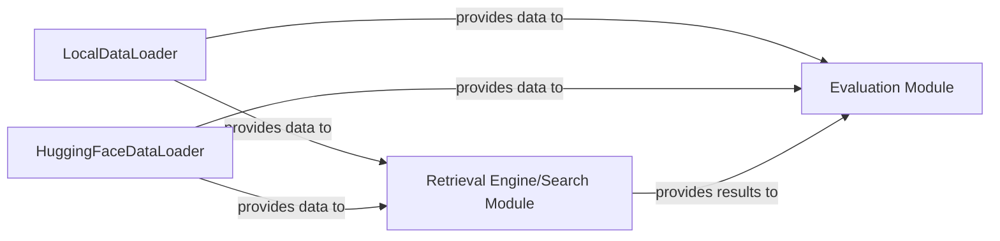

## Details

The BEIR (Benchmarking IR) framework is designed to provide a standardized and comprehensive approach to evaluating information retrieval models. At its core, the system facilitates the loading of diverse IR datasets, either from local files or directly from the HuggingFace Datasets hub. Once data is prepared, it is fed into the Retrieval Engine, which encompasses various search functionalities to retrieve relevant documents based on given queries. The results from the Retrieval Engine are then passed to the Evaluation Module, which calculates and reports standard IR metrics, providing insights into the performance of the retrieval models. This modular design ensures flexibility in data sources, retrieval methods, and evaluation metrics, making it a robust platform for IR research.

### LocalDataLoader
This component is responsible for loading IR datasets from local file paths. It handles the parsing of standard BEIR dataset formats (corpus.jsonl, queries.jsonl, qrels.tsv) and custom datasets provided as local files. Its core responsibility is to read, validate, and structure the raw data into a usable format for the benchmark framework.

**Related Classes/Methods**:

- <a href="https://github.com/beir-cellar/beir/blob/main/beir/datasets/data_loader.py" target="_blank" rel="noopener noreferrer">`beir.datasets.data_loader`</a>

### HuggingFaceDataLoader
This component specializes in loading IR datasets directly from the HuggingFace Datasets hub. It encapsulates the logic for interacting with the HuggingFace library, abstracting away the specifics of dataset retrieval and ensuring compatibility with the BEIR framework's data requirements. It serves as an alternative data source to local files, offering access to a vast collection of pre-existing datasets.

**Related Classes/Methods**:

- <a href="https://github.com/beir-cellar/beir/blob/main/beir/datasets/data_loader_hf.py" target="_blank" rel="noopener noreferrer">`beir.datasets.data_loader_hf`</a>

### Retrieval Engine/Search Module
This module is central to the BEIR framework, responsible for executing various search and retrieval operations on the loaded datasets. It provides an interface for different retrieval models (e.g., dense, sparse, lexical) to process queries and retrieve relevant documents from the corpus. It abstracts the underlying search mechanisms, allowing for interchangeable retrieval backends.

**Related Classes/Methods**:

- <a href="https://github.com/beir-cellar/beir/blob/main/beir/retrieval/search/base.py#L6-L38" target="_blank" rel="noopener noreferrer">`beir.retrieval.search.base.BaseSearch`:6-38</a>

### Evaluation Module [[Expand]](./Evaluation_Module.md)
The Evaluation Module is responsible for assessing the performance of retrieval models. It takes the retrieved results from the Retrieval Engine and the ground truth relevance judgments (qrels) to compute standard information retrieval metrics (e.g., NDCG, Recall, Precision, MAP). This module provides the quantitative analysis necessary to benchmark and compare different retrieval approaches.

**Related Classes/Methods**:

- <a href="https://github.com/beir-cellar/beir/blob/main/beir/retrieval/evaluation.py#L14-L147" target="_blank" rel="noopener noreferrer">`beir.retrieval.evaluation.EvaluateRetrieval`:14-147</a>

### [FAQ](https://github.com/CodeBoarding/GeneratedOnBoardings/tree/main?tab=readme-ov-file#faq)