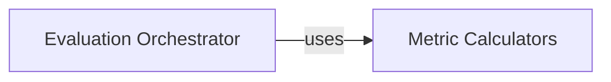

## Details

The Evaluation Module is a core subsystem responsible for assessing the performance of retrieval models within the BEIR framework. Its boundaries encompass the logic for taking retrieval results and ground truth relevance judgments, calculating various Information Retrieval (IR) metrics, and providing a structured output of these evaluations.

### Evaluation Orchestrator
This component serves as the central control unit for the evaluation process. It orchestrates the entire workflow, taking raw retrieval results and relevance judgments, then coordinating the application of various metric calculations. It acts as the primary interface for initiating an evaluation run and aggregating the results.

**Related Classes/Methods**:

- <a href="https://github.com/beir-cellar/beir/blob/main/beir/retrieval/evaluation.py" target="_blank" rel="noopener noreferrer">`Evaluation Orchestrator`</a>

### Metric Calculators
This component is a collection of specialized functions, each implementing the mathematical logic for a specific Information Retrieval metric (e.g., NDCG, Recall, MRR, Top-K Accuracy, Hole). These are the atomic units of calculation, providing the quantitative basis for performance assessment.

**Related Classes/Methods**:

- <a href="https://github.com/beir-cellar/beir/blob/main/beir/retrieval/custom_metrics.py" target="_blank" rel="noopener noreferrer">`Metric Calculators`</a>

### [FAQ](https://github.com/CodeBoarding/GeneratedOnBoardings/tree/main?tab=readme-ov-file#faq)