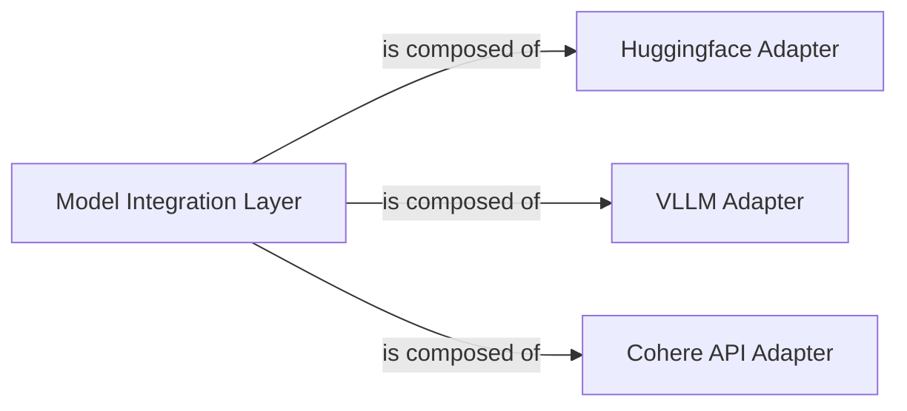

## Details

The `Model Integration Layer` subsystem is a critical abstraction responsible for integrating and managing various embedding models and external APIs within the `beir` framework. It provides a unified interface for encoding queries and corpus documents into vector representations, enabling different retrieval models to be seamlessly incorporated and benchmarked. This layer embodies the pluggable nature of the framework, allowing for easy extension with new models or APIs.

### Model Integration Layer [[Expand]](./Model_Integration_Layer.md)
The overarching abstraction layer that provides a unified interface for various embedding models and external APIs. It orchestrates the encoding of queries and corpus documents into vector representations, making the underlying model details transparent to higher-level retrieval logic. This component is central to the framework's pluggable architecture.

**Related Classes/Methods**:

- <a href="https://github.com/beir-cellar/beir/blob/main/beir/retrieval/models/huggingface.py" target="_blank" rel="noopener noreferrer">`beir/retrieval/models/huggingface.py`</a>
- <a href="https://github.com/beir-cellar/beir/blob/main/beir/retrieval/models/vllm.py" target="_blank" rel="noopener noreferrer">`beir/retrieval/models/vllm.py`</a>
- <a href="https://github.com/beir-cellar/beir/blob/main/beir/retrieval/apis/cohere.py" target="_blank" rel="noopener noreferrer">`beir/retrieval/apis/cohere.py`</a>

### Huggingface Adapter
Manages the integration and encoding process for various HuggingFace transformer models. It handles model loading, tokenization, and the generation of embeddings for both queries and corpus documents, including support for PEFT (Parameter-Efficient Fine-Tuning).

**Related Classes/Methods**:

- <a href="https://github.com/beir-cellar/beir/blob/main/beir/retrieval/models/huggingface.py#L40-L165" target="_blank" rel="noopener noreferrer">`beir.retrieval.models.huggingface.Huggingface`:40-165</a>

### VLLM Adapter
Integrates and optimizes the encoding process for vLLM models, which are designed for efficient inference with large language models. It provides methods to generate embeddings for queries and corpus documents, focusing on performance.

**Related Classes/Methods**:

- <a href="https://github.com/beir-cellar/beir/blob/main/beir/retrieval/models/vllm.py" target="_blank" rel="noopener noreferrer">`beir.retrieval.models.vllm.VLLM`</a>

### Cohere API Adapter
Acts as an adapter for the Cohere API, abstracting the details of API communication to encode text (queries and corpus documents) into vector embeddings. It ensures consistent interaction with the external Cohere service.

**Related Classes/Methods**:

- <a href="https://github.com/beir-cellar/beir/blob/main/beir/retrieval/apis/cohere.py#L29-L94" target="_blank" rel="noopener noreferrer">`beir.retrieval.apis.cohere.Cohere`:29-94</a>

### [FAQ](https://github.com/CodeBoarding/GeneratedOnBoardings/tree/main?tab=readme-ov-file#faq)