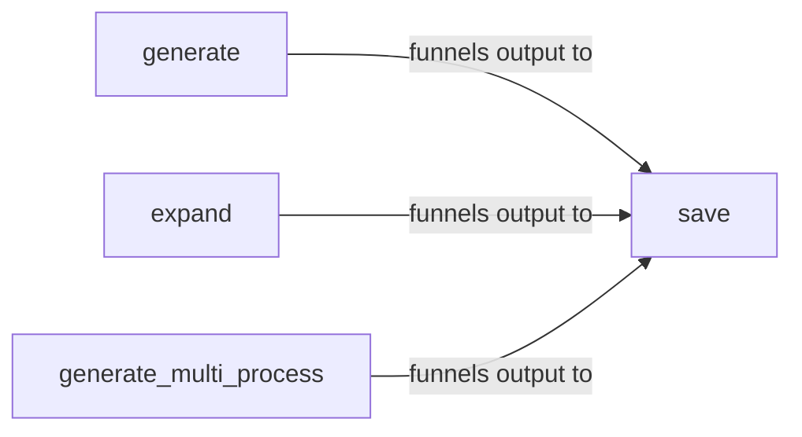

## Details

The Query Generation Module is encapsulated within the `beir.generation` package, specifically centered around the `generate.py` file. Its primary responsibility is to create synthetic queries for data augmentation, benchmarking, and training purposes.

### generate
Orchestrates the primary query generation process. It takes input data (e.g., documents or existing queries) and applies a defined generation logic (likely involving a language model or specific algorithms) to produce new, synthetic queries. This directly supports data augmentation and the creation of new datasets for training or benchmarking.

**Related Classes/Methods**:

- <a href="https://github.com/beir-cellar/beir/blob/main/beir/generation/models/tilde.py#L64-L92" target="_blank" rel="noopener noreferrer">`generate`:64-92</a>

### expand
Focuses on enriching or varying existing queries or data. This component is crucial for creating diverse query sets, potentially through techniques like query reformulation, synonym expansion, or generating variations, which is highly valuable for robust benchmark scenarios.

**Related Classes/Methods**:

- <a href="https://github.com/beir-cellar/beir/blob/main/beir/generation/generate.py#L27-L61" target="_blank" rel="noopener noreferrer">`expand`:27-61</a>

### generate_multi_process
Manages the query generation process in a parallelized, multi-process environment. This component is designed to enhance performance and scalability, enabling efficient handling of large datasets, a common requirement in ML toolkit and benchmark frameworks.

**Related Classes/Methods**:

- <a href="https://github.com/beir-cellar/beir/blob/main/beir/generation/models/auto_model.py#L144-L213" target="_blank" rel="noopener noreferrer">`generate_multi_process`:144-213</a>

### save
Acts as a utility component dedicated to persisting the output of all query generation processes (i.e., the newly generated or expanded queries) to a designated storage location. This ensures that the synthetic data is available for subsequent steps in the benchmark or training pipeline.

**Related Classes/Methods**:

- <a href="https://github.com/beir-cellar/beir/blob/main/beir/generation/generate.py" target="_blank" rel="noopener noreferrer">`save`</a>

### [FAQ](https://github.com/CodeBoarding/GeneratedOnBoardings/tree/main?tab=readme-ov-file#faq)