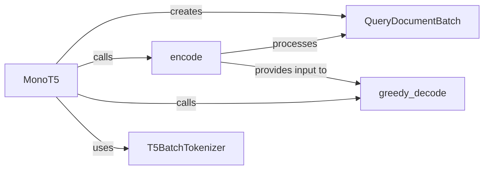

## Details

The Reranking Module subsystem is primarily defined by the beir/reranking/models/mono_t5.py file, which encapsulates the MonoT5 model and its associated utilities for re-ranking.

### MonoT5
The central orchestrator of the re-ranking process. It initializes the T5 model and tokenizer, manages the re-ranking workflow, and provides the primary interface for users to perform re-ranking by encapsulating input preparation, model inference, and score prediction.

**Related Classes/Methods**:

- <a href="https://github.com/beir-cellar/beir/blob/main/beir/reranking/models/mono_t5.py#L101-L169" target="_blank" rel="noopener noreferrer">`MonoT5`:101-169</a>

### T5BatchTokenizer
A specialized tokenizer class designed for efficient batch processing of text inputs (queries and documents), optimized for compatibility with T5 models. It prepares raw text into token IDs and attention masks required by the model.

**Related Classes/Methods**:

- <a href="https://github.com/beir-cellar/beir/blob/main/beir/reranking/models/mono_t5.py#L56-L69" target="_blank" rel="noopener noreferrer">`T5BatchTokenizer`:56-69</a>

### QueryDocumentBatch
A data structure that represents a structured batch of query-document pairs. It standardizes the input format for the re-ranking model, facilitating efficient and organized processing.

**Related Classes/Methods**:

- <a href="https://github.com/beir-cellar/beir/blob/main/beir/reranking/models/mono_t5.py#L21-L28" target="_blank" rel="noopener noreferrer">`QueryDocumentBatch`:21-28</a>

### encode
This component is responsible for transforming the QueryDocumentBatch into a numerical format (e.g., token IDs, attention masks) suitable for input to the MonoT5 model. It acts as the pre-processing step before model inference.

**Related Classes/Methods**:

- <a href="https://github.com/beir-cellar/beir/blob/main/beir/reranking/models/mono_t5.py#L42-L46" target="_blank" rel="noopener noreferrer">`encode`:42-46</a>

### greedy_decode
This component executes the actual inference or prediction step using the MonoT5 model. It takes the encoded input and generates re-ranked scores or outputs, representing the core re-ranking logic.

**Related Classes/Methods**:

- <a href="https://github.com/beir-cellar/beir/blob/main/beir/reranking/models/mono_t5.py#L72-L98" target="_blank" rel="noopener noreferrer">`greedy_decode`:72-98</a>

### [FAQ](https://github.com/CodeBoarding/GeneratedOnBoardings/tree/main?tab=readme-ov-file#faq)