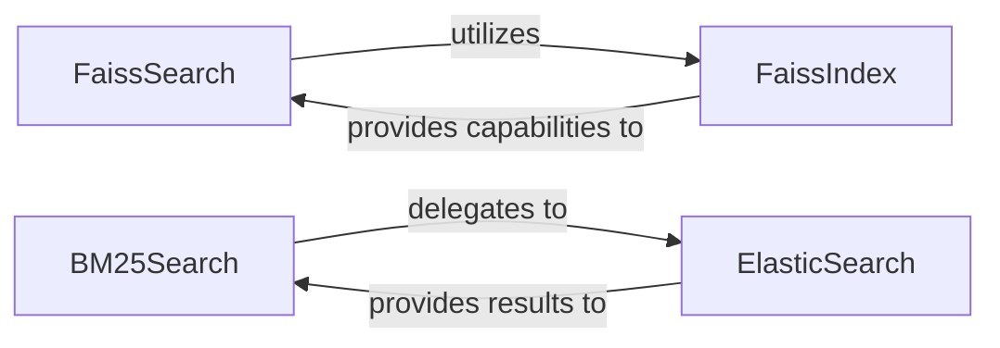

## Details

The `Retrieval Engine` subsystem is responsible for executing search operations on encoded data, encompassing both dense (vector-based) and lexical (keyword-based) retrieval methods. It serves as a central component within the Information Retrieval (IR) pipeline, providing the core search functionality.

### FaissSearch
This component orchestrates dense retrieval operations using the FAISS library. It manages the indexing of corpus embeddings and executes queries against the FAISS index, serving as the primary interface for dense search within the `Retrieval Engine`.

**Related Classes/Methods**:

- <a href="https://github.com/beir-cellar/beir/blob/main/beir/retrieval/search/dense/faiss_search.py#L21-L151" target="_blank" rel="noopener noreferrer">`FaissSearch`:21-151</a>

### BM25Search
Implements the BM25 lexical search algorithm. This component handles the setup and execution of BM25 queries, primarily by delegating to an underlying `ElasticSearch` instance for index management and search execution.

**Related Classes/Methods**:

- <a href="https://github.com/beir-cellar/beir/blob/main/beir/retrieval/search/lexical/bm25_search.py#L16-L102" target="_blank" rel="noopener noreferrer">`BM25Search`:16-102</a>

### ElasticSearch
Provides a low-level interface for direct interaction with an ElasticSearch cluster. It manages connections, handles index creation/deletion, and executes lexical search queries (both single and multi-search operations).

**Related Classes/Methods**:

- <a href="https://github.com/beir-cellar/beir/blob/main/beir/retrieval/search/lexical/elastic_search.py#L12-L291" target="_blank" rel="noopener noreferrer">`ElasticSearch`:12-291</a>

### FaissIndex
Manages the direct manipulation and persistence of FAISS indices. This includes adding vectors, performing batch searches, and handling the saving and loading of the index data.

**Related Classes/Methods**:

- <a href="https://github.com/beir-cellar/beir/blob/main/beir/retrieval/search/dense/faiss_index.py#L48-L90" target="_blank" rel="noopener noreferrer">`FaissIndex`:48-90</a>

### [FAQ](https://github.com/CodeBoarding/GeneratedOnBoardings/tree/main?tab=readme-ov-file#faq)