```mermaid
graph LR
    Data_Management_Module["Data Management Module"]
    Query_Generation_Module["Query Generation Module"]
    Model_Integration_Layer["Model Integration Layer"]
    Retrieval_Engine["Retrieval Engine"]
    Reranking_Module["Reranking Module"]
    Evaluation_Module["Evaluation Module"]
    Data_Management_Module -- "Supplies raw text data to" --> Model_Integration_Layer
    Query_Generation_Module -- "Provides generated queries to" --> Model_Integration_Layer
    Model_Integration_Layer -- "Delivers encoded embeddings to" --> Retrieval_Engine
    Retrieval_Engine -- "Passes initial retrieval results to" --> Reranking_Module
    Retrieval_Engine -- "Sends raw retrieval results to" --> Evaluation_Module
    Reranking_Module -- "Forwards reranked results to" --> Evaluation_Module
    Data_Management_Module -- "Provides ground truth relevance judgments to" --> Evaluation_Module
    click Data_Management_Module href "https://github.com/CodeBoarding/GeneratedOnBoardings/blob/main/beir/Data_Management_Module.md" "Details"
    click Query_Generation_Module href "https://github.com/CodeBoarding/GeneratedOnBoardings/blob/main/beir/Query_Generation_Module.md" "Details"
    click Model_Integration_Layer href "https://github.com/CodeBoarding/GeneratedOnBoardings/blob/main/beir/Model_Integration_Layer.md" "Details"
    click Retrieval_Engine href "https://github.com/CodeBoarding/GeneratedOnBoardings/blob/main/beir/Retrieval_Engine.md" "Details"
    click Reranking_Module href "https://github.com/CodeBoarding/GeneratedOnBoardings/blob/main/beir/Reranking_Module.md" "Details"
    click Evaluation_Module href "https://github.com/CodeBoarding/GeneratedOnBoardings/blob/main/beir/Evaluation_Module.md" "Details"
```

## Details

The `beir` project is architected as a flexible, pluggable benchmark framework for Information Retrieval, designed to facilitate the evaluation of various retrieval models. Its core architecture follows a pipeline pattern, starting with the **Data Management Module** which ingests and prepares datasets. This data, potentially augmented by the **Query Generation Module**, is then processed by the **Model Integration Layer** to produce vector embeddings. These embeddings are consumed by the **Retrieval Engine** to perform initial search operations. Optionally, results can be refined by the **Reranking Module** before being passed to the **Evaluation Module**, which calculates performance metrics against ground truth data. This clear, sequential flow with distinct component boundaries makes `beir` highly suitable for visual representation as a data flow diagram, emphasizing the modularity and interchangeability of its core components.

### Data Management Module [[Expand]](./Data_Management_Module.md)
Handles the loading, preprocessing, and management of diverse IR datasets, including corpus documents, queries, and relevance judgments (qrels). It supports both local file-based datasets and integration with HuggingFace datasets.

**Related Classes/Methods**:

- <a href="https://github.com/beir-cellar/beir/blob/main/beir/datasets/data_loader.py" target="_blank" rel="noopener noreferrer">`beir/datasets/data_loader.py`</a>
- <a href="https://github.com/beir-cellar/beir/blob/main/beir/datasets/data_loader_hf.py" target="_blank" rel="noopener noreferrer">`beir/datasets/data_loader_hf.py`</a>

### Query Generation Module [[Expand]](./Query_Generation_Module.md)
Facilitates the generation of synthetic queries, primarily used for data augmentation, specific benchmark scenarios, or training purposes.

**Related Classes/Methods**:

- <a href="https://github.com/beir-cellar/beir/blob/main/beir/generation/generate.py" target="_blank" rel="noopener noreferrer">`beir/generation/generate.py`</a>

### Model Integration Layer [[Expand]](./Model_Integration_Layer.md)
This is a crucial abstraction layer that integrates and manages various embedding models and external APIs. It's responsible for encoding queries and corpus documents into vector representations, enabling different retrieval models to be seamlessly incorporated. This component highlights the pluggable nature of the framework.

**Related Classes/Methods**:

- <a href="https://github.com/beir-cellar/beir/blob/main/beir/retrieval/models/huggingface.py" target="_blank" rel="noopener noreferrer">`beir/retrieval/models/huggingface.py`</a>
- <a href="https://github.com/beir-cellar/beir/blob/main/beir/retrieval/models/vllm.py" target="_blank" rel="noopener noreferrer">`beir/retrieval/models/vllm.py`</a>
- <a href="https://github.com/beir-cellar/beir/blob/main/beir/retrieval/apis/cohere.py" target="_blank" rel="noopener noreferrer">`beir/retrieval/apis/cohere.py`</a>

### Retrieval Engine [[Expand]](./Retrieval_Engine.md)
Executes search operations on the encoded data, supporting both dense (vector-based, e.g., FAISS) and lexical (keyword-based, e.g., BM25, ElasticSearch) retrieval methods. This component is central to the IR pipeline.

**Related Classes/Methods**:

- <a href="https://github.com/beir-cellar/beir/blob/main/beir/retrieval/search/dense/faiss_search.py" target="_blank" rel="noopener noreferrer">`beir/retrieval/search/dense/faiss_search.py`</a>
- <a href="https://github.com/beir-cellar/beir/blob/main/beir/retrieval/search/lexical/bm25_search.py" target="_blank" rel="noopener noreferrer">`beir/retrieval/search/lexical/bm25_search.py`</a>
- <a href="https://github.com/beir-cellar/beir/blob/main/beir/retrieval/search/lexical/elastic_search.py" target="_blank" rel="noopener noreferrer">`beir/retrieval/search/lexical/elastic_search.py`</a>

### Reranking Module [[Expand]](./Reranking_Module.md)
Refines the initial retrieval results by applying a secondary, often more complex, model (e.g., MonoT5) to re-score and reorder the top-k retrieved documents, aiming to improve precision.

**Related Classes/Methods**:

- <a href="https://github.com/beir-cellar/beir/blob/main/beir/reranking/models/mono_t5.py" target="_blank" rel="noopener noreferrer">`beir/reranking/models/mono_t5.py`</a>

### Evaluation Module [[Expand]](./Evaluation_Module.md)
A central component for assessing the performance of retrieval models. It calculates standard and custom Information Retrieval metrics (e.g., NDCG, Recall, MRR, Top-K Accuracy) based on retrieval results and ground truth relevance judgments.

**Related Classes/Methods**:

- <a href="https://github.com/beir-cellar/beir/blob/main/beir/retrieval/evaluation.py" target="_blank" rel="noopener noreferrer">`beir/retrieval/evaluation.py`</a>

### [FAQ](https://github.com/CodeBoarding/GeneratedOnBoardings/tree/main?tab=readme-ov-file#faq)