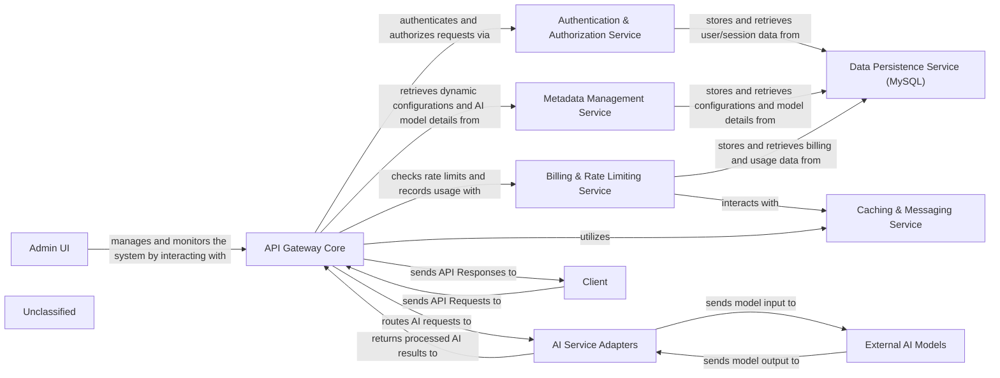

## Details

The bella project implements a robust AI Gateway designed to manage and orchestrate interactions with various AI models. At its heart, the API Gateway Core serves as the primary entry point, responsible for request routing, security, and coordinating AI model calls. It relies on the Authentication & Authorization Service for secure access and the Billing & Rate Limiting Service to manage usage and enforce quotas. Dynamic configurations and AI model metadata are managed by the Metadata Management Service, ensuring flexible routing based on a "Category-Endpoint-Model-Channel" structure. The AI Service Adapters provide a crucial abstraction layer, translating requests for diverse External AI Models. All persistent data, including user information, metadata, and billing records, is handled by the Data Persistence Service (MySQL). Performance is enhanced through the Caching & Messaging Service, which also facilitates asynchronous communication. External interactions are initiated by Clients, while an Admin UI provides management and monitoring capabilities. This architecture emphasizes modularity, scalability, and clear separation of concerns, making it suitable for managing complex AI service ecosystems.

### API Gateway Core
The central entry point for all external API requests, handling routing, security enforcement, and orchestration of AI model interactions.

**Related Classes/Methods**:

- <a href="https://github.com/LianjiaTech/bella-openapi//blob/develop/api/spi/src/main/java/com/ke/bella/openapi/server/BellaService.java" target="_blank" rel="noopener noreferrer">`com.ke.bella.openapi.server.BellaService`</a>

### Authentication & Authorization Service
Manages user authentication (OAuth 2.0, CAS, API Key) and enforces authorization policies.

**Related Classes/Methods**:

- <a href="https://github.com/LianjiaTech/bella-openapi//blob/develop/api/spi/src/main/java/com/ke/bella/openapi/login/LoginFilter.java" target="_blank" rel="noopener noreferrer">`com.ke.bella.openapi.login.LoginFilter`</a>

### Metadata Management Service
Stores and provides dynamic routing configurations, AI model details, and channel information, crucial for the "Category-Endpoint-Model-Channel" structure.

**Related Classes/Methods**:

- `com.ke.bella.openapi.metadata.service.MetaDataService`

### AI Service Adapters
A collection of specialized adapters for integrating with various AI models, handling protocol translation and data transformation.

**Related Classes/Methods**:

- <a href="https://github.com/LianjiaTech/bella-openapi//blob/develop/api/sdk/src/main/java/com/ke/bella/openapi/protocol/ITransfer.java" target="_blank" rel="noopener noreferrer">`com.ke.bella.openapi.protocol.ITransfer`</a>

### Billing & Rate Limiting Service
Enforces usage quotas, rate limits, and tracks API usage for billing purposes.

**Related Classes/Methods**:

- <a href="https://github.com/LianjiaTech/bella-openapi//blob/develop/api/server/src/main/java/com/ke/bella/openapi/protocol/limiter/LimiterManager.java" target="_blank" rel="noopener noreferrer">`com.ke.bella.openapi.protocol.limiter.LimiterManager`</a>
- <a href="https://github.com/LianjiaTech/bella-openapi//blob/develop/api/server/src/main/java/com/ke/bella/openapi/protocol/cost/CostCounter.java" target="_blank" rel="noopener noreferrer">`com.ke.bella.openapi.protocol.cost.CostCounter`</a>

### Data Persistence Service (MySQL)
Provides persistent storage for application data, metadata, user information, and billing records.

**Related Classes/Methods**:

- `com.ke.bella.openapi.db.repo.OpenapiUserRepo`

### Caching & Messaging Service
Offers distributed caching capabilities to improve performance and facilitates asynchronous communication and event-driven processing.

**Related Classes/Methods**:

- <a href="https://github.com/LianjiaTech/bella-openapi//blob/develop/api/sdk/src/main/java/com/ke/bella/job/queue/JobQueueClient.java" target="_blank" rel="noopener noreferrer">`com.ke.bella.job.queue.JobQueueClient`</a>

### External AI Models
Represents the various AI models (third-party or internal) that the AI Service Adapters integrate with. This is a conceptual component representing external dependencies.

**Related Classes/Methods**:

- `conceptual.ExternalAIModels`

### Client
External clients interacting with the API Gateway. This is a conceptual component representing external users or applications.

**Related Classes/Methods**:

- `conceptual.Client`

### Admin UI
User interface for managing and monitoring the platform. This is a conceptual component representing an external administrative interface.

**Related Classes/Methods**:

### Unclassified
Component for all unclassified files and utility functions (Utility functions/External Libraries/Dependencies)

**Related Classes/Methods**: _None_

### [FAQ](https://github.com/CodeBoarding/GeneratedOnBoardings/tree/main?tab=readme-ov-file#faq)