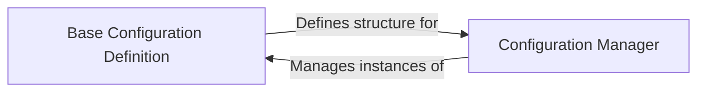

## Details

The `pythae` project's configuration subsystem is built around two core components: the `Base Configuration Definition` (`pythae.config.BaseConfig`) and the `Configuration Manager` (`pythae.config.Config`). The `Base Configuration Definition` establishes a standardized abstract interface for all configuration objects, ensuring uniformity across different model and training setups. The `Configuration Manager` then leverages this definition to effectively handle the loading, saving, and overall lifecycle of these configuration instances, thereby enabling consistent and reproducible experimental workflows. This clear separation of concerns between defining configuration structures and managing their instances is crucial for the system's flexibility and maintainability.

### Base Configuration Definition
pythae.config.BaseConfig acts as the abstract base class, defining the fundamental structure and interface for all configuration objects.

**Related Classes/Methods**: _None_

### Configuration Manager
pythae.config.Config component then serves as the central manager for these configuration objects, handling their lifecycle, including loading from and saving to persistent storage (e.g., JSON files).

**Related Classes/Methods**: _None_

### [FAQ](https://github.com/CodeBoarding/GeneratedOnBoardings/tree/main?tab=readme-ov-file#faq)